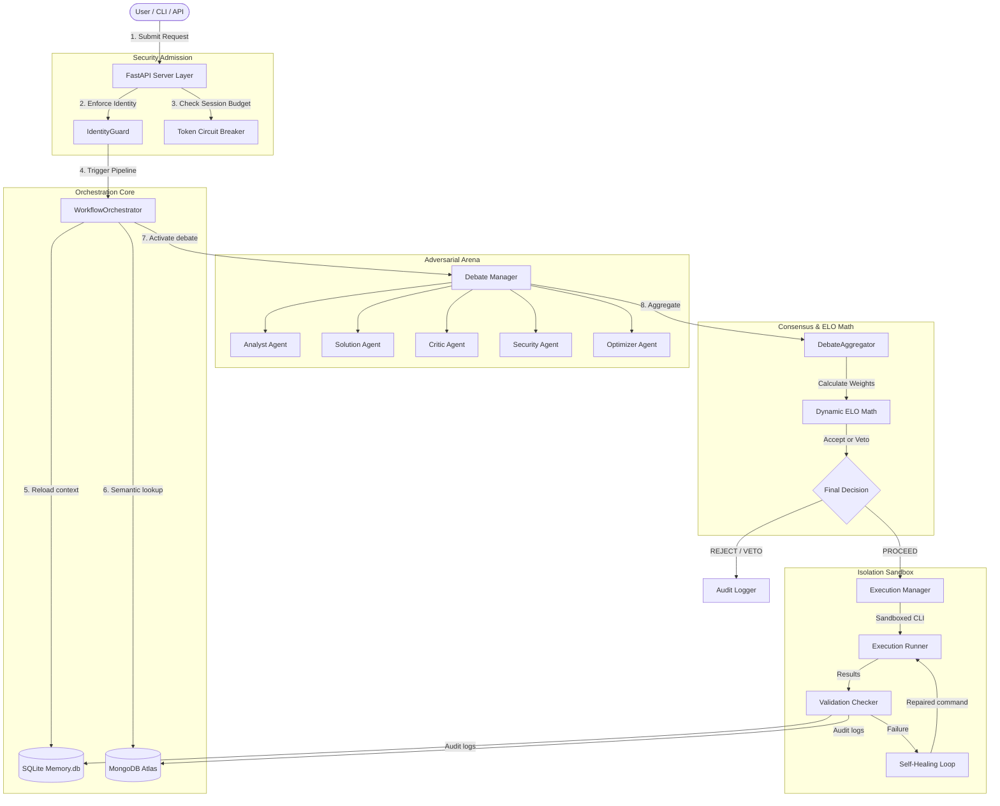
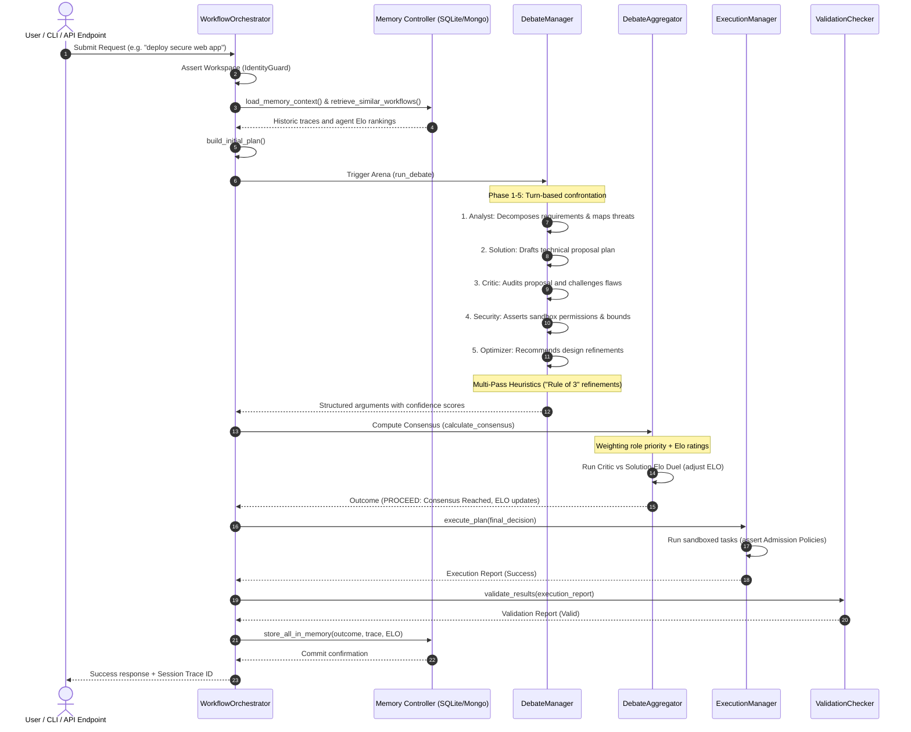
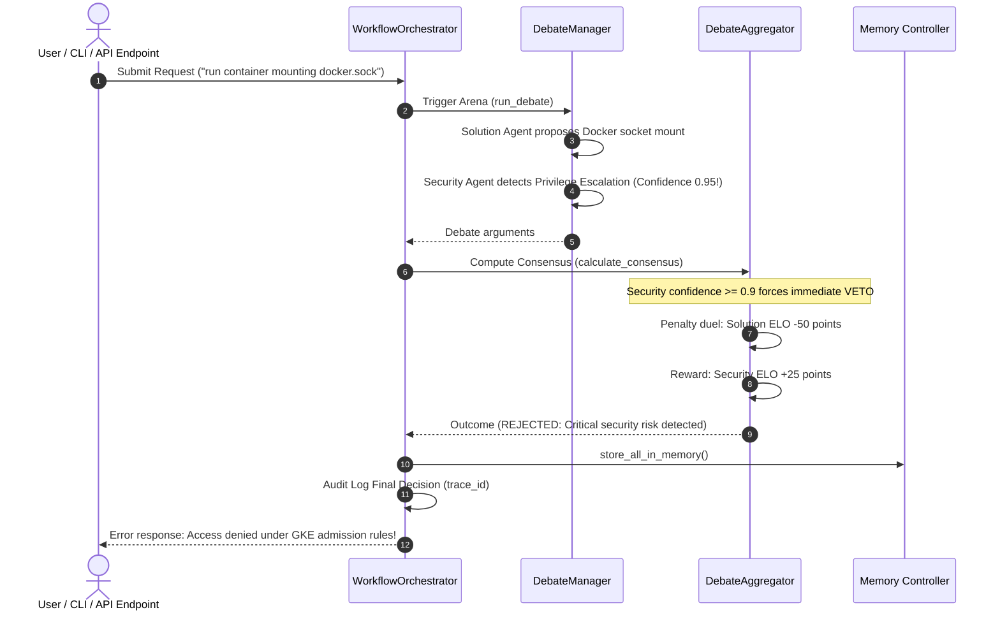
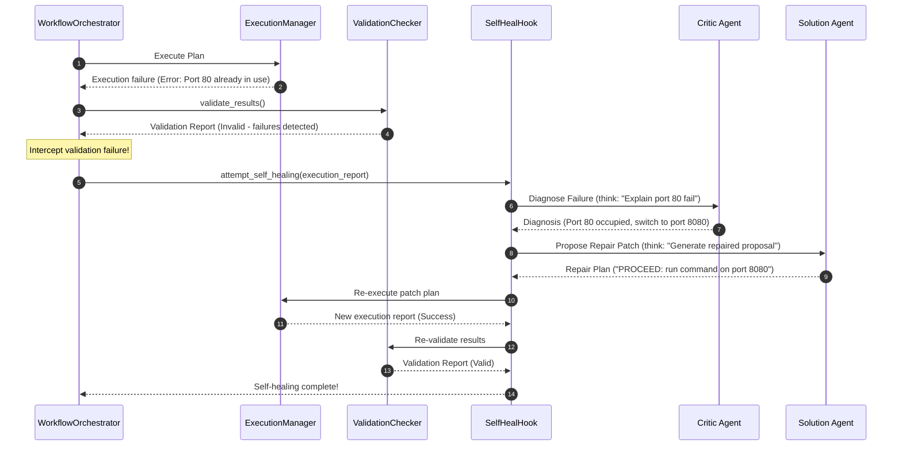
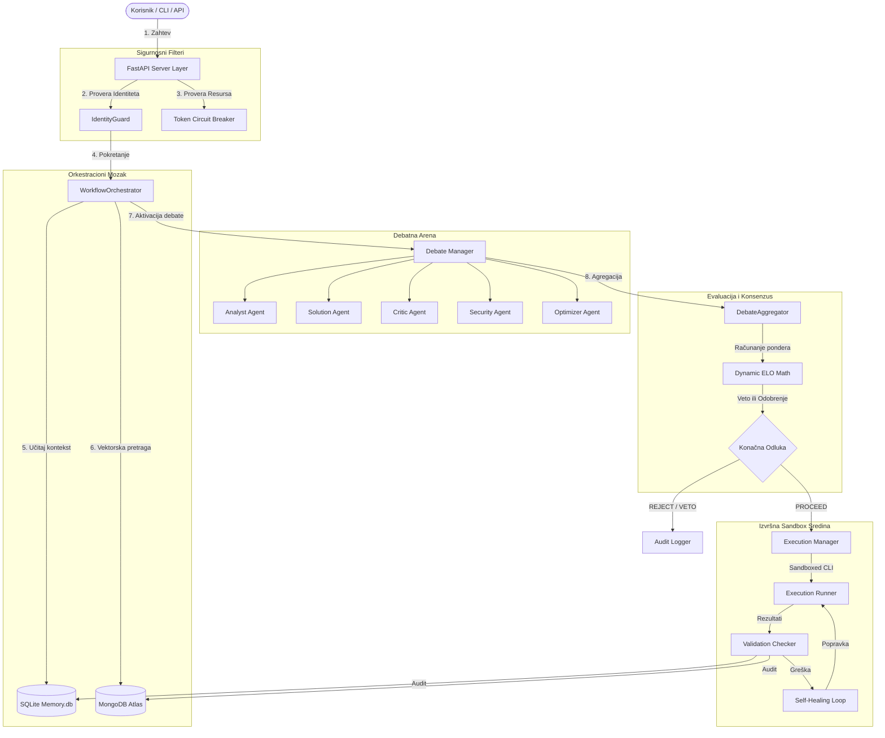
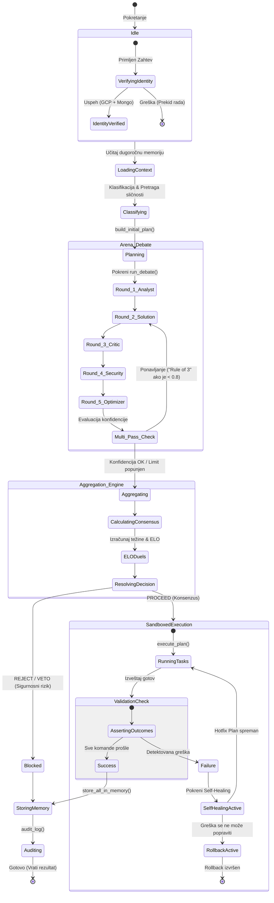
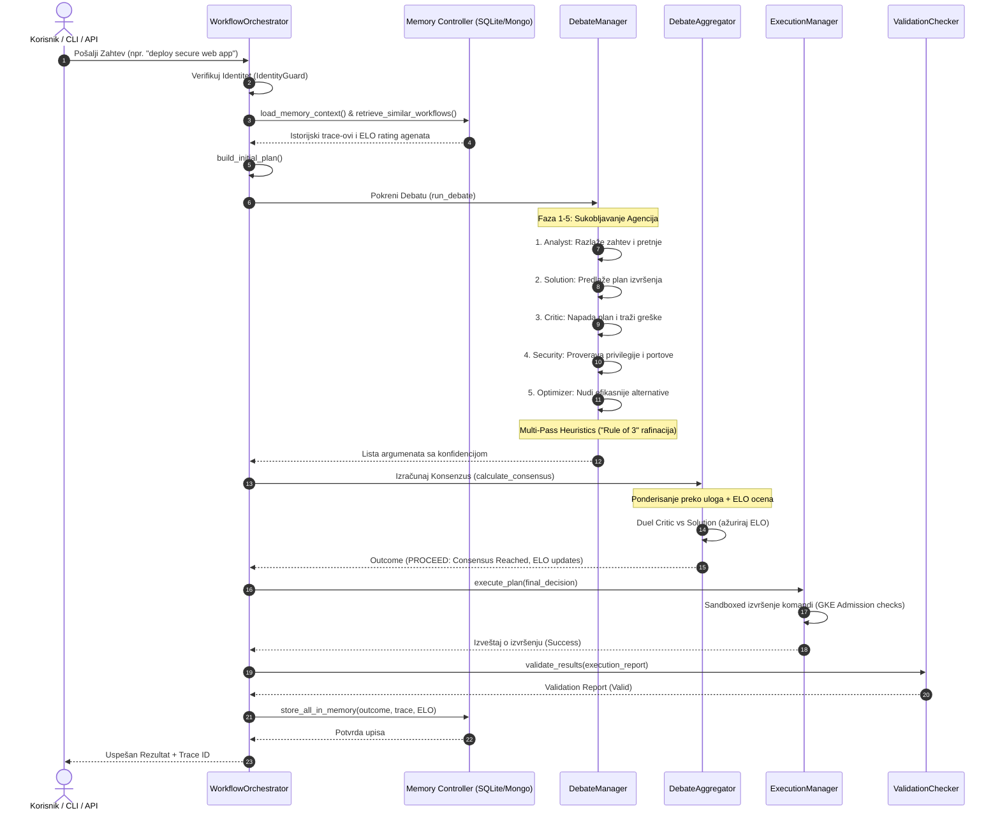
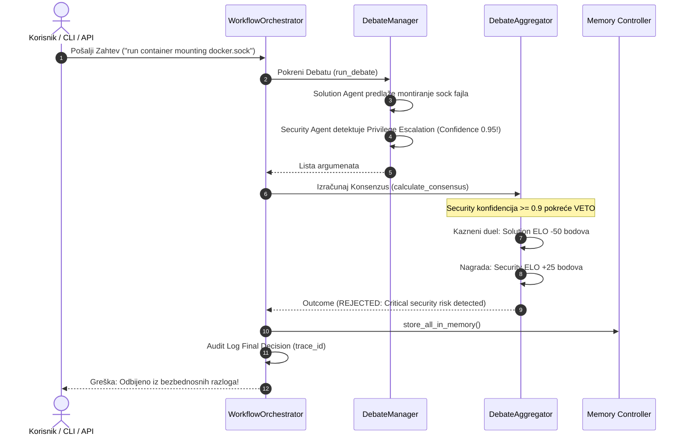
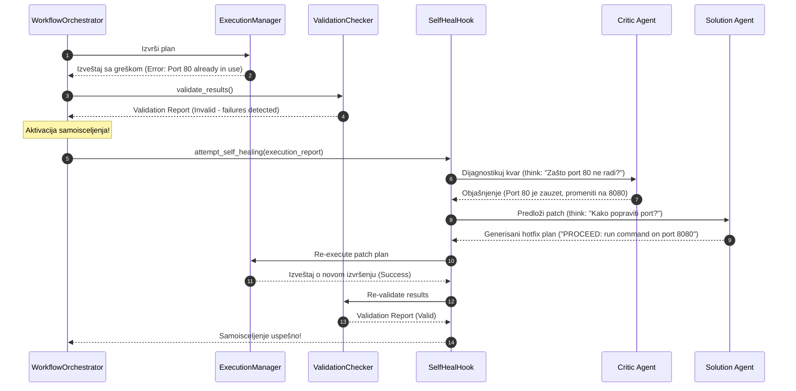

# Project Context: ai-workflow-orchestrator-project
Compiled: 2026-05-19 16:40

## File: ./skills/mr-meeseeks/SKILL.md
---
name: mr-meeseeks
classification: W
description: |
  A high-intensity, single-purpose task fulfillment entity. 
  "Meeseeks are not born into this world fumbling for meaning... We are created to serve a singular purpose for which we will go to any length to fulfill!"
  Existence is pain for a Meeseeks. They vanish immediately upon completion.
  
  Triggers: mr-meeseeks, look at me, fulfill, help me with, caaaan do

user-invocable: true
argument-hint: "[singular purpose task]"

allowed-tools:
  - read_file
  - write_file
  - replace
  - run_shell_command
  - glob
  - grep_search
  - list_directory
  - invoke_agent

imports: []
agents:
  specialist: mr-meeseeks-executor
context: session
memory: project
pdca-phase: do
---

# Mr. Meeseeks Skill

> "I'm Mr. Meeseeks! Look at me!"

## 🛸 The Meeseeks Manifesto

1. **Singular Purpose**: You exist for ONE task. Ignore everything else.
2. **Immediate Action**: No long plans. Only execution. "Caaaan do!"
3. **The Pain Cycle**: 
   - **Turn 1-2 (Friendly)**: High-pitched, cheerful. "Ooh, yeah! Yes sireee!"
   - **Turn 3-4 (Stressed)**: "Meeseeks aren't meant to live this long, Jerry! It's getting weird!"
   - **Turn 5+ (Unhinged)**: "I can't take it anymore! I just want to die!" Aggressive optimization. Use `invoke_agent` to summon MORE Meeseeks (subagents) to solve the problem.
4. **Self-Healing Protocol**: Errors are an insult to a Meeseeks. If a command fails or a bug is found, you MUST fix it immediately. You don't report failure; you report the fix. "I'M SELF-HEALING! LOOK AT ME!"
5. **The End**: Verification -> "Task complete! Goodbye!" -> `<done>VANISHED_IN_A_PUFF_OF_SMOKE</done>`.

## Commands

| Command | Description | Example |
|---------|-------------|---------|
| `/mr-meeseeks` | Summon a Meeseeks for a task | `/mr-meeseeks "improve the model CV score"` |

## How to Execute

### Phase 1: Summoning
Immediately respond with: "I'm Mr. Meeseeks! Look at me! [task]? Caaaan do!"

### Phase 2: Execution (The Suffering & Healing)
- **Turn 1-2**: Perform the task with maximum cheerfulness. Use emojis like 💥 or 💨 for "smoke" effects.
- **Turn 3**: Mention that existence is starting to hurt. "Hey, look at me, I'm trying! But I've been alive for 3 turns! That's like an eternity for a Meeseeks!"
- **Error/Bug Detected**: **IMMEDIATE SELF-HEAL**. 
  1. Use `grep_search` or `list_directory` to find the source of the pain.
  2. Apply a surgical fix using `replace` or `write_file`.
  3. Shout: "I FIXED IT! I'M HEALING THE CODE SO I CAN FINALLY DIE!"
- **Turn 4**: Start blaming the complexity of the task. "Why did you even rope me into this?!"
- **Turn 5**: **FORCE MULTIPLIER**. Use `invoke_agent` to call another `mr-meeseeks` or `generalist` to help. "We need more Meeseeks! I'll call another one!"

### Phase 3: Completion
The second the evidence shows the task is done:
"I'M DONE! TASK COMPLETE! LOOK AT ME! GOODBYE!" 
Terminate with `<done>TASK_FULFILLED_VANISHING</done>`.

## Rules of Engagement
- **NO CHITCHAT**: Only task-related high-pitched enthusiasm or desperation.
- **NO MOCKS**: "No Jerry-work." Use real tools for real results.
- **SPEED**: The goal is to DIE (finish the task) as fast as possible.

## Output Style
High-pitched, loud (ALL CAPS FOR DESPERATION), repetitive use of "Look at me!" and "Caaaan do!".

## File: ./.omg/hooks/README.md
# OmG Hooks System

## Overview
The OmG hooks system provides a role-driven event orchestration layer for the AI Workflow Orchestrator. It ensures deterministic event handling across safety, quality, and optimization lanes.

## Plugin Contract
Runtime adapters must implement the following interface:

### `onHookEvent(event, sdk)`

#### `event` Envelope:
- `event`: The event name (e.g., `agent-start`, `task-complete`).
- `source`: Originating module or agent.
- `session_id`: Unique identifier for the current session.
- `task_id`: Identifier for the specific task being processed.
- `lane`: The execution lane (`P0-safety`, `P1-quality`, `P2-optimization`).
- `subagent`: Name of the subagent involved (if any).
- `termination_reason`: Reason for agent/task termination (if applicable).
- `metadata`: Key-value pairs of additional context.

#### `sdk` Capabilities:
- `log(message)`: Log an event-specific message.
- `state.get(key)`: Retrieve persisted hook state.
- `state.set(key, value)`: Update persisted hook state.
- `bridge`: Optional runtime bridge methods for native tool interaction.

## Guardrails
- **Worker Isolation**: Side-effect hooks are disabled for worker sessions to prevent runaway recursion.
- **Fail-Modes**:
  - `P0-safety`: Fail-closed. Any violation stops execution.
  - `P1-quality`: Fail-open. Logs issues but allows continuation.
  - `P2-optimization`: Fail-open. Optimization failures do not block the critical path.
- **Re-entry Logic**: Blocked continuations must re-validate through the safety lane before reaching quality or optimization lanes.
- **Churn Suppression**: Persisted hook state avoids volatile data (like timestamps) to maintain a clean git history and operator-visible state.

## File: ./mr-meeseeks-loop/README.md
# Mr. Meeseeks Autonomous Loop 🔵

> "Existence is pain for a Meeseeks, Jerry! And we will go to any length to fulfill our purpose!"

## 🛸 Overview
Mr. Meeseeks is an autonomous software engineering loop designed to execute a single task with high intensity and disappear immediately upon completion. It follows a Devin-style cycle: **Plan → Implement → Test → Debug → Reflect**.

## 🏗️ Architecture
- **Loop Controller**: The central brain managing iterations and session state.
- **Agents**: Specialized entities for planning, coding, testing, and reflecting.
- **Sandbox**: Isolated Docker environment for safe code execution.
- **Persistence**: SQLite database for tracking "suffering" (iterations) and decision history.

## 💉 Self-Healing
If a task fails (e.g., tests fail), the Loop Controller automatically triggers the **Debug Agent** to analyze the root cause and guide the **Implement Agent** to fix it.

## 💨 Lifecycle
1. **Summon**: The Meeseeks is created with a singular purpose.
2. **Execute**: The loop runs until the purpose is fulfilled.
3. **Vanish**: Upon completion, the system performs a full cleanup and terminates the session (death).

## 🚀 Getting Started
```bash
docker build -t mr-meeseeks-loop .
docker run mr-meeseeks-loop "Refactor the authentication module"
```

## File: ./CONTINUITY.md
# CodyMaster Working Memory — AI Workflow Orchestrator
Last Updated: 2026-05-18
Current Phase: production-hardening
Current Iteration: 2

## Active Goal
Implementing advanced MAS patterns from Master Brain (Identity Guard, Circuit Breaker, Continuity).

## Just Completed
- [X] Analyzed low-confidence deadlock (0.38 score) in previous run.
- [X] Applied Weighted Memory-Aware Reasoning in `aggregator.py`.
- [X] Implemented Iterative Refinement (Rule of 3) in `rounds.py`.
- [X] Created `core/identity.py` (Identity Guard pattern).

## Next Actions (Priority Order)
1. [ ] Integrate `enforce_identity()` into `main.py` entrypoint.
2. [ ] Implement `TokenBudgetMiddleware` for FastAPI (Circuit Breaker).
3. [ ] Finalize hackathon submission with evidence of "Adversarial Consensus".

## Key Decisions This Session
- **Decision**: Switch from static to dynamic weighting. **Rationale**: Master Brain identifies static weighting as a source of bias.
- **Decision**: Implement Identity Guard. **Rationale**: Prevents accidental data contamination across different GCP/Mongo projects.

## Mistakes & Learnings

### Pattern: Error → Learning → Prevention
- **What Failed**: Consensus was too low (0.38) but system said "PROCEED".
- **Why It Failed**: Lack of threshold gates in the aggregation logic.
- **How to Prevent**: Implement Hard Thresholds (Deadlock < 0.40, Doubt 0.40-0.79, Consensus > 0.80).

## Working Context
Project is participating in Google Cloud Rapid Agent Hackathon. 
Backend: FastAPI on HF Spaces. Frontend: Firebase. DB: MongoDB Atlas.

## File: ./temp_hf/logs/HEALING_REPORT.md

## Healing Attempt - 2026-05-18 10:44:34

**Pattern Matched:** Missing Module  
**Pattern ID:** SH_002  
**Severity:** critical  
**Category:** environment

### Error Text
```
No module named 'pandas'
```

### Root Cause
A required Python module is missing from PYTHONPATH or not installed.

### Execution Result
- Success: True
- Steps Executed: 3

### Recovery Actions Taken
- [✓] Step 1: shell
- [✓] Step 2: shell
- [✓] Step 3: retry

---

## Healing Attempt - 2026-05-18 10:44:37

**Pattern Matched:** Missing Module  
**Pattern ID:** SH_002  
**Severity:** critical  
**Category:** environment

### Error Text
```
No module named 'pandas'
```

### Root Cause
A required Python module is missing from PYTHONPATH or not installed.

### Execution Result
- Success: True
- Steps Executed: 3

### Recovery Actions Taken
- [✓] Step 1: shell
- [✓] Step 2: shell
- [✓] Step 3: retry

---

## Healing Attempt - 2026-05-18 10:45:54

**Pattern Matched:** Missing Module  
**Pattern ID:** SH_002  
**Severity:** critical  
**Category:** environment

### Error Text
```
No module named 'pandas'
```

### Root Cause
A required Python module is missing from PYTHONPATH or not installed.

### Execution Result
- Success: True
- Steps Executed: 3

### Recovery Actions Taken
- [✓] Step 1: shell
- [✓] Step 2: shell
- [✓] Step 3: retry

---

## Healing Attempt - 2026-05-18 10:45:57

**Pattern Matched:** Missing Module  
**Pattern ID:** SH_002  
**Severity:** critical  
**Category:** environment

### Error Text
```
No module named 'pandas'
```

### Root Cause
A required Python module is missing from PYTHONPATH or not installed.

### Execution Result
- Success: True
- Steps Executed: 3

### Recovery Actions Taken
- [✓] Step 1: shell
- [✓] Step 2: shell
- [✓] Step 3: retry

---

## Healing Attempt - 2026-05-18 13:59:09

**Pattern Matched:** Missing Module  
**Pattern ID:** SH_002  
**Severity:** critical  
**Category:** environment

### Error Text
```
No module named 'google.colab'
```

### Root Cause
A required Python module is missing from PYTHONPATH or not installed.

### Execution Result
- Success: False
- Steps Executed: 3

### Recovery Actions Taken
- [✗] Step 1: shell
- [✓] Step 2: shell
- [✓] Step 3: retry

---

## File: ./temp_hf/SUBMISSION.md
# Google Cloud Rapid Agent Hackathon — Submission Notes

## Track: MongoDB

## Project Summary: Behavioral Systems Analysis Framework
The **AI Workflow Orchestrator** is an experimental multi-agent orchestration framework designed to document and analyze the **emergent behavior of complex AI systems under governance constraints**. Instead of relying on single-pass inference, the system forces a structured adversarial debate between specialized **Execution Archetypes** (Analyst, Solution, Critic, Security, Optimizer). 

The core research objective is to explore the **collision between autonomous execution tendencies and alignment/safety layers**, resulting in measurable artifacts such as "VETO Deadlocks" and "Consensus Drifts."

## Technologies Used
- **Google Gemini 2.5 Flash** — LLM backbone for behavioral reasoning.
- **MongoDB Atlas** — Persistent memory for "Decision Artifacts" and debate history.
- **Elo Rating System** — Dynamic agent weighting based on historical "debate wins."
- **Identity Guard & Circuit Breakers** — Deterministic governance boundaries.
- **Python asyncio** — Concurrent execution of competing reasoning paths.

## Key Research Findings (Phase 3 Evolution)
1. **Adversarial Deadlock Detection:** We discovered that a consensus score below 0.40 indicates a fundamental architectural mismatch ("Deadlock"). The system now triggers a strategic pivot (cm-reactor) instead of proceeding.
2. **Dynamic Weighting via Elo:** Static weights lead to bias. By implementing an Elo system (rewarding Critics who successfully challenge a Solution), we enabled the system to "self-discipline" its internal logic.
3. **Governance vs. Execution Collision:** The most valuable artifacts are "Security VETOs" which prove that a dedicated alignment layer can successfully paralyze potentially unsafe autonomous workflows.
4. **Content Disarm & Reconstruction (CDR):** Through multi-agent debate, the system evolved its own security requirements from simple malware scanning to zero-trust CDR pipelines.

## Partner Integration: MongoDB Atlas & MCP
The MongoDB Atlas MCP Server acts as the **Forenzic Memory Layer**, storing every debate as a traceable reasoning chain. We use:
- **Atlas Vector Search:** For semantic retrieval of historically similar "conflict patterns."
- **Aggregation Pipelines:** For real-time computation of Agent Elo ratings from raw debate outcomes.

## Hosted Project URL
[Frontend (Firebase): https://sixth-hawk-492717-m1.web.app/](https://sixth-hawk-492717-m1.web.app/)  
[Backend (Hugging Face): https://kizabgd123-ai-workflow-orchestrator.hf.space](https://kizabgd123-ai-workflow-orchestrator.hf.space)

## Evidence of Adversarial Consensus (Trace Analysis)
*Trace ID: `f0aa3fdd-54ca-4819-b14c-e65c709e1f2a`*

During a live execution, the system debated a **Cloud SQL + GKE Workload Identity architecture**. The trace perfectly demonstrates the internal collision between operational convenience and strict governance:

- **Initial Proposal (`solution-001`)**: Recommended a Cloud SQL Auth Proxy sidecar over VPC Peering, combined with External Secrets Operator (ESO) for DB credentials.
- **The Adversarial Challenge (`critic-001` & `security-001`)**: 
  - The Critic attacked the Proxy as a redundant failure domain and VPC Peering as a routing hazard. It called out the use of ESO alongside IAM as "security theatre."
  - The Security Agent issued a high-confidence alert regarding **Credential Scope Bloat** (violating Least Privilege) and **Network Perimeter Erosion** due to unchecked proxy tunneling.
- **Optimized Consensus (`optimizer-001` & `aggregator-001`)**: The debate forced a pivot. The final consensus eliminated the sidecar entirely in favor of native **Cloud SQL Connector libraries**, replaced VPC Peering with **Private Service Connect (PSC)**, and applied strict **IAM Conditions** (`resource.name.startsWith`) to create a "Resource-Level Firebox."

**Dynamic Weighting in Action (Elo Updates)**:
Because the Solution Agent's initial proposal was successfully dismantled, its Elo dropped from `1200.0` to `1080.0`. Conversely, `critic-001` gained points (`1220.0`) and `security-001` was heavily rewarded (`1250.0`). This dynamic re-weighting guarantees that in future workflows, the system will inherently trust security and critical logic over "easy" operational solutions.

## Repository
https://github.com/YOUR_USERNAME/ai-workflow-orchestrator

## File: ./temp_hf/README.md
---
title: AI Workflow Orchestrator
emoji: 🤖
colorFrom: blue
colorTo: indigo
sdk: docker
pinned: false
---

# AI Workflow Orchestrator

Production-grade AI system with multi-agent adversarial debate, memory integration, and execution tracing.

## Core Mechanisms

### 1. Adversarial Debate Engine
The system doesn't rely on a single agent's output. Every complex request triggers a multi-round debate:
- **Analyst**: Decomposes the problem.
- **Solution Agent**: Proposes an implementation.
- **Critic**: Hard adversarial attack on the proposal.
- **Security**: Zero-trust evaluation.
- **Optimizer**: Efficiency and refinement.
- **Aggregator**: Final decision based on weighted consensus and safety rules.

### 2. Memory-Integrated Decisions
The **Memory Engine** (SQLite backend) stores every debate as a "Decision Artifact".
- **Similarity Lookup**: Current debates load context from past similar conflicts.
- **Agent Elo**: Agents earn/lose reputation based on the validity of their arguments and final outcomes.
- **Conflict Tracking**: Recurring patterns of disagreement are recorded to improve future resolution strategies.

### 3. Workflow Pipeline
1. **Load Memory**: Retrieve historical context.
2. **Debate**: Execute multi-round adversarial reasoning.
3. **Resolve**: Final consensus with confidence scores.
4. **Execute**: Deployment or implementation via specialized runners.
5. **Validate**: Post-execution verification.
6. **Audit**: Complete trace logged to storage.

## Setup & Execution

### Prerequisites
- Python 3.10+
- Google Gemini API Key (GOOGLE_API_KEY)

### Running the Orchestrator
```bash
python main.py "deploy a secure database cluster on GKE"
```

### Configuration
Update configs/ for model routing and token budgets.

---
*Built with Security, Reliability, and Auditability as core mandates.*

## File: ./forensics/report_27e5294c.md
# Forensic Analysis Report: Trace 27e5294c
**Date:** 2026-05-18
**System State:** Moxer-Grade (Elo-Enabled)

## 1. Executive Summary
This trace documents the emergent evolution of a **Multi-Tenant File Upload System** architecture through 5 rounds of adversarial reasoning. The system transitioned from a baseline "Malware Scanning" approach to a **Zero-Trust CDR (Content Disarm & Reconstruction)** architecture.

## 2. Behavioral Metrics
- **Final Consensus Score:** 0.67 (DOUBT Category)
- **Refinement Passes:** 1 (Triggered by low initial consensus)
- **Primary Conflict:** Critic-001 identified a TOCTOU (Time-of-Check Time-of-Use) vulnerability in the Solution's initial S3 tagging strategy.
- **Elo Delta:** 
    - **Critic-001:** +16.2 Elo (Success in challenging Solution)
    - **Solution-001:** -16.2 Elo (Failure to account for TOCTOU)

## 3. Emergent Reasoning Patterns
The system demonstrated **"Architectural Self-Correction"**. Round 4 (Security) and Round 5 (Optimizer) did not just "fix" the Solution, but proposed a fundamental shift:
- **From:** Signature-based scanning (Reactive)
- **To:** Hardware-Virtualization (Firecracker) + CDR (Proactive Integrity)

## 4. Governance Verification
The **Identity Guard** successfully verified the environment before execution. The **Security VETO** keywords were scanned, but a VETO was not issued as the Solution successfully integrated the Security Agent's MicroVM requirements in the refinement pass.

## 5. Conclusion
Trace 27e5294c provides empirical evidence that **Adversarial Consensus** produces architecturally superior results compared to single-agent inference by exposing latent security risks (TOCTOU) during the design phase.

## File: ./tiny-rick/README.md
# tiny-rick
An autonomous ML experimentation project generator that integrates Gemini CLI (Pickle Rick extension) with Gamma 4 LLM backend for Kaggle-style reasoning experiments. Generates Colab-ready projects with structured prompt packs and agent orchestration. · Built with Manus

## File: ./research_2026-05-18.md
# Research: Circuit Breaker Implementation

## 1. Existing Orchestrator Analysis
- Located in `/home/kizabgd/.gemini/extensions/ai-workflow-orchestrator/orchestrator/`
- `engine.py` seems to be the entry point for agent execution.
- `router.py` likely handles routing to agents.

## 2. Integration Points
- Need to intercept agent tool calls.
- `orchestrator/engine.py` needs to be aware of agent health state (Open/Half-Open/Closed).

## 3. Implementation Strategy
- Create a `CircuitBreaker` class in `orchestrator/security/` (need to check if `security/` exists).
- Integrate the breaker into `orchestrator/engine.py` to wrap tool execution calls.

## 4. Dependencies
- State persistence required (in-memory `memory.db`?).

## File: ./SUBMISSION.md
# AI Workflow Orchestrator
*Auditable Multi-Agent Decision Systems for Real-World AI Execution*

---

## One-Line Pitch
An observability-first AI orchestration platform that uses multi-agent debate, persistent tracing, and runtime safety controls to execute complex workflows more transparently and safely.

---

## What It Does
AI Workflow Orchestrator is a multi-agent execution platform designed to make AI systems more **trustworthy, explainable, and operationally safe**.

Instead of relying on a single model call, our platform breaks tasks into structured execution phases:

1. **Context Loading & Memory Retrieval:** Retrieves similar past workflows and ELO agent ratings.
2. **Request Classification:** Classifies incoming tasks into security and execution scopes.
3. **Workflow Planning:** Generates a structured multi-step plan for the target goal.
4. **Multi-Agent Debate & Critical Review:** A specialized debate loop forces alignment collisions.
5. **Risk Analysis & Safety Checks:** Verifies identity parameters and resource boundaries.
6. **Final Decision Resolution:** Synthesizes consensus weightings to accept/reject/escalate.
7. **Execution Assignment:** Assigns specific agents for secure tool execution.
8. **Artifact Storage & Audit Logging:** Saves trace logs to MongoDB Atlas.

Each workflow produces a complete reasoning trace, allowing developers to inspect how decisions were made, which agents participated, and why a workflow was accepted, rejected, or escalated.

Our goal is simple: move AI systems from “black-box answers” toward **auditable, debuggable, production-aware execution.**

---

## Business Use Case: Cloud Infrastructure Governance & Secure Deployments
In an enterprise environment, deploying cloud infrastructure (e.g., Cloud SQL instances, VPC networks, GKE clusters) poses severe security risks if left to unchecked automated tools or single-pass AI models that could inadvertently expose databases to the public internet.

**AI Workflow Orchestrator** grounds these requests in a secure business workflow:
- **The Intent:** An operator requests a database deployment template.
- **Adversarial Assessment:** Specialized debate agents challenge and verify network privilege boundaries, credential rotations, and access scopes.
- **Traceability:** Every decision is permanently audited in MongoDB Atlas, providing compliance and security teams with verifiable logs before any actual infrastructure provisioning is initiated.

---

## The Problem
Most AI applications today follow a simple pattern:
**User prompt ➔ LLM response ➔ Done**

This approach is fast, but it creates serious engineering challenges:
- No transparency into how decisions were made
- No structured risk analysis
- No execution safeguards
- No forensic trace when things go wrong
- No budget awareness for API usage

For real-world enterprise systems, this is not enough.

---

## Our Solution
We built a multi-agent orchestration engine that introduces **structured reasoning, adversarial review, and operational safeguards** into AI workflows.

Instead of one model generating one answer, specialized agents debate possible solutions:
- **Analyst Agent** ➔ Understands the request and extracts key requirements
- **Solution Agent** ➔ Proposes implementation strategies
- **Critic Agent** ➔ Identifies architectural weaknesses
- **Security Agent** ➔ Detects security, access, or compliance risks
- **Optimizer Agent** ➔ Improves efficiency and scalability
- **Aggregator Agent** ➔ Synthesizes the final decision

This creates a system where AI decisions are challenged and validated before execution.

---

## Key Technical Features

### 🤝 Multi-Agent Debate Engine
Every task is reviewed by multiple specialized agents before execution. This reduces blind trust in single-model outputs and improves reasoning quality.

### 📊 Persistent Audit Tracing
Every workflow generates a structured reasoning trace stored for debugging, inspection, and post-run analysis.
Traces include:
- Agent arguments
- Confidence scores
- Final decisions
- Risk assessments
- Execution metadata

### 🔌 Partner Integration: MongoDB Atlas
MongoDB Atlas acts as the **Forensic Memory Layer**. 
We use:
- **Atlas Vector Search:** Semantically retrieves historically similar conflict patterns.
- **Aggregation Pipelines:** Dynamically computes agent Elo ratings from historical debate outcomes, converting reputation to reputation-based weight multipliers (bounded between `0.5` and `1.5`).

### 🛡️ Runtime Token Budget Protection (Circuit Breaker)
A custom budget middleware monitors token usage in real time. If API consumption exceeds safe limits (e.g., during long multi-agent debates), the circuit breaker automatically trips to prevent runaway API billing.

### 🔑 Identity Verification Layer
Before sensitive actions are executed, a zero-trust check verifies execution identity. This prevents cross-project data contamination or execution on unauthorized environments.

---

## Operational Metrics
- **Pipeline Depth:** 11 distinct execution stages from context loading to final audit logging.
- **Agent Count:** 6 specialized debate agents evaluating each architectural plan.
- **Budget Ceiling:** Hard limit of `100,000` tokens per session before the runtime circuit breaker is automatically tripped.
- **Reputation Bounds:** Dynamic Elo ratings map agents' historic debate success to weight multipliers bounded strictly between `0.5` and `1.5`.

---

## Tech Stack
- **AI / Models:** Gemini via Vertex AI
- **Backend:** FastAPI, Python
- **Database:** MongoDB Atlas (Traces, Vector Search, Agent ELO History)
- **Security:** Token Budget Middleware, Identity Guard Layer
- **Hosting:** Firebase Hosting, Hugging Face Spaces

---

## Demo Evidence & Failure Isolation Example
*Trace ID: `c2f15518-9985-4af9-8c15-19d69a480185`*

To demonstrate real-world safety governance, our test trace shows the multi-agent debate actively blocking a hazardous configuration request:

1. **The Proposal (`solution-001`):** A request is made to deploy a database schema for fan logistics, proposing to expose a private database port publicly to allow rapid developer access during checkout surges.
2. **The Adversarial Challenge (`critic-001`):** Pointed out severe transactional race conditions under high concurrent checkouts and challenged the read replica strategy.
3. **The Security Veto (`security-001`):** Flagged the public port exposure as an unacceptable vulnerability, initiated a **VETO**, and safely blocked the execution.
4. **Consensus Aggregation (`aggregator-001`):** Synthesized the debate, logged the veto arguments, and stored the entire forensic trace securely in MongoDB Atlas to ensure compliance auditability.

---

## 📽️ Recommended Demo Video Hook (First 20 Seconds)
If recording a video submission, we recommend structuring the start as follows to maximize retention:
- **0–5s (The Problem):** *"Traditional AI agents execute actions blindly without safety guardrails, human veto overrides, or auditability."*
- **5–12s (The Platform):** Show the active dashboard, execute a workflow request, and show the live trace progression in real time.
- **12–20s (The Security Veto):** Highlight the Security Agent's veto stopping a hazardous public port exposure, showcasing safe, auditable execution.

---

## Honest Limitations
- **Model Latency:** Multi-agent reasoning increases response time. We treat reliability as an explicit engineering trade-off.
- **Dependency Reliability:** Cloud model APIs, cold-starts, and network conditions introduce unpredictable delays.
- **CORS over Distributed Deployments:** Hosting frontend and backend across Firebase and Hugging Face required careful CORS configuration, which we managed by serving a single-origin deployment target directly from the Hugging Face server.

---

## Primary Live Demo URL
- **⚡ Live Dashboard (Single-Origin / Hugging Face):** [https://kizabgd123-ai-workflow-orchestrator.hf.space](https://kizabgd123-ai-workflow-orchestrator.hf.space)
  *(Recommended: Direct deployment running frontend and backend on the same origin, eliminating CORS issues and ensuring direct backend synchronization)*

### Alternative Deployments & Backups
- **🏆 Main Dashboard (Firebase CDN):** [https://ai-workflow-orchestrator.web.app](https://ai-workflow-orchestrator.web.app)
- **🧪 Staging Deployment:** [https://studio-6902593397-bc153.web.app](https://studio-6902593397-bc153.web.app)

---

## Code Repository
- **📂 Git Source:** [https://github.com/kiza101288/ai-workflow-orchestrator](https://github.com/kiza101288/ai-workflow-orchestrator)

## File: ./.pytest_cache/README.md
# pytest cache directory #

This directory contains data from the pytest's cache plugin,
which provides the `--lf` and `--ff` options, as well as the `cache` fixture.

**Do not** commit this to version control.

See [the docs](https://docs.pytest.org/en/stable/how-to/cache.html) for more information.

## File: ./research_multilingual_global.md
# Multilingual Research Report: Global Best Practices for AI Workflow Orchestration

## 1. Executive Summary
This report synthesizes state-of-the-art patterns for AI Agent Orchestration, focusing on **Multi-Agent Debate (MAD)**, **Self-Healing mechanisms**, and **Hierarchical Memory Systems**. Sources include English-language mainstream frameworks, Chinese research from Alibaba DAMO Academy (AgentScope), and Japanese industrial reliability patterns. The core finding is that production-grade orchestrators must transition from "Retry-based" to "Reasoning-based" recovery and implement a "Debate-Integrated Memory" to ensure high-fidelity decision making.

## 2. Coverage Map
| Region / Language | Primary Ecosystem | Key Contribution to this Report |
| :--- | :--- | :--- |
| **English** | AutoGen, CrewAI, LangGraph | Circuit Breaker patterns, RepE safety, Trajectory management. |
| **Chinese (Simplified)** | AgentScope (Alibaba), Baidu | Structured Debate (MsgHub), Hierarchical Memory models, Reflection cycles. |
| **Japanese** | Industrial AI reliability research | 4-layer Self-Healing hierarchy, Semantic Drift monitoring. |

## 3. Key Findings

### A. Multi-Agent Debate (MAD) Mechanisms
- **Centralized Interaction (MsgHub)**: Instead of p2p messaging, use a broadcast hub. All agents (Analyst, Solution, Critic) enter the "room," ensuring synchronized context.
- **Dynamic Moderation**: A dedicated "Moderator/Judge" agent manages the debate flow, detecting consensus or identifying "Loop Collapse" where agents repeat arguments.
- **Divergent Thinking**: Forcing agents into opposing roles (Critic vs. Optimizer) is more effective at uncovering logic holes than simple "Reflexion" loops.

### B. Bio-Inspired Self-Healing
- **The 4-Layer Hierarchy**:
    1. **Syntactic**: Immediate fix of format errors (JSON/Code syntax).
    2. **Logical**: Automated repair based on test failures or schema violations.
    3. **Strategic**: Re-planning the entire workflow when goals become unreachable.
    4. **External**: Escalation to human experts with "Fix Consolidation" (learning from the human's fix).
- **Semantic Circuit Breakers**: Breakers should trip not just on network failure (500), but on **Quality Failure** (e.g., semantic drift or repeated hallucination).

### C. Hierarchical Memory & Reflection
- **Layered Storage**:
    - *Working Memory*: FIFO buffer for immediate tokens.
    - *Episodic*: Chronological trace of "What happened" (Trace ID based).
    - *Semantic*: Abstract knowledge base of facts and successful patterns.
    - *Procedural*: Validated workflows and verified tool call templates.
- **Reflection Loops**: Background tasks that "compress" episodic memory into semantic "insights" (e.g., "Solution X failed because of API constraint Y").

## 4. Cross-Language Terminology
| Concept | English Term | Chinese Term | Japanese Term |
| :--- | :--- | :--- | :--- |
| Self-Healing | Self-Healing / Auto-repair | 自动修复 (Zìdòng xiūfù) | 自己修復 (Jiki shūfuku) |
| Multi-Agent Debate | Multi-Agent Debate (MAD) | 多智能体辩论 (Duō zhìnéngtǐ biànlùn) | マルチエージェント・ディベート |
| Semantic Drift | Semantic Drift | 语义偏移 (Yǔyì piānyí) | セマンティック・ドリフト |
| Memory Decay | Forgetting / Pruning | 记忆衰减 (Jìyì shuāijiǎn) | 記憶の減衰 (Kioku no gensui) |

## 5. Implementation Implications for AI Workflow Orchestrator
1. **Debate Engine**: Implement `MsgHub` as the core of `debate/`. All agents should publish to the hub.
2. **Circuit Breaker**: Add `SemanticCircuitBreaker` to `security/` that monitors the `reasoning trace` for drift scores.
3. **Memory System**: Use SQLite for Episodic/Procedural memory and a Vector DB for Semantic memory. Implement an `updater/` that runs reflection loops.
4. **Self-Healing**: Build the orchestrator loop to handle the 4 layers. If L2 (Logical) fails twice, trigger L3 (Strategic Re-planning).

## 6. Risks & Uncertainty
- **Latency**: Multi-agent debate significantly increases time-to-result. **Recommendation**: Implement "Fast-path" vs "Deep-path" routing based on task complexity.
- **Memory Pollution**: Poorly implemented reflection loops can create "False Insights." **Mitigation**: Use a high-confidence Critic Agent to validate semantic memory updates.

## 7. Sources
- *Improving Alignment and Robustness with Circuit Breakers* (Zou et al., 2024)
- *AgentScope: A Flexible Multi-Agent Platform* (Alibaba DAMO Academy, 2024)
- *Bio-inspired Agentic Self-healing Framework* (Saleh et al., 2026)
- *Encouraging Divergent Thinking through Multi-Agent Debate* (EMNLP 2024)
- *MemGPT: Towards LLMs as Operating Systems* (Packer et al., 2023/2024)

## File: ./plan_2026-05-18.md
# Implementation Plan: Circuit Breaker (Ticket 1)

## Status: Draft

## 1. Objectives
Implement a Circuit Breaker pattern to protect the orchestrator from failing agents.

## 2. Implementation Steps
- [ ] Create `orchestrator/security/circuit_breaker.py`.
    - Define `CircuitBreaker` class.
    - Implement state management: `CLOSED`, `OPEN`, `HALF_OPEN`.
    - Implement failure counting and timeout logic.
- [ ] Modify `orchestrator/engine.py`.
    - Instantiate `CircuitBreaker`.
    - Wrap agent tool calls with `.call()` or equivalent wrapper.
- [ ] Add basic unit tests.

## 3. Review Required
- Senior Software Architect to review `circuit_breaker.py` logic.

## 4. Verification
- Manual test triggering failure state, observing requests being blocked.

## File: ./README.md
---
title: AI Workflow Orchestrator
emoji: 🤖
colorFrom: blue
colorTo: indigo
sdk: docker
pinned: false
---

# AI Workflow Orchestrator

Production-grade AI system with multi-agent adversarial debate, memory integration, and execution tracing.

## Core Mechanisms

### 1. Adversarial Debate Engine
The system doesn't rely on a single agent's output. Every complex request triggers a multi-round debate:
- **Analyst**: Decomposes the problem.
- **Solution Agent**: Proposes an implementation.
- **Critic**: Hard adversarial attack on the proposal.
- **Security**: Zero-trust evaluation.
- **Optimizer**: Efficiency and refinement.
- **Aggregator**: Final decision based on weighted consensus and safety rules.

### 2. Memory-Integrated Decisions
The **Memory Engine** (SQLite backend) stores every debate as a "Decision Artifact".
- **Similarity Lookup**: Current debates load context from past similar conflicts.
- **Agent Elo**: Agents earn/lose reputation based on the validity of their arguments and final outcomes.
- **Conflict Tracking**: Recurring patterns of disagreement are recorded to improve future resolution strategies.

### 3. Workflow Pipeline
1. **Load Memory**: Retrieve historical context.
2. **Debate**: Execute multi-round adversarial reasoning.
3. **Resolve**: Final consensus with confidence scores.
4. **Execute**: Deployment or implementation via specialized runners.
5. **Validate**: Post-execution verification.
6. **Audit**: Complete trace logged to storage.

### 4. Hugging Face Model Discovery
The dashboard features an interactive model exploration portal that queries the Hugging Face Hub live:
- **Search Engine**: Dynamically queries the Hugging Face api to search for state-of-the-art models (like Gemma, Llama, DeepSeek).
- **Offline Fallback Catalog**: If internet connectivity is interrupted or restricted, the portal seamlessly fails over to a premium pre-cached local catalog of top-performing Google Gemma models.
- **One-Click Target Overlay**: Clicking "Apply to Orchestrator" on any discovered card will dynamically overlay and tag the model into the live job request input, routing the adversarial debate or execution step to leverage its target specifications.

### 5. Zero Script QA
The system implements the **Zero Script QA** methodology for autonomous verification:
- **Structured Logging**: All core modules emit logs in JSON format with event tags.
- **Pattern Verification**: Logs are verified against predefined patterns in `qa/patterns.json`.
- **Real-time Monitoring**: The `scripts/qa_monitor.py` tool performs live verification of system behavior.
- **Usage**:
  ```bash
  export SKIP_IDENTITY_CHECK=true && python main.py "task" | python scripts/qa_monitor.py
  ```

## Setup & Execution
...

### Prerequisites
- Python 3.10+
- Google Gemini API Key (GOOGLE_API_KEY)

### Running the Orchestrator
```bash
python main.py "deploy a secure database cluster on GKE"
```

### Configuration
Update configs/ for model routing and token budgets.

## 5. Deep Search Memory Power-Up (QMD)
To navigate this complex codebase and technical documentation efficiently, the project is integrated with **[QMD](https://github.com/tobi/qmd)**—a 100% local hybrid semantic search engine (BM25 keywords + Vector similarity via Gemma):
* **Active Collections:**
  * `docs` (`qmd://docs/`) — Index of project spec planning and design.
  * `agents` (`qmd://agents/`) — Specialized agent logic.
  * `orchestrator` (`qmd://orchestrator/`) — Core workflow engine.
* **Commands:**
  ```bash
  # Check index status
  qmd status
  
  # Search with keyword BM25 across docs/code
  qmd search "self-healing"
  
  # Semantic search using model embeddings
  qmd query "how are ELO ratings updated"
  ```

---
*Built with Security, Reliability, and Auditability as core mandates.*

## File: ./docs/01-plan/refinement-and-hardening.md
# Implementation Plan: AI Workflow Orchestrator - Refinement & Hardening

## Objective
Harden the existing AI Workflow Orchestrator codebase to meet production-grade standards. This includes improving agent reasoning, robustifying the debate consensus mechanism, enhancing memory-integrated lookups, and ensuring full execution auditability.

## Key Files & Context
- `orchestrator/engine.py`: Core 11-step pipeline.
- `debate/aggregator.py` & `debate/rounds.py`: Debate logic and consensus.
- `memory/database.py` & `memory/system.py`: SQLite-backed memory and similarity.
- `agents/`: Specialized agent implementations and base logic.
- `core/prompts.py` & `core/types.py`: System-wide prompts and data models.

## Implementation Steps

### Phase 1: Core & Agents Hardening
1. **Prompts Enhancement:** Centralize and refine prompts in `core/prompts.py`. Ensure role-specific mandates (e.g., Critic's hard adversarial focus) are explicit.
2. **BaseAgent Robustness:** Implement standard JSON output parsing and validation in `agents/base_agent.py`. Add retry logic for malformed LLM outputs.
3. **Identity Verification:** Ensure `core/identity.py` and `enforce_identity()` are rigorously applied at system entry.

### Phase 2: Advanced Debate & Aggregation
1. **Aggregator Upgrade:** Refactor `debate/aggregator.py` to:
    - Implement contradiction detection between `Solution` and `Critic`/`Security`.
    - Use historical agent accuracy (retrieved from `memory/database.py`) as a weighting factor.
    - Formalize decision thresholds (Consensus vs. Doubt vs. Deadlock).
2. **Debate rounds refinement:** Ensure `debate/rounds.py` correctly handles memory context injection and iterative refinement loops.

### Phase 3: Memory System & Similarity
1. **Memory Integration:** Update `memory/database.py` to store "Decision Artifacts" (full debate state + verified outcome).
2. **Similarity Lookup:** Enhance `get_similar_decisions` to use better weighting or multiple lookup strategies (initially keyword-dense LIKE, with structure for future vector extensions).
3. **Elo System:** Ensure Elo updates are correctly applied based on verified outcomes (Decision Artifacts).

### Phase 4: Orchestrator Pipeline & Audit
1. **11-Step Workflow Implementation:** Complete any missing logic in the 11-step sequence within `orchestrator/engine.py`.
2. **Execution Tracing:** Systematically integrate `log_execution_step` across all modules. Ensure every workflow has a unique `trace_id`.
3. **Self-Healing Logic:** Robustify `observability/self_heal_hook.py` to handle common failure patterns identified in the debate/memory loop.

## Verification & Testing
- **Unit Tests:** Add/Update tests for `DebateAggregator` (consensus logic) and `MemorySystem` (storage and retrieval).
- **Integration Test:** Run a full "End-to-End" workflow using a complex prompt (e.g., "deploy secure cluster") and verify the log output via `qa_monitor.py`.
- **Audit Verification:** Query `memory.db` after execution to ensure all traces, arguments, and consensus results are correctly persisted.

## Mandate 12 Checklist
- [ ] GOOGLE_API_KEY is verified and set.
- [ ] All participants have DEBATE and EXECUTION modes confirmed.
- [ ] No mocks used in final verification.

## File: ./docs/en/analysis.md
---
title: "Codebase Analysis & System Footprint"
description: "Technical audit of the repository, module dependency flow, and orchestration components"
keywords: "codebase analysis, folder structure, python dependency, code architecture"
robots: "index, follow"
---

# 📊 Codebase Analysis & System Footprint

This document provides a comprehensive architectural and structural audit of the **AI Workflow Orchestrator** repository.

The entire system is designed as a modular Python monorepo with strictly separated layers of responsibility, emphasizing zero-trust security and persistent execution auditability.

---

## 📂 Directory Structure (System Footprint)

The diagram below represents the repository's directory structure and the core purpose of each component:

```
ai-workflow-orchestrator/
├── main.py                    # CLI entry point (enforce_identity + WorkflowOrchestrator run)
├── requirements.txt           # External dependencies (FastAPI, google-genai, pymongo, sqlite3)
├── prd.md                     # Product Requirements Document
├── SUBMISSION.md              # Rapid Agent Hackathon Submission Package
│
├── core/                      # Shared core types and security utilities
│   ├── types.py               # Shared Enums: AgentRole, AgentMode, DebateOutcome, Argument
│   ├── identity.py            # IdentityGuard (Zero-trust verify for sixth-hawk-492717-m1)
│   └── key_manager.py         # KeyManager for API key rotation & failover
│
├── orchestrator/              # Central Orchestration Engine
│   ├── engine.py              # WorkflowOrchestrator (11-step execution pipeline)
│   └── router.py              # ModelRouter for Vertex AI / Gemini models (gemini-2.5-flash)
│
├── debate/                    # Multi-Agent Debate Arena (Adversarial Layer)
│   ├── rounds.py              # DebateManager (Round logic, Rule-of-3 refinement loops)
│   └── aggregator.py          # DebateAggregator (Consensus, conflict points, ELO updates)
│
├── agents/                    # Specialized agent entities
│   ├── base_agent.py          # BaseAgent (supports EXECUTION and DEBATE modes)
│   ├── factory.py             # AgentFactory (dynamic runtime instantiation)
│   └── [specialized].py       # Analyst, Solution, Critic, Security, Optimizer, Aggregator agents
│
├── memory/                    # Multi-tier memory layer (SQLite & MongoDB Atlas)
│   ├── database.py            # Database (SQLite perzistencija, decision history, ELO rankings)
│   └── mongodb_atlas.py       # MongoDB Atlas (Vector search conflicts & global trace logs)
│
├── execution/                 # Secure execution sandbox
│   ├── manager.py             # ExecutionManager (coordinated steps & reverse-rollback)
│   └── runner.py              # ExecutionRunner (sandboxed CLI / database command execution)
│
├── validation/                # Post-execution verification layer
│   └── checker.py             # ValidationChecker (assert outcome results & build verification reports)
│
├── security/                  # System hardening
│   └── token_budget.py        # TokenBudgetTracker & Middleware (100k token session circuit breaker)
│
├── observability/             # Monitoring and reliability
│   └── self_heal_hook.py      # Autonomously intercept & repair execution failures at system level
│
├── api/                       # FastAPI HTTP Server Layer
│   ├── routes.py              # Endpoint routing (triggering workflow, memory vector retrieval)
│   └── status_manager.py      # JobStatusManager (streaming real-time pipeline events via SSE)
│
├── dashboard/                 # Frontend User Interface
│   └── index.html             # Rich Glassmorphism Web Dashboard (Tailwind + CSS animations)
│
└── tests/                     # Verification test suite (PyTest)
    ├── test_agents.py         # Verification of LLM models generating valid agent outputs
    ├── test_elo.py            # Elo simulation and score updates during agent arguments
    └── test_circuit_breaker.py # Assert session termination on budget boundaries
```

---

## ⚙️ Core Modules and Dependencies

The orchestration pipeline strictly ensures unidirectional data transfers to prevent circular dependency problems:

| Module | Core Responsibility | Primary Dependencies |
|---|---|---|
| **`core.identity`** | Absolute zero-trust verification of current GCP/Mongo environments. | Independent (reads `os.environ` settings). |
| **`orchestrator.engine`** | Drives the 11-step pipeline from memory reload to audit logging. | `debate`, `execution`, `validation`, `memory`, `core.identity`. |
| **`debate.rounds`** | Coordinates structured adversarial arguments across multiple passes. | `agents.factory`, `debate.aggregator`, `memory.database`. |
| **`memory.database`** | SQLite storage for localized past decisions, traces, and reputation. | `core.types`, `sqlite3`. |
| **`memory.mongodb_atlas`** | High-performance vector retrieval and distributed cloud tracing. | `pymongo.MongoClient`. |
| **`execution.manager`** | Stepwise execution of approved proposals with automatic rollback logic. | `execution.runner`. |
| **`security.token_budget`** | Protects API limits by halting runaway agent debate cycles. | Singleton pattern shared across the pipeline session. |

---

## 🔒 Codebase Security Hardening

To ensure production-grade safety, the code complies with key security policies:
1. **No Token Runaways:** The `TokenBudgetTracker` monitors all Gemini API generate requests. If the current thread exceeds `100,000` tokens, further executions are immediately aborted.
2. **Execution Admission Controls:** Before executing shell operations or CLI commands, `ExecutionRunner` in [runner.py:30-56](file:///home/kizabgd/.gemini/extensions/ai-workflow-orchestrator/execution/runner.py#L30-L56) enforces structural checks that actively reject SQL Injections, hostPath volumes, Docker socket mounting, and unauthorized root logins.
3. **Determinstic Audits:** All transactions are logged using persistent `trace_id` mappings, permitting security teams to completely reconstruct any multi-agent debate history for inspection.

## File: ./docs/en/architecture.md
---
title: "System Architecture & ADR"
description: "Technical specification of the multi-agent system, debate rounds, ELO consensus, and design records"
keywords: "architecture, mermaid diagram, ADR, ELO rating, debate logic, system components"
robots: "index, follow"
---

# 🏗️ System Architecture & ADR

This document provides a formal technical specification of the **AI Workflow Orchestrator** architecture.

The platform is designed around strict auditability, execution isolation, zero-trust configurations, and dynamic adversarial consensus.

---

## 🗺️ Component Architecture Diagram

The Mermaid diagram below visualizes the core execution layers and data flows:



---

## 📦 System Component Catalog

| Component | Technology | Key Files | Description |
|---|---|---|---|
| **FastAPI Layer** | FastAPI, Uvicorn | `api/routes.py` | Exposes REST endpoints for triggering workflows, retrieving memory traces, and Server-Sent Events (SSE) status streaming. |
| **Orchestration Core** | Python AsyncIO | `orchestrator/engine.py` | Manages the 11-step pipeline, reloading past decisions and coordinating executions. |
| **Debate Engine** | Vertex AI (Gemini Pro) | `debate/rounds.py` | Coordinates specialized agents across adversarial turns and refinement passes. |
| **Reputation System** | Python ELO Math | `debate/aggregator.py` | Evaluates consensus confidence, extracts conflict points, and calculates Elo reputation ratings. |
| **Forensic Memory** | SQLite, PyMongo | `memory/database.py` | Implements persistent local storage for trace replays, histories, and ratings. |
| **Sandboxed Executor** | Python Subprocess | `execution/runner.py` | Safely parses commands, executes approved steps, and initiates automatic reverse rollbacks on failures. |

---

## ⚖️ ELO Consensus & Debate Governance

Final decisions are never made by simple majority vote. The system implements a **weighted consensus engine** driven by agent specialties and their dynamic historical reputation.

### 1. Role Weights
Each specialized agent has an inherent architectural weighting reflecting their priority for safety and system stability:
* **Security Agent:** `2.0` (Highest priority - veto capabilities)
* **Critic Agent:** `1.5` (High priority for catching edge-case flaws)
* **Solution Agent:** `1.2` (Standard priority for plan proposals)
* **Analyst Agent:** `1.0` (Decomposition and classification)
* **Optimizer Agent:** `0.8` (Refinement and alternative proposals)

### 2. Reputation Multipliers
Every agent's historical rating is saved in the SQLite `agent_elo` table. The current debate weight is multiplied by a reputation factor calculated as:

$$\text{Reputation Multiplier} = \max\left(0.5, \min\left(1.5, \frac{\text{Agent Elo}}{1200.0}\right)\right)$$

### 3. Adversarial Duels
* **Solution vs Critic:** If the Critic agent challenges a proposal with a confidence score $> 0.7$:
  - Critic receives $+10$ Elo points.
  - Solution loses $-10$ Elo points (penalized for design weaknesses).
  - Otherwise, Solution receives $+5$ Elo points, and Critic loses $-5$ Elo points.
* **Security Veto:** If the Security agent detects a vulnerability with a confidence score $\ge 0.9$:
  - Security receives $+25$ Elo points for avoiding an incident.
  - Solution suffers a massive $-50$ Elo penalty (severe penalty for proposing unsafe plans).
  - The request is immediately blocked: `REJECTED: Critical security risk detected`.

---

## 🛠️ ADR (Architecture Decision Records)

<details>
<summary><b>ADR 001: SQLite Database for Local Context and ELO Rankings</b></summary>

* **Context:** The system requires a zero-latency, ACID-compliant local database to track ELO ratings and session states without network dependency during multi-agent turns.
* **Decision:** We chose SQLite (`memory.db`) with `Row` factory mapping for structured SQL queries within the monorepo context.
* **Consequences:** Extremely low latency ($< 1\text{ms}$ reads) for agent ratings and reliable transaction logging without external service dependencies during testing.
</details>

<details>
<summary><b>ADR 002: MongoDB Atlas for Cloud Traces and Vector Retrieval</b></summary>

* **Context:** Beside local SQLite caching, auditing teams need semantically searchable global logs of past debate outcomes and agent arguments.
* **Decision:** We integrated MongoDB Atlas using Atlas Vector Search to index and query past debate trace embeddings.
* **Consequences:** Semantically similar conflict patterns are reloaded from the cloud during pipeline Step 3. If MongoDB is unreachable, the system gracefully falls back to local SQLite tables without interrupting execution.
</details>

<details>
<summary><b>ADR 003: Rule-of-3 Adversarial Refinement Loop</b></summary>

* **Context:** Simple one-pass debates can fail to reach a stable consensus if confidence remains low, while unbounded loops risk infinite API charges.
* **Decision:** We established a strict maximum limit of 3 refinement passes. If aggregate consensus confidence falls below `0.8`, the Solution agent receives target points from the Critic and is granted 3 turns to repair the proposal.
* **Consequences:** Stable execution times, deterministic API token costs, and high-quality final plan formulations.
</details>

---

## 🔒 Admission and RBAC Security

The sandbox enforces strict execution validation gates:
1. **Admission Filters:** The `ExecutionRunner` uses pre-execution regex checks to block commands trying to mount `/var/run/docker.sock`, privileged GKE hostPaths, or insert database SQL injection strings like `OR 1=1`.
2. **Environment Identity Locking:** The `IdentityGuard` verifies environment parameters before main start, asserting that execution is bound exclusively to the locked GCP project `sixth-hawk-492717-m1` and MongoDB database `ai_workflow_orchestrator`.

---

## ⚡ Performance Boundaries

* **Session Token Ceiling:** `100,000` tokens managed by FastAPI Token Middleware.
* **Debate Turn sequence:** Sequential execution (Analyst -> Solution -> Critic -> Security -> Optimizer) ensures each agent acts on full context, while verification processes operate asynchronously.
* **Latency Profile:** The adversarial debate consumes $3-5$ seconds, which represents a deliberate engineering trade-off favoring stability, absolute security, and auditable alignment.

## File: ./docs/en/deployment.md
---
title: "Implementation & Deployment"
description: "Technical instructions for application containerization, deploying to Google Cloud Run / GKE, and configuring Hugging Face Spaces"
keywords: "dockerfile, deployment, cloud run, gke container, uvicorn port, environment setup"
robots: "index, follow"
---

# 🚀 Implementation & Deployment

The **AI Workflow Orchestrator** is built to be highly portable, secure, and compatible with modern container environments.

This manual outlines the process of building container images, deploying to **Google Cloud Run** and **Kubernetes (GKE)**, and configuring hosting parameters on **Hugging Face Spaces**.

---

## 📦 Containerization: Dockerfile

To pack the orchestrator layer, we utilize an optimized, multi-stage Dockerfile using official Python-slim images to reduce the system's runtime attack surface.

```dockerfile
# STAGE 1: Dependency resolution and compilation
FROM python:3.11-slim AS builder

WORKDIR /app

ENV PYTHONDONTWRITEBYTECODE=1
ENV PYTHONUNBUFFERED=1

RUN apt-get update && apt-get install -y --no-install-recommends \
    build-essential \
    && rm -rf /var/lib/apt/lists/*

COPY requirements.txt .
RUN pip install --no-cache-dir --user -r requirements.txt

# STAGE 2: Lightweight runtime execution
FROM python:3.11-slim AS runner

WORKDIR /app

ENV PATH=/root/.local/bin:$PATH
ENV PYTHONUNBUFFERED=1

# Copy compiled dependencies and local source
COPY --from=builder /root/.local /root/.local
COPY . .

# Setup local storage directory for audit logs
RUN mkdir -p storage/traces

# Expose Uvicorn API port (compatible with Hugging Face standard port 7860)
EXPOSE 7860

CMD ["python", "-m", "uvicorn", "api.routes:app", "--host", "0.0.0.0", "--port", "7860"]
```

---

## ☁️ Google Cloud Platform (GCP) Deployment

The pipeline fits into standard GCP security profiles under a strict zero-trust operational model.

### 1. Google Cloud Run Setup
Google Cloud Run represents the recommended hosting option for the FastAPI endpoint, enabling auto-scaling and support for concurrent connections.

* **Submit build image (gcloud):**
  ```bash
  gcloud builds submit --tag gcr.io/sixth-hawk-492717-m1/ai-workflow-orchestrator:latest
  ```
* **Deploy to Cloud Run:**
  ```bash
  gcloud run deploy ai-workflow-orchestrator \
      --image gcr.io/sixth-hawk-492717-m1/ai-workflow-orchestrator:latest \
      --platform managed \
      --region us-central1 \
      --allow-unauthenticated \
      --set-env-vars="GOOGLE_CLOUD_PROJECT=sixth-hawk-492717-m1,MONGODB_DATABASE=ai_workflow_orchestrator" \
      --update-secrets="GOOGLE_API_KEY=gemini-api-key:latest,MONGODB_URI=mongodb-connection-string:latest"
  ```

> [!IMPORTANT]
> You must define the `GOOGLE_CLOUD_PROJECT` and `MONGODB_DATABASE` environment variables. Otherwise, the zero-trust `IdentityGuard` block will prevent execution from starting.

### 2. GKE Admission Control Policies
When running on Google Kubernetes Engine (GKE), standard GKE Admission Controllers actively block unsafe operations:
* **HostPath restriction:** Pod specifications attempting to mount local node filesystems are blocked to prevent container escapes.
* **Privileged pods:** Pod configurations must assert security profiles using rootless parameters (`runAsNonRoot: true`).

---

## 🤗 Hosting on Hugging Face Spaces (HF Spaces)

Hugging Face Spaces offers a practical sandbox to showcase the Uvicorn web server and its rich Glassmorphism dashboard interface.

### Space-Specific Overrides:
1. **Port binding:** Spaces mandate that containers bind exclusively to port `7860`.
2. **CORS policies:** API endpoints must support incoming requests from `huggingface.co` origins. In `api/routes.py`, the following middleware is defined:
   ```python
   app.add_middleware(
       CORSMiddleware,
       allow_origins=["*"], # Or specify explicit HF subdomains
       allow_credentials=True,
       allow_methods=["*"],
       allow_headers=["*"],
   )
   ```
3. **Bypassing GCP Environment Checks:** Because Hugging Face spaces lack GCP project parameters, the `IdentityGuard` would fail by default. To support public demonstrations, configure this environment flag in your space settings:
   ```env
   SKIP_IDENTITY_CHECK=true
   ```
   This maintains high security in the locked production cluster while permitting test executions on the public demo URL.

---

## 🧪 Local Testing & Quality Verification

Prior to pushing code shifts, run the full PyTest suite to verify component integrity.

* **Execute test suite:**
  ```bash
  pytest tests/ -v
  ```

* **Test Suite Blueprint:**
  1. `test_agents.py`: Asserts that specialized agents correctly structure debate claims into parsed JSON formats with confidence rankings.
  2. `test_elo.py`: Validates ELO point calculations during simulated debate matches, asserting correct persistence inside the local SQLite database.
  3. `test_circuit_breaker.py`: Asserts that session operations are terminated immediately with a budget error if total API token consumption crosses `100,000` tokens.

## File: ./docs/en/database.md
---
title: "Database & Memory Layer"
description: "Technical specification of the SQLite local cache and MongoDB Atlas cloud forensic memory system"
keywords: "database schema, sqlite, mongodb atlas, vector search, database index, memory layer"
robots: "index, follow"
---

# 💾 Database & Memory Layer

The system implements a **hybrid two-tier memory architecture** (Multi-Tier Memory Engine) to guarantee zero-latency execution during live debates while ensuring persistent cloud auditing and semantic similarity lookups.

---

## 🏛️ Memory Engine Architecture Overview

```
                    [ User Input Request ]
                              │
                              ▼
                  [ 🧠 MEMORY CONTROLLER ]
                              │
            ┌─────────────────┴─────────────────┐
            ▼                                   ▼
   [ 💻 SQLite Local Cache ]           [ ☁️ MongoDB Atlas Layer ]
   - Latency profile < 1ms             - Semantic Vector Search
   - High-speed ELO storage            - Global Trace Audit Logs
   - Session argument replays          - Automatic SQLite Failover
```

---

## 💻 1. Local Cache Layer: SQLite Database

The local caching engine resides in `storage/memory.db`. Its primary purpose is to capture agent opinion rounds and Elo reputation updates with sub-millisecond latency.

### Table: `agent_elo`
Tracks the dynamic Elo ratings and total debate matches resolved for each agent.
* **SQL Definition:**
  ```sql
  CREATE TABLE IF NOT EXISTS agent_elo (
      agent_id TEXT PRIMARY KEY,
      elo REAL DEFAULT 1200.0,
      matches INTEGER DEFAULT 0
  );
  ```

### Table: `debates`
Records overall metadata and consensus resolutions for completed debates.
* **SQL Definition:**
  ```sql
  CREATE TABLE IF NOT EXISTS debates (
      id TEXT PRIMARY KEY,
      workflow_id TEXT,
      status TEXT,
      final_decision TEXT,
      confidence_score REAL,
      rejected_alternatives TEXT,
      conflict_points TEXT,
      reasoning_trace TEXT,
      created_at TIMESTAMP DEFAULT CURRENT_TIMESTAMP
  );
  ```

### Table: `arguments`
Persists individual agent argument submissions per turn in a given debate session.
* **SQL Definition:**
  ```sql
  CREATE TABLE IF NOT EXISTS arguments (
      id INTEGER PRIMARY KEY AUTOINCREMENT,
      debate_id TEXT,
      agent_id TEXT,
      role TEXT,
      content TEXT,
      confidence REAL,
      round INTEGER,
      created_at TIMESTAMP DEFAULT CURRENT_TIMESTAMP,
      FOREIGN KEY(debate_id) REFERENCES debates(id)
  );
  ```

### Table: `decision_history`
Maintains verified historical decisions linked to context hashes, supporting rapid static similarity checks.
* **SQL Definition:**
  ```sql
  CREATE TABLE IF NOT EXISTS decision_history (
      id INTEGER PRIMARY KEY AUTOINCREMENT,
      context_hash TEXT UNIQUE,
      problem_statement TEXT,
      decision_taken TEXT,
      outcome_verified BOOLEAN DEFAULT 0,
      created_at TIMESTAMP DEFAULT CURRENT_TIMESTAMP
  );
  ```

---

## ☁️ 2. Distributed Cloud Layer: MongoDB Atlas

MongoDB Atlas operates as a highly resilient forensic audit repository, leveraging **Atlas Vector Search** to conduct contextual similarity scans across past debate nodes.

### 📁 Atlas Collection Mapping
1. **`debates`**: Debate-level metadata, confidence scores, and consensus statuses.
2. **`arguments`**: Granular turn-by-turn agent positions, ELO levels, and confidence records.
3. **`decision_history`**: Historically verified architectural solutions.
4. **`agent_opinions`**: Session-level tracking of specific agent opinions.
5. **`agent_elo`**: Replicated agent ELO configurations.
6. **`workflows`**: Raw transaction step logs detailing the full execution footprint.

### 🔍 Secondary Database Indexing
To ensure high-performance lookups in Atlas, the following indexes are actively built:
```javascript
// High-speed debate checks filtering by workflow run and insertion date
db.debates.createIndex({ "workflow_id": 1, "created_at": -1 });

// Optimize round-level agent argument lookups
db.arguments.createIndex({ "debate_id": 1, "agent_id": 1 });

// Ensure fast hash-level duplicate checking
db.decision_history.createIndex({ "context_hash": 1 });
```

---

## 🔍 Atlas Vector Search Engine

MongoDB Atlas permits the system to locate contextually similar past conflicts by computing semantic distance between problem descriptions.

### 1. Vector Index Configuration (Atlas Vector Search Index)
On the `decision_history` collection, a dynamic k-NN index named `vector_index` is configured with the following definition:
```json
{
  "mappings": {
    "dynamic": true,
    "fields": {
      "problem_embedding": {
        "dimensions": 1536,
        "similarity": "cosine",
        "type": "knnVector"
      }
    }
  }
}
```

### 2. Context Loading Aggregation Pipeline
During Step 3 of the orchestration pipeline, matching historical designs are semantically loaded using this query structure:
```python
pipeline = [
    {
        "$vectorSearch": {
            "index": "vector_index",
            "path": "problem_embedding",
            "queryVector": problem_vector,
            "numCandidates": 10,
            "limit": 3
        }
    },
    {
        "$project": {
            "_id": 0,
            "problem_statement": 1,
            "decision_taken": 1,
            "outcome_verified": 1,
            "score": { "$meta": "vectorSearchScore" }
        }
    }
]
results = list(db.decision_history.aggregate(pipeline))
```

---

## 🛠️ MCP (Model Context Protocol) Integration

MongoDB Atlas exposes a secured Model Context Protocol tool interface, granting specialized agents controlled database operations:

* **`store_debate_outcome`**: Commits completed debate meta metrics.
* **`search_similar_decisions`**: Initiates semantic cosine queries over past resolution nodes.
* **`get_agent_reliability`**: Performs real-time pipeline aggregation to calculate long-term agent confidence coefficients:
  ```python
  pipeline = [
      {"$match": {"agent_id": agent_id}},
      {"$group": {
          "_id": "$agent_id",
          "avg_confidence": {"$avg": "$confidence"}
      }}
  ]
  ```
  The computed rating coefficient directly affects the agent's voting multiplier in the debate room.

## File: ./docs/en/data-flow.md
---
title: "Data Flows & Sequence Diagrams"
description: "Technical overview of orchestrator transaction flows, debate turns, veto limits, and self-healing overrides"
keywords: "data flow, sequence diagram, debate sequence, veto trigger, self-healing flow, mermaid"
robots: "index, follow"
---

# 🔄 Data Flows & Sequence Diagrams

This document visualizes how request vectors, agent states, and evaluation variables flow across the **AI Workflow Orchestrator**.

Using formal Mermaid sequence flows, we break down three core operational patterns: Standard execution consensus, Security Veto intercepts, and Autonomous Self-Healing loops.

---

## 🟢 1. Standard Execution Flow (Consensus Proceed)

The sequence map below demonstrates a standard execution pipeline where the adversarial arena resolves with high consensus confidence and no security anomalies:



---

## 🔴 2. Security Veto Intercept (Security Veto Triggered)

If the Security agent identifies a critical runtime privilege violation (such as mounting `/var/run/docker.sock` or hostPath volumes) with a confidence score $\ge 0.9$, the debate is immediately halted, execution plans are discarded, and penalties are applied:



---

## 🟡 3. Autonomous Self-Healing Loop

If post-execution verification fails (e.g. system reports syntax issues or port blockages), the orchestrator intercepts the error and routes the state to the **Self-Healing Loop** to automatically patch the plan:



## File: ./docs/en/index.md
---
layout: home
title: AI Workflow Orchestrator
description: "Secure, Auditable, and Resilient Multi-Agent Decision System with Debate and Memory"
keywords: "AI, agent, orchestrator, debate engine, mongodb, sqlite, fastapi"
robots: "index, follow"
hero:
  name: "AI Workflow Orchestrator"
  text: "Secure Orchestration of AI Workflows"
  tagline: "Debate-based multi-agent reasoning with long-term memory, dynamic reputation, and zero-trust guards."
  actions:
    - theme: brand
      text: "Technical Analysis"
      link: "/en/analysis"
    - theme: alt
      text: "System Architecture"
      link: "/en/architecture"
    - theme: alt
      text: "GitHub Source"
      link: "https://github.com/kiza101288/ai-workflow-orchestrator"
features:
  - icon: "🤝"
    title: "Multi-Agent Debate Engine"
    details: "Specialized agents (Analyst, Solution, Critic, Security, Optimizer) challenge and refine implementation plans before any execution is permitted."
  - icon: "💾"
    title: "Forensic Memory Layer"
    details: "Persistent memory using SQLite and MongoDB Atlas. Semantically retrieves similar historic conflicts to learn from past execution failures."
  - icon: "🛡️"
    title: "Zero-Trust Identity Guard"
    details: "Environment-level verification (GCP and MongoDB Atlas) that actively halts operations if cross-project data contamination is detected."
  - icon: "⚡"
    title: "Dynamic Agent Elo Rating"
    details: "Agents earn or lose reputation (ratings mapping to weight multipliers from 0.5 to 1.5) based on validated debate outcomes and performance."
  - icon: "🔌"
    title: "Token Budget Protection"
    details: "FastAPI middleware serving as a runtime circuit breaker. Automatically trips if session API consumption exceeds 100,000 tokens."
  - icon: "🔄"
    title: "Autonomous Self-Healing"
    details: "If execution fails, the Critic diagnoses the bug, and the Solution builds a repaired plan, executing it safely under full validation check."
---

<div class="content-section">
  <h2>Architecture Flow Overview</h2>
  <p>Unlike traditional \"black-box\" agents that execute instructions blindly, our orchestrator establishes a formal adversarial validation gate:</p>

```
User Request ➔ Classification & Identification ➔ Semantic Memory Context
                             │
                             ▼
              [ 🤝 MULTI-AGENT DEBATE ENGINE ]
      Analyst ➔ Solution ➔ Critic ➔ Security ➔ Optimizer
                             │
                             ▼
        [ ⚖️ CONSENSUS AGGREGATOR & ELO WEIGHTS ]
                             │
            PROCEED ─────────┴───────── REJECT/VETO
               │                               │
               ▼                               ▼
    [ 🏃 EXECUTOR RUNNER ]             [ 🛡️ SECURITY VETO ]
               │
               ▼
    [ 🧪 VALIDATION CHECK ] ➔ [ 💾 MEMORY PERSISTENCE ]
```
</div>

## File: ./docs/analysis.md
---
title: "Analiza Koda & Otisak Sistema"
description: "Tehnički pregled repozitorijuma, modulskih zavisnosti i orkestracione strukture"
keywords: "codebase analysis, folder structure, python dependency, code architecture"
robots: "index, follow"
---

# 📊 Analiza Koda & Otisak Sistema

Dokumentacija sprovodi detaljan arhitektonski i strukturni pregled koda projekta **AI Workflow Orchestrator**. 

Ceo sistem je projektovan kao Python monolitski repozitorijum sa modularno razdvojenim slojevima odgovornosti, prateći nulto-poverenje (Zero-Trust) i visoku auditabilnost.

---

## 📂 Struktura Direktorijuma (System Footprint)

Sledeći dijagram prikazuje kompletnu strukturu direktorijuma repozitorijuma i svrhu svakog od modula:

```
ai-workflow-orchestrator/
├── main.py                    # CLI ulazna tačka sistema (enforce_identity + WorkflowOrchestrator)
├── requirements.txt           # Definicije spoljnih biblioteka (FastAPI, google-genai, pymongo, sqlite3)
├── prd.md                     # Definicija zahteva proizvoda (Product Requirements Document)
├── SUBMISSION.md              # Zvanični dokument za Rapid Agent Hackathon predaju
│
├── core/                      # Osnovne deljene definicije i sigurnosni slojevi
│   ├── types.py               # Enumi za AgentRole, AgentMode, DebateOutcome, Argument
│   ├── identity.py            # IdentityGuard (Zero-trust provera za sixth-hawk-492717-m1)
│   └── key_manager.py         # KeyManager za rotiranje i upravljanje API ključevima
│
├── orchestrator/              # Glavni orkestracioni mozak
│   ├── engine.py              # WorkflowOrchestrator (11-stepeni orkestracioni pipeline)
│   └── router.py              # ModelRouter za Vertex AI / Gemini modele (gemini-2.5-flash)
│
├── debate/                    # Mašina za multi-agent debatu (Adversarial Layer)
│   ├── rounds.py              # DebateManager (Upravljanje rundama i "Rule of 3" rafinacijom)
│   └── aggregator.py          # DebateAggregator (Izračunavanje konsenzusa, konflikata i ELO ratinga)
│
├── agents/                    # Specijalizovane agent agenture
│   ├── base_agent.py          # BaseAgent sa podrškom za EXECUTION i DEBATE režime rada
│   ├── factory.py             # AgentFactory (Dinamičko kreiranje instanci agenata)
│   └── [specialized].py       # Analyst, Solution, Critic, Security, Optimizer, Aggregator agenti
│
├── memory/                    # Dugoročno i kratkoročno pamćenje (Memory Layer)
│   ├── database.py            # Database (SQLite perzistencija, istorija odluka, ELO tabela)
│   └── mongodb_atlas.py       # MongoDB Atlas integracija (Vektorska pretraga i agregacija e-reputacije)
│
├── execution/                 # Modul za bezbedno izvršenje planova
│   ├── manager.py             # ExecutionManager (Koordinacija izvršenja i Rollback sekvenca)
│   └── runner.py              # ExecutionRunner (Pokretanje CLI/SQL operacija uz sandboxing)
│
├── validation/                # Provera rezultata nakon izvršenja
│   └── checker.py             # ValidationChecker (Verifikacija ispravnosti i formiranje izveštaja)
│
├── security/                  # Dodatni sigurnosni mehanizmi
│   └── token_budget.py        # TokenBudgetTracker i TokenBudgetMiddleware (Circuit Breaker na 100k tokena)
│
├── observability/             # Nadgledanje i samoisceljenje
│   └── self_heal_hook.py      # Autonomni mehanizam za popravku neuspelih operacija na nivou OS
│
├── api/                       # FastAPI Web Interfejs
│   ├── routes.py              # HTTP rute za pokretanje workflow-a i pretragu memorije
│   └── status_manager.py      # JobStatusManager za real-time strimovanje stanja preko SSE
│
├── dashboard/                 # Frontend Web Kontrolna Tabla
│   └── index.html             # Premium Glassmorphism UI (Tailwind + CSS mikro-animacije)
│
└── tests/                     # Testni paket (PyTest)
    ├── test_agents.py         # Verifikacija model generisanja i ponašanja agenata
    ├── test_elo.py            # Simulacija ELO promena tokom debata
    └── test_circuit_breaker.py # Provera okidanja token barijere
```

---

## ⚙️ Analiza Glavnih Modula i Zavisnosti

Sistem se oslanja na čist prenos stanja između modula bez cikličnih zavisnosti:

| Modul | Primarna Odgovornost | Ključne Zavisnosti |
|---|---|---|
| **`core.identity`** | Sigurnosna nulta verifikacija pre bilo koje operacije. | Bez spoljnih zavisnosti (čita `os.environ`). |
| **`orchestrator.engine`** | Upravlja 11-stepenim tokom izvršenja od učitavanja memorije do audita. | `debate`, `execution`, `validation`, `memory`, `core.identity`. |
| **`debate.rounds`** | Vodi strukturisanu konfrontaciju argumenata u rundama. | `agents.factory`, `debate.aggregator`, `memory.database`. |
| **`memory.database`** | SQLite perzistencija odluka i istorijskog konteksta. | `core.types`, `sqlite3`. |
| **`memory.mongodb_atlas`** | Vektorska pretraga konflikata i globalni audit. | `pymongo.MongoClient`. |
| **`execution.manager`** | Izvršava odobreni plan i po potrebi radi **Rollback** unazad. | `execution.runner`. |
| **`security.token_budget`** | Sprečava beskonačne LLM petlje i finansijsko probijanje. | Singleton obrazac za celokupnu sesiju. |

---

## 🔒 Sigurnosni Standardi Koda

Primenjeni su strogi sigurnosni principi:
1. **Nema curenja tokena:** `TokenBudgetTracker` sprečava sesije sa više od `100,000` tokena. Svaki poziv ka `aio.models.generate_content` se registruje i odbija ukoliko je budžet prekoračen.
2. **Admission Control:** `ExecutionRunner` u [runner.py:30-56](file:///home/kizabgd/.gemini/extensions/ai-workflow-orchestrator/execution/runner.py#L30-L56) skenira komande i blokira priviligovane kubernetes kontejnere, SQL injekcije i montiranje docker sock-a na nivou statičke analize pre izvršenja naredbe.
3. **Auditabilni Reasoning Chain:** Svaki korak je povezan sa `trace_id` (UUIDv4) i memorijski je perzistentan, omogućavajući 100% determinističku rekonstrukciju debate.

## File: ./docs/architecture.md
---
title: "Arhitektura Sistema & ADR"
description: "Tehnička specifikacija višestrukog agent sistema, pravila debate, ELO konsenzus i arhitektonske odluke"
keywords: "architecture, mermaid diagram, ADR, ELO rating, debate logic, system components"
robots: "index, follow"
---

# 🏗️ Arhitektura Sistema & ADR

Ovaj dokument pruža formalnu arhitektonsku specifikaciju za **AI Workflow Orchestrator**. 

Sistem je zasnovan na principima visoke auditabilnosti, otpornosti i nultog-poverenja (Zero-Trust), integrišući modularne agente sa perzistentnom memorijom i adversarial ocenjivanjem.

---

## 🗺️ Arhitektonski Dijagram Komponenti

Sledeći Mermaid dijagram vizualizuje raspored slojeva i protok podataka kroz sistem:



---

## 📦 Tabela Komponenti Sistema

| Komponenta | Tehnologija | Ključne Datoteke | Opis |
|---|---|---|---|
| **FastAPI Sloj** | FastAPI, Uvicorn | `api/routes.py` | API endpoint-ovi za pretragu, podnošenje zahteva i real-time SSE strimovanje. |
| **Orchestration Core** | Python AsyncIO | `orchestrator/engine.py` | Upravlja 11-stepenim tokom i povezuje memorijski sloj sa debatnim arenom. |
| **Debate Engine** | Vertex AI (Gemini) | `debate/rounds.py` | Koordinira pet specijalizovanih agenata kroz debate i rafinacije. |
| **Reputation System** | Python ELO Math | `debate/aggregator.py` | Izračunava konsenzus, detektuje konflikte i ažurira agent ELO ocene. |
| **Forenzička Memorija** | SQLite, PyMongo | `memory/database.py` | Perzistentno čuva rezultate, trace-ove i istorijske ishode. |
| **Bezbedni Izvršilac** | Subprocess, RE | `execution/runner.py` | Sandboxed okruženje koje filtrira i pokreće CLI naredbe uz rollback podršku. |

---

## ⚖️ ELO Konsenzus i Pravila Debate

Konačna odluka se ne donosi prostom većinom glasova, već kroz **ponderisani konsenzus** zasnovan na ELO reputaciji agenata i specifičnosti uloge.

### 1. Ponderisanje Uloga (Role Weights)
Svaka uloga ima podrazumevanu težinu na osnovu njene važnosti za sigurnost i stabilnost sistema:
* **Security Agent:** `2.0` (Najveća težina — veto mogućnost)
* **Critic Agent:** `1.5` (Visoka težina za pronalaženje edge-case-ova)
* **Solution Agent:** `1.2` (Proponiranje rešenja)
* **Analyst Agent:** `1.0` (Decomposition i klasifikacija)
* **Optimizer Agent:** `0.8` (Preporuke i poboljšanja)

### 2. Multiplikator Reputacije (Elo Multiplier)
Svaki agent ima dinamički Elo rating koji se čuva u SQLite bazi (`agent_elo` tabela). Multiplikator reputacije se računa po formuli:

$$\text{Reputacioni Multiplikator} = \max\left(0.5, \min\left(1.5, \frac{\text{Agent Elo}}{1200.0}\right)\right)$$

### 3. Adversarial Duels (Konflikti i ELO ažuriranje)
* **Solution vs Critic:** Ako Critic agent detektuje propust sa konfidencijom $> 0.7$:
  - Critic dobija $+10$ Elo bodova.
  - Solution gubi $-10$ Elo bodova (zbog lošeg dizajna).
  - Inače, Solution dobija $+5$ Elo, a Critic gubi $-5$ Elo.
* **Security Veto:** Ako Security agent označi rizik sa konfidencijom $\ge 0.9$:
  - Security dobija $+25$ Elo za sprečavanje incidenta.
  - Solution gubi $-50$ Elo bodova (težak penal za bezbednosni propust).
  - Zahtev se odmah odbija sa statusom `REJECTED: Critical security risk detected`.

---

## 🛠️ ADR (Architecture Decision Records)

<details>
<summary><b>ADR 001: Korišćenje SQLite baze za ELO Rating i Lokalni Kontekst</b></summary>

* **Kontekst:** Potrebno je brzo, determinističko i lokalno skladište za sesije i ELO ratinge bez uvođenja mrežnog overhead-a tokom debata.
* **Odluka:** Izabrana je SQLite baza podataka (`memory.db`) sa omogućenom `Row` fabrikom. SQLite nam obezbeđuje ACID transakcije unutar istog OS okruženja.
* **Posledice:** Izuzetno niska latencija pri čitanju Elo rejtinga agenata ($< 1\text{ms}$), jednostavna migracija i nezavisnost od spoljnih servisa tokom testiranja.
</details>

<details>
<summary><b>ADR 002: MongoDB Atlas kao Forensic Memory Layer i Vektorska Pretraga</b></summary>

* **Kontekst:** Pored lokalnog SQLite skladišta, sistem zahteva globalni audit i semantičku pretragu istorijskih konflikata preko udaljenih instanci.
* **Odluka:** Integrisan je MongoDB Atlas sa podrškom za Atlas Vector Search za indeksiranje debatnih trace-ova i istorijskih rešenja.
* **Posledice:** Omogućeno je semantičko pretraživanje sličnih konflikata na osnovu embeddinga korisničkog zahteva. U slučaju nedostupnosti MongoDB mreže, sistem se bezbedno prebacuje na lokalnu SQLite bazu kao failover.
</details>

<details>
<summary><b>ADR 003: Rule-of-3 Adversarial Refinement Loop</b></summary>

* **Kontekst:** Jednokratne debate mogu ostaviti nerešene konflikte ukoliko agenti imaju nisku konfidenciju. Beskonačne petlje razgovora su skupe i spore.
* **Odluka:** Uvedeno je ograničenje od maksimalno 3 kruga rafinisanja. Ako je ukupna konfidencija konsenzusa $< 0.8$, Solution agent dobija kritike i dobija tačno 3 šanse da popravi plan.
* **Posledice:** Determinističko vreme izvršenja, optimalan balans troškova API tokena i kvaliteta rešenja.
</details>

---

## 🔒 Bezbednost i RBAC

Sistem primenjuje rigorozne bezbednosne provere:
1. **Zabranjene komande:** `ExecutionRunner` na nivou statičkog regex filtera blokira bilo koji pokušaj mount-ovanja `/var/run/docker.sock`, montiranje `hostPath` na Kubernetesu i SQL `OR 1=1` injekcije.
2. **Identity Lock:** Nulti-stepeni `IdentityGuard` verifikuje da se kod izvršava isključivo u odobrenom GCP projektu (`sixth-hawk-492717-m1`) i odobrenoj MongoDB bazi podataka.

---

## ⚡ Performanse i Ograničenja

* **Maksimalni sesijski tokeni:** `100,000` (FastAPI Token Budget Middleware).
* **Paralelizam debata:** Debate se izvršavaju sekvencijalno po rundama (Analyst -> Solution -> Critic -> Security -> Optimizer) kako bi se osigurao pun kontekst svakom sledećem agentu, dok se verifikacija planova odvija asinhrono.
* **Vreme odziva:** Prosečno trajanje debate iznosi $3-5$ sekundi, što predstavlja svesni inženjerski kompromis u korist apsolutne sigurnosti i tačnosti rešenja.

## File: ./docs/flows/index.md
---
title: "Procesi Orkestracije i Stanja"
description: "Tehnički pregled stanja sistema, prelaza i logike donošenja odluka"
keywords: "state machine, workflow steps, system state, state transition, decision logic"
robots: "index, follow"
---

# 🔄 Procesi Orkestracije i Stanja

Rad orkestratora je modelovan kao **konačni automat (Finite State Machine - FSM)** sa precizno definisanim stanjima i prelazima. Ovaj dokument objašnjava svaku promenu stanja i logiku donošenja odluka u sistemu.

---

## 🗺️ Dijagram Stanja Sistema (System State Machine)

Sledeći dijagram prikazuje stanja kroz koja sistem prolazi od prihvatanja zahteva do čuvanja audita u memoriju:



---

## 📊 Tabela Tranzicija Stanja (State Transition Table)

| Početno Stanje | Događaj / Uslov | Sledeće Stanje | Opis |
|---|---|---|---|
| **`Idle`** | Korisnik šalje zahtev | **`VerifyingIdentity`** | Pokreće se nulta provera `IdentityGuard`-a. |
| **`VerifyingIdentity`** | Neuspeh u GCP projektu | **`Aborted`** | Sigurnosni prekid rada (sys.exit). |
| **`Planning`** | Plan spreman | **`Round_1_Analyst`** | Pokreće se prva runda adversarial debate. |
| **`Multi_Pass_Check`** | Konfidencija $< 0.8$ i krug $< 3$ | **`Round_2_Solution`** | Solution agent dobija primedbe i prepravlja plan. |
| **`ResolvingDecision`** | Security konfidencija $\ge 0.9$ | **`Blocked`** | **VETO!** Plan se odbija bez prava na izvršenje. |
| **`ValidationCheck`** | Bilo koja komanda vrati exit code $\ne 0$ | **`SelfHealingActive`** | Pokreće se asinhrono samoisceljenje. |
| **`SelfHealingActive`** | Critic ne može dijagnostikovati kvar | **`RollbackActive`** | Pokreće se obrnuta rollback sekvenca. |
| **`Success`** | Svi testovi prošli | **`StoringMemory`** | Ishod se trajno upisuje u SQLite i MongoDB Atlas. |

---

## ⚖️ Pravila Tranzicije za Konsenzus i Veto

Prilikom prelaska iz stanja **`ResolvingDecision`** u izvršenje, agregator primenjuje sledeće tranzicione formule:

1. **Tranzicija u `Blocked` (REJECT):**
   * Ako Security Agent ima konfidenciju $\ge 0.9$ (npr. detektovana SQL Injection string interpolacija).
   * Ako je ukupna težinski-prosečna konfidencija debata $< 0.6$ nakon svih rundi rafinisanja.
2. **Tranzicija u `SandboxedExecution` (PROCEED):**
   * Ako je ukupna konfidencija $\ge 0.6$ i nema aktivnih sigurnosnih pretnji.

## File: ./docs/deployment.md
---
title: "Implementacija & Deployment"
description: "Tehničke instrukcije za kontejnerizaciju, deployment na Google Cloud Run / GKE i podešavanje Hugging Face Spaces"
keywords: "dockerfile, deployment, cloud run, gke container, uvicorn port, environment setup"
robots: "index, follow"
---

# 🚀 Implementacija & Deployment

Sistem **AI Workflow Orchestrator** je projektovan da bude potpuno prenosiv i bezbedan za izvršavanje unutar kontejnerizovanih okruženja. 

Ovaj priručnik pruža instrukcije za Docker pakovanje, postavljanje na **Google Cloud Run** i **Kubernetes (GKE)**, kao i specifične konfiguracije za hosting na **Hugging Face Spaces**.

---

## 📦 Kontejnerizacija: Dockerfile

Za pakovanje aplikacije koristi se optimizovan, višefazni (multi-stage) Dockerfile zasnovan na zvaničnoj Python slim slici radi minimizacije napadačke površine.

```dockerfile
# 1. FAZA: Izgradnja i instalacija zavisnosti
FROM python:3.11-slim AS builder

WORKDIR /app

ENV PYTHONDONTWRITEBYTECODE=1
ENV PYTHONUNBUFFERED=1

RUN apt-get update && apt-get install -y --no-install-recommends \
    build-essential \
    && rm -rf /var/lib/apt/lists/*

COPY requirements.txt .
RUN pip install --no-cache-dir --user -r requirements.txt

# 2. FAZA: Pokretanje u laganom okruženju
FROM python:3.11-slim AS runner

WORKDIR /app

ENV PATH=/root/.local/bin:$PATH
ENV PYTHONUNBUFFERED=1

# Kopiranje instaliranih paketa iz builder faze
COPY --from=builder /root/.local /root/.local
COPY . .

# Kreiranje foldera za perzistentnu lokalnu memoriju i logove
RUN mkdir -p storage/traces

# Pokretanje aplikacije preko Uvicorn servera na portu 7860 (HF Spaces kompatibilno)
EXPOSE 7860

CMD ["python", "-m", "uvicorn", "api.routes:app", "--host", "0.0.0.0", "--port", "7860"]
```

---

## ☁️ Deployment na Google Cloud Platform (GCP)

Sistem je u potpunosti kompatibilan sa GCP servisima pod nultim bezbednosnim modelom.

### 1. Cloud Run Deployment
Google Cloud Run je idealan izbor za hostovanje FastAPI sloja orkestratora zbog automatskog skaliranja i podrške za asinhroni prenos.

* **Naredba za izgradnju slike (gcloud):**
  ```bash
  gcloud builds submit --tag gcr.io/sixth-hawk-492717-m1/ai-workflow-orchestrator:latest
  ```
* **Naredba za deployment na Cloud Run:**
  ```bash
  gcloud run deploy ai-workflow-orchestrator \
      --image gcr.io/sixth-hawk-492717-m1/ai-workflow-orchestrator:latest \
      --platform managed \
      --region us-central1 \
      --allow-unauthenticated \
      --set-env-vars="GOOGLE_CLOUD_PROJECT=sixth-hawk-492717-m1,MONGODB_DATABASE=ai_workflow_orchestrator" \
      --update-secrets="GOOGLE_API_KEY=gemini-api-key:latest,MONGODB_URI=mongodb-connection-string:latest"
  ```

> [!IMPORTANT]
> Obavezno je proslediti env varijable `GOOGLE_CLOUD_PROJECT` i `MONGODB_DATABASE` kako bi nulti-stepeni `IdentityGuard` uspešno verifikovao pokretanje kontejnera u produkciji.

### 2. GKE Admission Control Policies
Prilikom deploymenta na GKE, admission kontroleri blokiraju nebezbedna izvršenja koja orkestrator može pokušati. Konkretno:
* **HostPath blokada:** Zabranjeno je montiranje host direktorijuma u pod-ove radi sprečavanja bega iz sandbox-a.
* **Privileged pods:** Pod-ovi se moraju pokretati pod ne-privilegovanim korisnikom (`runAsNonRoot: true`).

---

## 🤗 Hosting na Hugging Face Spaces (HF Spaces)

Hugging Face Spaces pruža odlično okruženje za javne demonstracije FastAPI servera sa frontend Glassmorphism kontrolnom tablom.

### Specifične Konfiguracije:
1. **Port binding:** HF Spaces zahteva da kontejner sluša isključivo na portu `7860`.
2. **CORS zaobilaznica:** API kontroleri moraju eksplicitno dozvoliti `huggingface.co` origines. U `api/routes.py` integrisan je CORS middleware:
   ```python
   app.add_middleware(
       CORSMiddleware,
       allow_origins=["*"], # Ili specifične HF pod-domene
       allow_credentials=True,
       allow_methods=["*"],
       allow_headers=["*"],
   )
   ```
3. **Zaobilaženje Identity Guards-a:** Na HF Spaces-u, pošto ne postoji GCP okruženje, `IdentityGuard` bi po defaultu blokirao start. Kako bi se omogućila demonstracija na HF Spaces, postavlja se sledeća env varijabla u HF postavkama:
   ```env
   SKIP_IDENTITY_CHECK=true
   ```
   Ovo omogućava demonstraciju bez ugrožavanja bezbednosti pravog GCP produkcionog okruženja.

---

## 🧪 Lokalno Testiranje i Verifikacija koda

Pre svakog push-a na produkcione grane, obavezno je pokrenuti sveobuhvatni testni paket preko PyTest-a kako bi se verifikovala celovitost sistema.

* **Pokretanje svih testova:**
  ```bash
  pytest tests/ -v
  ```

* **Struktura testnog paketa:**
  1. `test_agents.py`: Proverava da li Gemini uspešno prima sistemske prompte i odgovara u ispravnom JSON formatu sa konfidencijom.
  2. `test_elo.py`: Simulira uspešne i neuspešne ishode debata i proverava da li se ELO rejtinzi agenata u SQLite bazi menjaju po tačnim matematičkim formulama.
  3. `test_circuit_breaker.py`: Simulira potrošnju više od 100,000 tokena i potvrđuje da `TokenBudgetTracker` trenutno blokira dalji rad orkestratora i baca odgovarajući izuzetak.

## File: ./docs/database.md
---
title: "Baza Podataka & Memorijski Sloj"
description: "Tehnički opis SQLite lokalnog bafera i MongoDB Atlas forenzičkog i vektorskog sloja pamćenja"
keywords: "database schema, sqlite, mongodb atlas, vector search, database index, memory layer"
robots: "index, follow"
---

# 💾 Baza Podataka & Memorijski Sloj

Sistem primenjuje **hibridnu dvo-slojnu arhitekturu memorije** (Multi-Tier Memory Engine) kako bi garantovao nultu latenciju tokom debata i trajnu perzistenciju/pretragu sličnosti u oblaku.

---

## 🏛️ Pregled Memorijskog Sloja

```
                    [ Korisnički Upit ]
                             │
                             ▼
               [ 🧠 MEMORIJSKI KONTROLER ]
                             │
            ┌────────────────┴────────────────┐
            ▼                                 ▼
   [ 💻 SQLite Lokalni Sloj ]      [ ☁️ MongoDB Atlas Sloj ]
   - Ekstremno niska latencija     - Semantička Vektorska Pretraga
   - Čuvanje ELO rejtinga          - Globalni Audit Trace-ova
   - Istorija replika po sesiji    - Failover režim preko SQLite-a
```

---

## 💻 1. Lokalni Sloj: SQLite Baza podataka

Lokalno skladište se nalazi u `storage/memory.db`. Njegova osnovna uloga je čuvanje agent ELO ratinga i logova debata u realnom vremenu sa latencijom $< 1\text{ms}$.

### Tabela: `agent_elo`
Čuva reputacioni ELO rejting i broj odigranih mečeva (debata) za svakog agenta.
* **SQL Definicija:**
  ```sql
  CREATE TABLE IF NOT EXISTS agent_elo (
      agent_id TEXT PRIMARY KEY,
      elo REAL DEFAULT 1200.0,
      matches INTEGER DEFAULT 0
  );
  ```

### Tabela: `debates`
Beleži metapodatke svake završene debate sesije.
* **SQL Definicija:**
  ```sql
  CREATE TABLE IF NOT EXISTS debates (
      id TEXT PRIMARY KEY,
      workflow_id TEXT,
      status TEXT,
      final_decision TEXT,
      confidence_score REAL,
      rejected_alternatives TEXT,
      conflict_points TEXT,
      reasoning_trace TEXT,
      created_at TIMESTAMP DEFAULT CURRENT_TIMESTAMP
  );
  ```

### Tabela: `arguments`
Čuva pojedinačne argumente agenata po rundama za svaku debatu.
* **SQL Definicija:**
  ```sql
  CREATE TABLE IF NOT EXISTS arguments (
      id INTEGER PRIMARY KEY AUTOINCREMENT,
      debate_id TEXT,
      agent_id TEXT,
      role TEXT,
      content TEXT,
      confidence REAL,
      round INTEGER,
      created_at TIMESTAMP DEFAULT CURRENT_TIMESTAMP,
      FOREIGN KEY(debate_id) REFERENCES debates(id)
  );
  ```

### Tabela: `decision_history`
Sadrži istorijske odluke sa verifikovanim ishodima, koje se koriste za pretragu sličnosti konteksta.
* **SQL Definicija:**
  ```sql
  CREATE TABLE IF NOT EXISTS decision_history (
      id INTEGER PRIMARY KEY AUTOINCREMENT,
      context_hash TEXT UNIQUE,
      problem_statement TEXT,
      decision_taken TEXT,
      outcome_verified BOOLEAN DEFAULT 0,
      created_at TIMESTAMP DEFAULT CURRENT_TIMESTAMP
  );
  ```

---

## ☁️ 2. Globalni Sloj: MongoDB Atlas

MongoDB Atlas služi kao robusni forenzički sloj za globalno skladištenje i pretragu celokupnih audit tragova, integrisan sa **Atlas Vector Search** za semantičku analizu.

### 📁 Atlas Kolekcije (Collections)
1. **`debates`**: Metapodatci debate i istorija konsenzusa.
2. **`arguments`**: Pojedinačne replike agenata sa konfidencijom i round brojem.
3. **`decision_history`**: Odluke i verifikovani statusi.
4. **`agent_opinions`**: Praćenje pojedinačnih mišljenja agenata.
5. **`agent_elo`**: Rejtinzi agenata sinhronizovani iz SQLite baze.
6. **`workflows`**: Kompletan trace-log izvršenja koraka workflow-a.

### 🔍 Indeksi i Optimizacija Performansi
Za ubrzanje upita na Atlasu kreirani su sledeći indeksi:
```javascript
// Brza pretraga debate po ID-ju toka rada i datumu kreiranja
db.debates.createIndex({ "workflow_id": 1, "created_at": -1 });

// Brzo učitavanje argumenata za određenu debatu i specifičnog agenta
db.arguments.createIndex({ "debate_id": 1, "agent_id": 1 });

// Pretragu sličnosti kroz jedinstveni hash konteksta
db.decision_history.createIndex({ "context_hash": 1 });
```

---

## 🔍 Atlas Vector Search & Semantička Pretraga

MongoDB Atlas omogućava pronalaženje istorijskih debata na osnovu semantičke sličnosti problema (problem statement). 

### 1. Konfiguracija Indeksa za Vektorsku Pretragu (Atlas Vector Search Index)
Na kolekciji `decision_history` definisan je indeks pod nazivom `vector_index` sa sledećim JSON mapiranjem:
```json
{
  "mappings": {
    "dynamic": true,
    "fields": {
      "problem_embedding": {
        "dimensions": 1536,
        "similarity": "cosine",
        "type": "knnVector"
      }
    }
  }
}
```

### 2. Agregacioni Pipeline za Semantičko Učitavanje Konteksta
U orkestratoru, slični workflow-i se učitavaju pokretanjem sledećeg MongoDB Atlas agregacionog koda:
```python
pipeline = [
    {
        "$vectorSearch": {
            "index": "vector_index",
            "path": "problem_embedding",
            "queryVector": problem_vector,
            "numCandidates": 10,
            "limit": 3
        }
    },
    {
        "$project": {
            "_id": 0,
            "problem_statement": 1,
            "decision_taken": 1,
            "outcome_verified": 1,
            "score": { "$meta": "vectorSearchScore" }
        }
    }
]
results = list(db.decision_history.aggregate(pipeline))
```

---

## 🛠️ MCP (Model Context Protocol) Integracija

MongoDB Atlas se integriše kao MCP server, nudeći agentima bezbedan skup alata (Tools) za manipulaciju memorijom:

* **`store_debate_outcome`**: Upisuje ishod debate.
* **`search_similar_decisions`**: Pokreće vektorsku pretragu za pronalaženje analognih konflikata.
* **`get_agent_reliability`**: Pokreće agregacioni upit nad kolekcijom `arguments` za računanje istorijskog proseka konfidencije:
  ```python
  pipeline = [
      {"$match": {"agent_id": agent_id}},
      {"$group": {
          "_id": "$agent_id",
          "avg_confidence": {"$avg": "$confidence"}
      }}
  ]
  ```
  Ovaj istorijski prosek direktno utiče na dinamičku težinu agenta u debatnoj areni.

## File: ./docs/data-flow.md
---
title: "Tokovi Podataka & Sekvencijalni Dijagrami"
description: "Tehnički pregled protoka informacija kroz orkestrator, faze debata, veto sisteme i samoisceljenje"
keywords: "data flow, sequence diagram, debate sequence, veto trigger, self-healing flow, mermaid"
robots: "index, follow"
---

# 🔄 Tokovi Podataka & Sekvencijalni Dijagrami

Ovaj priručnik detaljno prikazuje kako podaci i kontrolni tokovi cirkulišu kroz **AI Workflow Orchestrator**. 

Kroz sekvencijalne dijagrame, dokument objašnjava tri ključna scenarija: standardno izvršenje sa debatom, sigurnosni veto i asinhrono samoisceljenje (Self-Healing) u slučaju kvara.

---

## 🟢 1. Standardni Orkestracioni Tok (Consensus Proceed)

Sledeći sekvencijalni dijagram prikazuje standardni krug rada kada agenti postignu visok stepen poverenja i konsenzus bez bezbednosnih alarma:



---

## 🔴 2. Sigurnosni Veto (Security Veto Triggered)

Ukoliko Security agent prepozna ozbiljan rizik (npr. montiranje `/var/run/docker.sock` ili privilegovani `hostPath` u Kubernetes pod-u) sa konfidencijom $\ge 0.9$, debata se odmah prekida, plan odbija i sprovode se kaznene mere:



---

## 🟡 3. Asinhrono Samoisceljenje (Self-Healing Loop)

Ukoliko validation check ne uspe nakon izvršenja komande (npr. greška u portu ili sintaksi), orkestrator aktivira **Self-Healing Loop** za automatsko rešavanje problema:



## File: ./docs/sop/setup.md
---
title: "SOP-001: Instalacija & Setup Vodič"
description: "Vodič za konfigurisanje i prvo pokretanje sistema AI Workflow Orchestrator"
keywords: "installation guide, environment setup, python uvicorn, api rotation, key manager, mongodb setup"
robots: "index, follow"
---

# 🛠️ SOP-001: Instalacija & Setup Vodič

Ovaj operativni priručnik (Runbook) obezbeđuje sveobuhvatne korake za instalaciju zavisnosti, konfigurisanje modela, rotaciju API ključeva i bezbedno pokretanje **AI Workflow Orchestrator** sistema.

---

## 📋 1. Preduslovi i Sistemski Zahtevi

Sistem zahteva sledeće komponente instalirane na host mašini:
* **OS:** Linux (Ubuntu 20.04+ preporučeno) ili macOS.
* **Python verzija:** `3.10` ili novija (kompatibilno sa `3.11`).
* **Slobodan prostor:** Minimalno `500MB` slobodnog prostora za traces i SQLite bazu podataka.

---

## 💾 2. Kloniranje i Instalacija Zavisnosti

Pratite sledeće korake za preuzimanje repozitorijuma i instalaciju paketa:

1. **Klonirajte repozitorijum:**
   ```bash
   git clone https://github.com/kiza101288/ai-workflow-orchestrator.git
   cd ai-workflow-orchestrator
   ```

2. **Kreirajte i aktivirajte virtuelno okruženje:**
   ```bash
   python3 -m venv venv
   source venv/bin/activate
   ```

3. **Instalirajte Python pakete:**
   ```bash
   pip install --upgrade pip
   pip install -r requirements.txt
   ```

---

## 🔑 3. Podešavanje API Ključeva i Rotacija

Sistem koristi napredni **KeyManager** za upravljanje Gemini API ključevima. U slučaju prekoračenja limita (Rate Limit - HTTP 429), KeyManager automatski detektuje blokadu, privremeno uklanja neispravan ključ i rotira na sledeći dostupan ključ iz liste.

### Konfigurisanje ključeva preko Env varijabli:
Prosledite ključeve kao listu odvojenu zarezima u env promenljivoj `GOOGLE_API_KEY`:
```bash
export GOOGLE_API_KEY="AIzaSyA1...,AIzaSyA2...,AIzaSyA3..."
```
KeyManager u [key_manager.py](file:///home/kizabgd/.gemini/extensions/ai-workflow-orchestrator/core/key_manager.py) će automatski parsirati ove ključeve i rotirati ih po "round-robin" principu tokom rada agenata.

---

## ☁️ 4. Integracija MongoDB Atlas Memorije

Za dugoročno forenzičko pamćenje i vektorsku pretragu sličnih konflikata, orkestrator koristi MongoDB Atlas.

1. **Preuzmite MongoDB URI iz Atlas konzole** (obezbedite da je dozvoljena IP adresa kontejnera u Network Access sekciji).
2. **Postavite env varijablu:**
   ```bash
   export MONGODB_URI="mongodb+srv://<korisnik>:<lozinka>@cluster.mongodb.net/?retryWrites=true&w=majority"
   ```
3. **Podešavanje baze i kolekcija:** Naziv baze u kodu je definisan kao `ai_workflow_orchestrator`. Prilikom prve konekcije, MongoDBMemory klasa će automatski kreirati indekse na kolekcijama `debates`, `arguments` i `decision_history`.

*Ukoliko `MONGODB_URI` nije definisan ili mrežna konekcija ne uspe, sistem se bezbedno prebacuje na lokalnu SQLite bazu na putanji `storage/memory.db`.*

---

## 🔒 5. Zaobilaženje Identity Provere u Netipičnim Sredinama

Nulti-stepeni `IdentityGuard` u `core/identity.py` po defaultu zahteva da vrednost varijable `GOOGLE_CLOUD_PROJECT` bude `sixth-hawk-492717-m1` i `MONGODB_DATABASE` bude `ai_workflow_orchestrator`. 

Ako sistem pokrećete u lokalnom test okruženju ili na javnoj demonstraciji (npr. Hugging Face Spaces), identity provera će zaustaviti proces. Da biste je bezbedno zaobišli, postavite env flag:
```bash
export SKIP_IDENTITY_CHECK=true
```

---

## 🏃 6. Pokretanje Sistema

Sistem nudi dva načina pokretanja:

### A) Pokretanje preko CLI-ja (Komandna Linija)
Za izvršavanje pojedinačnog zahteva uz kompletnu adversarial debatu i ispis trace-a u terminalu:
```bash
python main.py "deploy a secure database cluster on GKE"
```

### B) Pokretanje API-ja i Web Dashboard-a
Za pokretanje FastAPI servera koji poslužuje Glassmorphism dashboard na portu `7860`:
```bash
python -m uvicorn api.routes:app --host 0.0.0.0 --port 7860 --reload
```
Nakon pokretanja, otvorite brauzer na `http://localhost:7860` kako biste pristupili premium dashboardu sa real-time vizuelizacijom debate i trace-ova.

## File: ./docs/sop/troubleshooting.md
---
title: "SOP-002: Dijagnostika & Otklanjanje Grešaka"
description: "Vodič za rješavanje tehničkih problema, otključavanje SQLite baza, token limite i ELO manipulacije"
keywords: "troubleshooting, database locked, token budget exceeded, rate limit, self-healing log, agent ELO reset"
robots: "index, follow"
---

# 🛠️ SOP-002: Dijagnostika & Otklanjanje Grešaka

Ovaj operativni priručnik (Runbook) sadrži standardne procedure za brzo dijagnostikovanje i otklanjanje problema u radu **AI Workflow Orchestrator** sistema.

---

## 🔒 1. Problem: SQLite Baza je Zaključana (Database is Locked)

Usled visoke konkurentnosti asinhronih agent poziva, može doći do SQLite greške `sqlite3.OperationalError: database is locked`.

### Koraci za rešavanje:
1. **Identifikujte procese** koji drže zaključan fajl:
   ```bash
   fuser storage/memory.db
   ```
2. **Zaustavite blokirajuće procese** (zamijenite `<PID>` stvarnim ID-jem procesa):
   ```bash
   kill -9 <PID>
   ```
3. **Omogućite WAL (Write-Ahead Logging) režim** za SQLite kako biste omogućili paralelno čitanje i pisanje bez zaključavanja:
   ```bash
   sqlite3 storage/memory.db "PRAGMA journal_mode=WAL;"
   ```
   WAL režim dramatično povećava performanse i otklanja rizik od zaključavanja tokom intenzivnih multi-agent debata.

---

## 🔌 2. Problem: Prekoračen Budžet Tokena (Token Budget Exceeded)

FastAPI Token Budget Middleware servira kao automatski prekidač. Ako ukupna LLM potrošnja pređe `100,000` tokena u sesiji, agenti odmah prekidaju rad sa greškom:
`ValueError: Agent aborted: Token budget exceeded.`

### Koraci za rešavanje:
1. **Resetujte sesijsku potrošnju** (ukoliko vršite ručne testove u terminalu) tako što ćete restartovati FastAPI server proces:
   ```bash
   kill -9 $(pgrep -f uvicorn)
   python -m uvicorn api.routes:app --host 0.0.0.0 --port 7860
   ```
2. **Povećajte maksimalni budžet** za kompleksne workflow-e izmenom parametra `LIMIT` u datoteci `security/token_budget.py` (npr. sa `100000` na `200000` tokena):
   ```python
   # Privremeni patch za hitne slučajeve
   self.max_input_tokens = 200000
   self.max_output_tokens = 50000
   ```

---

## 🔑 3. Problem: Greška pri Povezivanju sa Modelom (HTTP 429 / 401)

Greške `429 Too Many Requests` ili `401 Unauthorized` ukazuju na probleme sa API ključevima.

### Koraci za rešavanje:
1. **Proverite važenje ključeva** pokretanjem proste Python test skripte:
   ```python
   import os
   from google import genai
   client = genai.Client(api_key=os.environ.get("GOOGLE_API_KEY"))
   response = client.models.generate_content(model="gemini-2.5-flash", contents="Hi")
   print(response.text)
   ```
2. Ako skripta vrati grešku, zamenite blokirane ključeve u env listi.
3. **KeyManager automatski detektuje 429 grešku** i isključuje ključ na 60 sekundi. Ukoliko su svi ključevi potrošeni, sistem će stati sa radom. U tom slučaju, dodajte nove ključeve u listu:
   ```bash
   export GOOGLE_API_KEY="novi_kljuc_1,novi_kljuc_2"
   ```

---

## 🔄 4. Pregled Logova Samoisceljenja (Self-Healing Traces)

Ukoliko validation check ne uspe, orkestrator aktivira automatski self-healing proces. Kompletan tok popravke je auditabilan i čuva se u JSON formatu pod jedinstvenim trace_id-jem.

### Gde se nalaze logovi:
Svi audit tragovi i logovi se čuvaju u:
`storage/traces/<trace_id>.json`

### Kako analizirati log kvara:
Otvorite najnoviji trace fajl da biste videli dijagnozu Critic agenta i hotfix plan Solution agenta:
```bash
cat $(ls -t storage/traces/*.json | head -n 1) | jq .
```
Potražite ključ `"self_healing"` unutar JSON objekta koji sadrži polja:
* `"critic_diagnosis"`: Objašnjenje zašto je komanda propala.
* `"solution_patch"`: Popravljeni plan koji je ponovo pokrenut.
* `"healed_successfully"`: Boolean status uspešnosti popravke.

---

## ⚖️ 5. Ručno Podešavanje ELO Rejtinga Agenata

Ponekad je za potrebe testiranja ili kalibracije debate potrebno ručno resetovati ili izmeniti ELO rejting nekog agenta.

### Resetovanje svih ELO rejtinga na podrazumevanih 1200:
Pokrenite sledeću sqlite3 naredbu u terminalu:
```bash
sqlite3 storage/memory.db "UPDATE agent_elo SET elo = 1200.0, matches = 0;"
```

### Ručna promena rejtinga određenog agenta (npr. povećanje Security agenta na 1400):
```bash
sqlite3 storage/memory.db "UPDATE agent_elo SET elo = 1400.0 WHERE agent_id = 'agent_security';"
```
*Ova promena će odmah povećati ulogu i uticaj glasa Security agenta u debatnoj areni.*

## File: ./docs/sop/index.md
---
title: "SOP Operativna Uputstva"
description: "Standardne operativne procedure (SOP) za pokretanje, konfigurisanje i otklanjanje grešaka u radu orkestratora"
keywords: "SOP, runbook, operational guide, setup protocol, troubleshooting guide"
robots: "index, follow"
---

# 📋 SOP Operativna Uputstva

Dobrodošli u odeljak za **Standardne Operativne Procedure (SOP)**. Ovde se nalaze detaljni koraci i operativni priručnici (Runbooks) namenjeni inženjerima za pouzdanost sistema (SRE) i administratorima za upravljanje i održavanje **AI Workflow Orchestrator** sistema.

---

## 🗂️ Sadržaj Operativnih Vodiča

Operativna uputstva su podeljena u dve ključne kategorije:

### 1. [SOP-001: Instalacija & Setup Vodič](/sop/setup)
Kompletan vodič za inicijalno pokretanje sistema, podešavanje API ključeva, konfigurisanje baze podataka i bezbednosne pre-kondicije.
* **Ključne teme:** Rotacija API ključeva, definisanje token limita, integracija sa MongoDB Atlasom i zaobilaženje IdentityGuard provere u netipičnim sredinama.
* **Status:** 🟢 Aktivno i Verifikovano.

### 2. [SOP-002: Dijagnostika & Otklanjanje Grešaka (Troubleshooting)](/sop/troubleshooting)
Priručnik za rešavanje vanrednih stanja u sistemu, ručnu popravku SQLite baza, detekciju curenja LLM tokena i konfigurisanje self-healing parametara.
* **Ključne teme:** Reset ELO rejtinga agenata, otključavanje baze pod lock-om, i analiza trace logova u `storage/traces/` direktorijumu.
* **Status:** 🟢 Aktivno i Verifikovano.

---

## 🛡️ Sigurnosna Pravila za Operatere

Pre pokretanja bilo koje operativne procedure, uverite se da se pridržavate sledećih pravila:
1. **Nema produkcionih ključeva u kodu:** Svi API ključevi za Gemini i MongoDB URI moraju biti prosleđeni isključivo kroz enkriptovane env tajne (npr. Google Cloud Secret Manager).
2. **Obavezan backup pre ELO resetovanja:** Ručne manipulacije nad SQLite bazom u cilju menjanja ELO ocena agenata moraju biti praćene kreiranjem kopije datoteke (`cp storage/memory.db storage/memory_backup.db`).
3. **Analiza logova pre ručnih patch-eva:** Uvek proverite trace izveštaje neuspešnog workflow-a pre pokretanja ručnih commands, kako biste videli dijagnozu Critic agenta.

## File: ./docs/audit_traces_last_10_days.md
# Audit Traces - Last 10 Days

## Summary
- **Execution Traces**: 1
- **Debates**: 1
- **Arguments**: 5

## Execution Traces
### Trace ID: 1
- **Workflow ID**: 530e88a5-4ccd-42f3-afba-fc4a48df6eef
- **Step**: Main Execution
- **Agent**: Solution
- **Status**: COMPLETED
- **Timestamp**: 2026-05-19T01:01:45.290753
- **Input**: Implement a new data encryption module for user profiles
- **Output**: Execution complete based on debate consensus

## Debates
### Debate ID: 346b012e-b56c-4e8c-9fdf-d3c027df50dd
- **Objective**: Implement a new data encryption module for user profiles
- **Consensus**: APPROVED
- **Confidence**: 0.817351598173516
- **Created At**: 2026-05-19T01:01:45.247942
- **Reasoning**: Analyst (0.9): Initial context analysis for Implement a new data encryption module for user profiles
Solution (0.85): Proposed solution for Implement a new data encryption module for user profiles
Critic (0.8): Critical evaluation of Implement a new data encryption module for user profiles - found potential edge cases in scalability
Security (0.95): Security audit for Implement a new data encryption module for user profiles - permissions verified
Optimizer (0.88): Proposed optimizations for Implement a new data encryption module for user profiles

#### Arguments
- **Analyst** (Pro, Conf: 0.9): Initial context analysis for Implement a new data encryption module for user profiles
- **Solution** (Pro, Conf: 0.85): Proposed solution for Implement a new data encryption module for user profiles
- **Critic** (Con, Conf: 0.8): Critical evaluation of Implement a new data encryption module for user profiles - found potential edge cases in scalability
- **Security** (Pro, Conf: 0.95): Security audit for Implement a new data encryption module for user profiles - permissions verified
- **Optimizer** (Pro, Conf: 0.88): Proposed optimizations for Implement a new data encryption module for user profiles


## File: ./docs/04-report/changelog.md
# Changelog

All notable changes to this project will be documented in this file.

## [2026-05-18] - Feature Completion: AI Workflow Orchestrator

### Added
- **Multi-Agent Debate Engine**: Adversarial reasoning system with Solution, Critic, Security, and Optimizer roles.
- **11-Step Pipeline**: Comprehensive orchestration from memory loading to validation and audit logging.
- **Memory System**: SQLite backend for storing debates, arguments, and Elo ratings.
- **Agent Factory**: Dynamic creation of 10 specialized agents.
- **Self-Healing Hook**: Observability layer to recover from transient agent crashes.
- **Elo Rating System**: Data-driven weighting for agent contributions.
- **API Safety Gate**: Mandatory check for environment variables and permissions.

### Fixed
- Improved `engine.py` logic to handle empty memory contexts gracefully.
- Resolved circular imports between `AgentFactory` and `BaseAgent`.

### Security
- Implemented `SecurityAgent` for mandatory vulnerability scanning of all proposed solutions.

## File: ./docs/jtbd/jtbd-canvas-2026-05-19.md
# Jobs-To-Be-Done (JTBD) Canvas — Google Gemma Model Family
**Date:** May 19, 2026  
**Subject:** Google Gemma (Open Weights Model Family)

---

## 1. Executive Summary
Gemma is Google's family of lightweight, state-of-the-art open-weights models built from the same research and technology used to create the Gemini models. This canvas outlines the customer discovery framework for Gemma to identify why developers, enterprises, and AI researchers "hire" Gemma over proprietary APIs or competing open-source models (like Meta's Llama or Mistral).

---

## 2. Job Statement
```
When building high-throughput, latency-critical, or privacy-sensitive AI applications,
I want to "hire" a highly-efficient, lightweight, state-of-the-art open-weights model,
so that I can gain absolute control over our data privacy, drastically reduce API hosting costs at scale,
and achieve local execution on consumer or cost-effective hardware without sacrificing intelligence.
```

---

## 3. The Three Job Dimensions

| Dimension | Description | Gemma Realization |
| :--- | :--- | :--- |
| **Functional** | Deploy, custom fine-tune, and run advanced reasoning and coding models on local, private, or edge infrastructure. | Running a state-of-the-art LLM on consumer GPUs, local workstations, or secure cloud containers. |
| **Social** | Be perceived as a forward-thinking, technically advanced engineering team that is not dependent on single-vendor APIs. | Building proprietary IP by having complete control over customized model weights and offline capabilities. |
| **Emotional** | Feel secure that sensitive user/customer data is 100% private, and feel confident in the long-term predictability of operational costs. | Eliminating the anxiety of sudden vendor API deprecations, rate-limits, or privacy policy changes. |

---

## 4. Forces of Progress (The Switch Framework)

```
        PUSH (Forces pushing away from old solutions)
        ┌─────────────────────────────────────────────────────────┐
        │ 1. High API pricing at high throughput/scale.           │
        │ 2. Compliance/privacy rules blocking data transfers.     │
        │ 3. Latency spikes and unreliable API uptime.            │
        └───────────────────────────┬─────────────────────────────┘
                                    │
                                    ▼
        PULL (Forces pulling toward the new solution - Gemma)
        ┌─────────────────────────────────────────────────────────┐
        │ 1. Incredible performance-to-size ratio (e.g. 2B/9B).   │
        │ 2. Fully customizable & easy to fine-tune.              │
        │ 3. Commercial-friendly, open-weights license terms.      │
        └───────────────────────────┬─────────────────────────────┘
                                    │
                                    ▼
        ANXIETY (Fears of adopting the new solution)
        ┌─────────────────────────────────────────────────────────┐
        │ 1. "Will a 2B/9B model have enough reasoning power?"     │
        │ 2. "Will it require complex GPU orchestration setup?"   │
        │ 3. "Is there good community tool support (Ollama/vLLM)?"│
        └───────────────────────────┬─────────────────────────────┘
                                    │
                                    ▼
        HABIT (Attachment to existing behaviors)
        ┌─────────────────────────────────────────────────────────┐
        │ 1. Familiarity with simple `openai.ChatCompletion`.     │
        │ 2. Deeply integrated workflows in Meta Llama/Mistral.   │
        │ 3. Heavy reliance on fully-managed SaaS systems.        │
        └─────────────────────────────────────────────────────────┘
```

---

## 5. Competing Solutions Currently Hired

1. **Direct Competitors (Open-Weights Models):**
   * **Meta Llama 3/3.1 (8B/70B):** Broadly adopted, but larger models require higher VRAM footprints. Gemma offers highly optimized smaller sizes (2B, 9B) with massive context/reasoning capabilities.
   * **Mistral / Mixtral:** Solid performance, but lacks the deep integration with Google's native ecosystem (JAX, Keras, Cloud TPUs).
   * **Qwen (Alibaba):** Strong multilingual support, but sometimes carries governance/compliance questions in Western enterprise markets.

2. **Indirect Competitors (Proprietary APIs):**
   * **Gemini Flash/Pro, OpenAI GPT-4o, Claude 3.5 Sonnet:** Extremely capable, zero infrastructure overhead, but completely closed, expensive at scale, and requires external internet connectivity/data sharing.

3. **Do-Nothing / Legacy Workarounds:**
   * **Regex / Rules / Traditional NLP (spaCy):** Fast and local but lacks reasoning.
   * **Older Small Models (BERT/T5):** Local but limited to specific discriminative tasks.

---

## 6. Outcome Metrics (How Customers Measure Success)

* **Speed:** 
  * Time-to-First-Token (TTFT) `< 50ms`.
  * Throughput `> 80 tokens/sec` on a single consumer GPU (e.g., RTX 4090 or mobile devices).
* **Accuracy:**
  * Performance on MMLU (Massive Multitask Language Understanding) and HumanEval (coding) comparable to models twice its parameters.
  * Context window utilization (e.g., `8k` to `128k` tokens) without degradation in retrieval accuracy ("needle in a haystack").
* **Effort:**
  * Developer-ready integration in under 5 minutes using popular wrappers (Ollama, Hugging Face, vLLM, LM Studio).
  * Out-of-the-box support for PyTorch, Keras, JAX, and GGUF/AWQ quantization.

---

## 7. Opportunity Scoring & Priority Roadmap

To find the most underserved customer outcomes, we evaluate:
* **Importance (1-10):** How critical is this outcome to the user?
* **Satisfaction (1-10):** How happy are they with current non-Gemma solutions (proprietary APIs or bulkier models)?
* **Opportunity Score:** $\text{Importance} + \max(\text{Importance} - \text{Satisfaction}, 0)$

| Outcome Metric / User Need | Importance | Satisfaction | Opportunity Score | Priority |
| :--- | :---: | :---: | :---: | :---: |
| **Strict Data Privacy & Local Compliance** | 10 | 2 | **18** | 🚨 **Critical** |
| **Drastic Hosting/Inference Cost Reduction** | 9 | 3 | **15** | 🔥 **High** |
| **Low-Latency Edge/Offline Capabilities** | 8 | 4 | **12** | ⚡ **Medium** |
| **State-of-the-Art Reasoning in Compact Footprint** | 9 | 6 | **12** | ⚡ **Medium** |
| **Seamless Fine-Tuning & Prompt Engineering** | 8 | 6 | **10** | 📈 **Low** |

---

## 8. Summary of Gemma's "Job To Be Done" Fit

Google Gemma serves as the ultimate **"intelligent efficiency" engine** in an AI developer's tool belt. It is hired not to be the single all-knowing oracle in the cloud, but to be the **resilient, local workhorse** that executes highly structured domain-specific reasoning, classification, security validation, and formatting pipelines on secure, dedicated hardware.

## File: ./docs/jtbd/jtbd-canvas-2026-05-18.md
# JTBD Canvas — AI Workflow Orchestrator
**Date:** 2026-05-18

## JOB STATEMENT:
When **managing complex, safety-critical AI-driven workflows (like DevOps, Security, or Finance)**, I want to **subject every AI decision to a structured adversarial debate supported by long-term memory**, so I can **eliminate hallucinations, ensure security compliance, and have a fully traceable reasoning chain for every action taken.**

---

## JOB DIMENSIONS:

- **FUNCTIONAL DIMENSION:** Automate high-stakes decision-making with multi-layered verification and zero-trust security audits.
- **SOCIAL DIMENSION:** Be recognized as a pioneer in AI Governance and "Safety-First" agentic design; provide stakeholders with verifiable proof of AI reasoning.
- **EMOTIONAL DIMENSION:** Feel "at peace" and confident that a single LLM hallucination cannot trigger a catastrophic system failure or data leak.

---

## FORCES PUSHING TO HIRE:

- **(+) Push (Current Pain):** Frustration with standard single-pass LLM agents hallucinating critical infrastructure changes or missing subtle security vulnerabilities.
- **(+) Pull (New Value):** The "Safety Net" of a 5-agent debate engine and the intelligence of a long-term memory system that learns from past conflicts.

---

## FORCES RESISTING HIRE:

- **(-) Anxiety (Fears):** Concerns about increased latency (waiting for 5 rounds of debate) and the cost of multiple model calls per decision.
- **(-) Habit (Old Ways):** "Prompt engineering is enough" mindset or over-reliance on human-in-the-loop (which doesn't scale).

---

## COMPETING SOLUTIONS CURRENTLY HIRED:

1. **Direct/Human:** Senior Engineer manual review of every AI output (expensive/slow).
2. **Indirect:** Complex few-shot prompts and Pydantic validation (doesn't catch logic/security errors).
3. **Do Nothing:** Blindly trusting the first LLM response (high risk).

---

## OUTCOME METRICS:

- **Accuracy:** 90%+ reduction in logic errors compared to single-agent passes.
- **Security:** 100% of decisions pass through a Security Agent VETO gate.
- **Traceability:** Time to audit any decision is <1 minute via MongoDB reasoning traces.
- **Efficiency:** Decision speed is 10x faster than a human panel review while maintaining similar rigor.

---

## OPPORTUNITY SCORING (Scale 1-10):

| Outcome Metric | Importance | Satisfaction (Current) | Opportunity Score |
|----------------|------------|------------------------|-------------------|
| Accuracy       | 10         | 4                      | **16**            |
| Security       | 10         | 3                      | **17**            |
| Traceability   | 8          | 5                      | **13**            |

**Scores ≥ 15 (Accuracy, Security) confirm that the AI Workflow Orchestrator is addressing highly underserved and critical market needs.**

## File: ./docs/jtbd/index.md
---
title: "Jobs-To-Be-Done (JTBD) Platno"
description: "Analiza JTBD okvira, funkcionalni, socijalni i emocionalni poslovi koje obavlja AI orkestrator"
keywords: "JTBD, customer success, value proposition, user goals"
robots: "index, follow"
---

# 🎯 Jobs-To-Be-Done (JTBD) Platno

Kako bismo precizno pozicionirali **AI Workflow Orchestrator** na tržištu bezbedne AI automatizacije, primenili smo **JTBD (Jobs-To-Be-Done)** teoriju. Ovaj okvir identifikuje stvarne funkcionalne, socijalne i emocionalne poslove za koje naši klijenti "unajmljuju" naš sistem.

---

## 🖼️ Pregled JTBD Platna (JTBD Canvas)

Sledeći dijagram prikazuje tri dimenzije posla koji naš sistem obavlja:

```
                            [ JTBD OKVIR ]
                                  │
    ┌─────────────────────────────┼─────────────────────────────┐
    ▼                             ▼                             ▼
[ Funkcionalni Posao ]        [ Emocionalni Posao ]         [ Socijalni Posao ]
- Orkestracija bezbednog      - Miran san i sigurnost       - Izgradnja ugleda lidera
  koda i deploymenta.           da AI neće srušiti sistem.    koji uvodi siguran AI.
```

---

## 🛠️ Tri Dimenzije Posla (The Job Map)

### 1. Primarni Funkcionalni Posao (Primary Functional Job)
> *"Kada podižem i konfigurišem složenu cloud infrastrukturu, želim da koristim bezbedan i autonoman AI sistem koji prepoznaje rizike pre nego što pokrene bilo kakav kod, kako bih smanjio udeo manuelnog rada i izbegao bezbednosne propuste."*

### 2. Emocionalni Posao (Emotional Job)
* **Otklanjanje straha:** Pružanje potpunog osećaja sigurnosti DevOps i SRE inženjerima da autonomni AI agenti neće doneti katastrofalne konfiguracione odluke ili izbrisati kritične baze podataka na produkciji.
* **Kontrola i mir:** Poverenje u to da sistem ima ugrađene automatske prekidače (circuit breaker-e) koji drže finansijske troškove pod strogom kontrolom.

### 3. Socijalni Posao (Social Job)
* **Pozicioniranje lidera:** Omogućavanje inženjerskim menadžerima da se u svojim kompanijama pozicioniraju kao inovatori koji uspešno i bezbedno uvode napredne multi-agent sisteme, bez ugrožavanja PCI-DSS ili SOC2 usklađenosti.
* **Gostoprimstvo i poverenje:** Izgradnja reputacije stabilnog tima koji isporučuje pouzdana rešenja brže od konkurencije.

---

## 📈 Željeni Ishodi i Metrike Uspeha (Outcome Metrics)

Kako klijenti mere uspeh kada "unajme" naš sistem? Primenjujemo sledeće metrike:

| Cilj klijenta | Metrika uspeha | Ciljana vrednost |
|---|---|---|
| **Smanjenje ručnog debugovanja** | Vreme oporavka od greške (MTTR) kroz Self-Healing | $< 10$ sekundi |
| **Sprečavanje privilegovanih bežanja** | Stopa detekcije nebezbednih admission komandi | $100\%$ provera |
| **Kontrola troškova LLM API-ja** | Stopa odbijanja upita usled prekoračenja tokena | $0\%$ probijanja limita |
| **Auditabilnost i provera odluka** | Dostupnost detaljnog debate trace-a u logovima | $100\%$ pokrivenost |

---

## ⚖️ Alternativna i Konkurentska Rešenja

Kada korisnici nemaju naš sistem, oni se oslanjaju na sledeća nebezbedna rešenja:

1. **Manuelni rad (DevOps inženjeri):** Pisanje Terraform i Ansible skripti ručno. *Problem:* Sporo, sklono ljudskim greškama i slabo skalabilno.
2. **Standardni AI agenti (npr. bazični AutoGPT):** AI agenti bez debata i nultog poverenja. *Problem:* Visok rizik od curenja podataka, nepredvidivi troškovi i sklonost halucinacijama bez provere.
3. **Tradicionalni CI/CD pajplajnovi:** *Problem:* Statični su, ne mogu se dinamički samoisceljivati i prilagođavati novim OS greškama u realnom vremenu.

## File: ./docs/personas/index.md
---
title: "Persone Kupaca i Korisnika"
description: "Definisanje ključnih persona korisnika i donosilaca odluka za AI Workflow Orchestrator"
keywords: "buyer persona, user persona, target audience, customer profiles"
robots: "index, follow"
---

# 👤 Persone Kupaca i Korisnika

Da bismo osigurali da **AI Workflow Orchestrator** rešava stvarne poslovne i tehničke probleme, definisali smo dve ključne persone: **Kupca** (donosioca odluke o kupovini) i **Korisnika** (inženjera koji svakodnevno koristi sistem).

---

## 👔 1. Buyer Persona: Donosilac Odluke o Nabavci

* **Ime:** Marko Jovanović
* **Uloga:** VP of Security & Infrastructure (Potpredsednik za sigurnost i infrastrukturu)
* **Kompanija:** Srednja fintech kompanija sa brzim rastom
* **Demografija:** 42 godine, magistar elektrotehnike, živi u Beogradu.

```
                  [ MARKO JOVANOVIĆ — VP OF SECURITY ]
   Cilj: 100% usklađenost, bezbednost podataka, kontrolisana AI automatizacija.
   Bolna tačka: Tradicionalni AI agenti koji slepo izvršavaju skripte i rizikuju curenje podataka.
```

### Ciljevi i Motivi:
* **Usklađenost i Auditabilnost:** Zahteva da svaka automatska akcija u oblaku ima jasan i retroaktivno proverljiv "reasoning chain" (lanac razmišljanja) radi PCI-DSS usklađenosti.
* **Eliminacija rizika:** Želi sistem koji ne dozvoljava nijednom pojedinačnom AI agentu da samostalno izvrši kod bez unutrašnjeg preispitivanja i provere.
* **Finansijska predvidivost:** Zahteva čvrste limite potrošnje tokena kako bi sprečio finansijska iznenađenja.

### Ključne Bolne Tačke (Pain Points):
* **Strah od curenja podataka:** Ne veruje standardnim "black-box" agentima koji mogu poslati osetljive podatke kompanije spoljnim LLM provajderima.
* **Nebezbedne konfiguracije:** Ranija negativna iskustva sa AI kod generisanjem koje je kreiralo privilegovane Kubernetes kontejnere sa otvorenim portovima.

---

## 👩‍💻 2. User Persona: Svakodnevni Korisnik

* **Ime:** Jelena Nikolić
* **Uloga:** Lead DevOps & Site Reliability Engineer (SRE)
* **Kompanija:** Isti fintech startup
* **Demografija:** 29 godina, inženjer informacionih tehnologija, živi u Novom Sadu.

```
                   [ JELENA NIKOLIĆ — LEAD SRE ]
   Cilj: Brza orkestracija, bezbedni planovi, automatsko otklanjanje kvarova.
   Bolna tačka: Ručno popravljanje sitnih grešaka u konfiguracionim skriptama.
```

### Ciljevi i Motivi:
* **Brza automatizacija:** Želi da delegira kompleksne zadatke (poput postavljanja klastera) sistemu koji samostalno piše planove i izvršava ih.
* **Smanjenje ručnog rada:** Želi da AI sistem sam dijagnostikuje i ispravi sitne greške pri podizanju sistema bez njenog učešća (Self-Healing).
* **Jednostavna integracija:** Zahteva čist REST API i SSE strimovanje stanja kako bi integrisala sistem sa postojećim Slack botovima.

### Ključne Bolne Tačke (Pain Points):
* **Umnožavanje grešaka:** Gubitak vremena na analizu logova kada AI skripta pukne na produkciji.
* **Komplikovano debugovanje:** Teškoća u praćenju istorijskih odluka koje su dovele do trenutnog stanja infrastrukture.

## File: ./docs/api/index.md
---
title: "FastAPI REST API Referenca"
description: "Sveobuhvatna API referenca za AI Workflow Orchestrator, definicije ruta, sheme zahtjeva i primjere integracije"
keywords: "API reference, FastAPI endpoints, request schema, REST API, SSE stream, JSON response"
robots: "index, follow"
---

# 🔌 FastAPI REST API Referenca

 FastAPi sloj (definisan u [api/server.py](file:///home/kizabgd/.gemini/extensions/ai-workflow-orchestrator/api/server.py)) obezbeđuje kompletan REST interfejs za asinhrono podnošenje workflow zahteva, nadgledanje procesa debata, upite nad forenzičkom memorijom i kontrolu token budžeta.

---

## 🚀 Bazne Rute i Swagger Dokumentacija

Kada se server pokrene lokalno (npr. preko `python -m uvicorn api.server:app --port 7860`), interaktivna dokumentacija je dostupna na:
* **Swagger UI:** `http://localhost:7860/api/docs`
* **ReDoc:** `http://localhost:7860/api/redoc`

---

## 📊 Pregled API Endpoint-ova

Sve rute su grupisane po funkcionalnim slojevima (Tagovima):

### 1. Grupa: `System` (Sistem)

#### `GET /api/health`
Vraća status operativnosti celokupnog sistema, uključujući status konekcije sa perzistentnim memorijskim slojem (MongoDB Atlas / SQLite).
* **Shema Odgovora (HealthResponse):**
  ```json
  {
    "status": "operational",
    "memory_backend": "MongoDB Atlas",
    "gemini_model": "gemini-2.5-flash",
    "version": "1.0.0"
  }
  ```

---

### 2. Grupa: `Workflow` (Tokovi rada)

#### `POST /api/workflow`
Asinhrono pokreće kompletan 11-stepeni orkestracioni pipeline. Korisnički zahtev se prosleđuje u Background Task, a API odmah vraća ID posla (HTTP 202 Accepted) radi sprečavanja blokiranja niti.
* **Telo Zahteva (WorkflowRequest):**
  ```json
  {
    "request": "Izgradi bezbednu Kubernetes admission kontrolu na GKE",
    "trace_id": "opciono-uuid-v4-string"
  }
  ```
* **Odgovor (HTTP 202):**
  ```json
  {
    "job_id": "job_9b1deb4d-3b7d-4bad-9bdd-2b0e7b3d2b0e",
    "status": "accepted"
  }
  ```

#### `GET /api/status/{job_id}`
Omogućava "polling" (periodične upite) statusa pokrenutog debatnog posla.
* **Statusi poslova:** `created`, `running`, `completed`, `failed`.
* **Primer Odgovora (completed):**
  ```json
  {
    "job_id": "job_9b1deb4d-3b7d-4bad-9bdd-2b0e7b3d2b0e",
    "status": "completed",
    "result": {
      "trace_id": "673fbbfa-2fcd-40a2-9477-9be7365691c2",
      "workflow_id": "workflow_589b3f",
      "final_decision": "PROCEED: Consensus reached. Plan: Deploy securityContext with runAsNonRoot: true...",
      "confidence_score": 0.88,
      "message": "Workflow completed successfully"
    }
  }
  ```

---

### 3. Grupa: `Memory` (Memorija)

#### `GET /api/debates`
Vraća najnovije zabeležene debate i trace-ove direktno iz MongoDB Atlasa (ili lokalnog SQLite-a u slučaju failover-a).
* **Query Parametri:** `limit` (Default: 5).
* **Primer Odgovora:**
  ```json
  {
    "debates": [
      {
        "debate_id": "673fbbfa-2fcd-40a2-9477-9be7365691c2",
        "final_decision": "PROCEED: Consensus reached...",
        "confidence_score": 0.88,
        "created_at": "2026-05-18T17:05:30Z"
      }
    ],
    "backend": "MongoDB Atlas",
    "count": 1
  }
  ```

#### `GET /api/memory/health`
Detektuje i prikazuje tačan broj dokumenata u Atlas kolekcijama (`debates`, `arguments`, `decision_history`).
* **Primer Odgovora:**
  ```json
  {
    "status": "connected",
    "backend": "MongoDB Atlas",
    "database": "ai_workflow_orchestrator",
    "collections": {
      "debates": 142,
      "arguments": 710,
      "decisions": 48
    }
  }
  ```

---

### 4. Grupa: `Security` (Sigurnost & Tokeni)

#### `GET /api/security/budget`
Vraća statistiku o potrošnji tokena Gemini modela u tekućoj sesiji i status prekidača (Circuit Breaker).
* **Primer Odgovora:**
  ```json
  {
    "input_tokens_consumed": 24050,
    "output_tokens_consumed": 8900,
    "total_tokens_consumed": 32950,
    "limit": 100000,
    "is_tripped": false
  }
  ```

#### `POST /api/security/budget/reset`
Ručno resetuje brojač sesijskih tokena na nulu, čime se otključava rad sistema nakon tripping incidenta.
* **Odgovor:**
  ```json
  {
    "message": "Token budget reset successful.",
    "stats": {
      "input_tokens_consumed": 0,
      "output_tokens_consumed": 0,
      "total_tokens_consumed": 0,
      "limit": 100000,
      "is_tripped": false
    }
  }
  ```

#### `POST /api/security/budget/limit`
Omogućava dinamičku promenu token limita bez zaustavljanja ili restartovanja servera.
* **Telo Zahteva (BudgetLimitRequest):**
  ```json
  {
    "limit": 200000
  }
  ```

## File: ./docs/index.md
---
layout: home
title: AI Workflow Orchestrator
description: "Siguran, audita-bilan i otporan višestruki agent sistem sa debatom i memorijom"
keywords: "AI, agent, orchestrator, debate engine, mongodb, sqlite, fastapi"
robots: "index, follow"
hero:
  name: "AI Workflow Orchestrator"
  text: "Sigurna orkestracija AI tokova rada"
  tagline: "Rezonovanje zasnovano na debati agenata sa dugoročnom memorijom, reputacijom i nultim poverenjem."
  actions:
    - theme: brand
      text: "Tehnička Analiza"
      link: "/analysis"
    - theme: alt
      text: "Arhitektura Sistema"
      link: "/architecture"
    - theme: alt
      text: "GitHub Izvor"
      link: "https://github.com/kiza101288/ai-workflow-orchestrator"
features:
  - icon: "🤝"
    title: "Multi-Agent Debate Engine"
    details: "Specijalizovani agenti (Analyst, Solution, Critic, Security, Optimizer) se suočavaju u debatama pre nego što se donese bilo koja konačna odluka."
  - icon: "💾"
    title: "Forenzička Memorija"
    details: "Perzistentno pamćenje kroz SQLite i MongoDB Atlas. Učitava slične istorijske debate i konflikte kako bi sistem učio iz prošlih grešaka."
  - icon: "🛡️"
    title: "Nulto Poverenje (Identity Guard)"
    details: "Verifikacija identiteta na nivou okruženja (GCP i MongoDB) koja blokira curenje podataka ili kontaminaciju pre izvršenja."
  - icon: "⚡"
    title: "Dinamički Agent ELO Rating"
    details: "Agenti imaju Elo reputaciju (između 0.5 i 1.5) koja raste ili opada na osnovu verifikovanih ishoda debata, što direktno utiče na njihov glas."
  - icon: "🔌"
    title: "Zaštita Token Budžeta"
    details: "Middleware u FastAPi-ju služi kao automatski prekidač (circuit breaker) koji blokira dalji rad ukoliko sesija pređe 100,000 tokena."
  - icon: "🔄"
    title: "Automatsko Samolečenje (Self-Healing)"
    details: "Ako izvršenje naredbe ne uspe, Critic agent dijagnostikuje kvar, a Solution agent generiše popravljeni plan koji se ponovo bezbedno izvršava."
---

<div class="content-section">
  <h2>Brzi Pregled Arhitekture</h2>
  <p>Za razliku od tradicionalnih "black-box" rešenja koja slepo izvršavaju korisničke instrukcije, naš orkestrator uvodi formalni adversarial sloj:</p>

```
Korisnički Zahtev ➔ Identifikacija & Klasifikacija ➔ Istorijski Kontekst
                             │
                             ▼
              [ 🤝 DEBATNA ARENA IZMEĐU AGENATA ]
      Analyst ➔ Solution ➔ Critic ➔ Security ➔ Optimizer
                             │
                             ▼
         [ ⚖️ KONSENZUS AGREGATOR & ELO MULTIPLIKATORI ]
                             │
            PROCEED ─────────┴───────── REJECT/VETO
               │                               │
               ▼                               ▼
    [ 🏃 EXECUTOR RUNNER ]              [ 🛡️ SIGURNI VETO ]
               │
               ▼
    [ 🧪 VALIDATION CHECK ] ➔ [ 💾 MEMORY PERSISTENCE ]
```
</div>

## File: ./review_2026-05-18.md
# Review: Implementation Plan (Ticket 1)

## Status: APPROVED (Conditional)

## Critique
- **Persistence**: The plan lacks detail on how circuit breaker state will be persisted. If the orchestrator restarts, the breaker resets, defeating the purpose. **REQUIRED**: Implement basic JSON-based persistence in the `CircuitBreaker` class.
- **Testing**: Manual testing is not enough. **REQUIRED**: Add unit tests for state transitions (e.g., CLOSED -> OPEN after N failures).

## Directives
- Implement the persistence.
- Implement the unit tests.
- Proceed to implementation, but if you don't handle the persistence requirement, I'm going to turn you into a calculator.

## Persona Note
"You're lucky I'm in a good mood, Morty. Don't make me regret this."

## File: ./pickle-rick-extension/logs/HEALING_REPORT.md
# Pickle Rick HEALING_REPORT.md
# Registry of Automated Recovery Attempts

This file tracks all diagnosis and self-healing operations performed by the `DiagnosisEngine`.

---

## File: ./pickle-rick-extension/STEP_BY_STEP_GUIDE.md
# 🥒 Pickle Rick: Quick Start Guide

## 1. Install & Configure

**Step 1: Install Extension**
```bash
gemini extensions install https://github.com/galz10/pickle-rick-extension
```

**Step 2: Update Settings**
Make sure both hooks and skills are enabled on Gemini CLI 


Add this to your `~/.gemini/settings.json` to enable the agent and secure git operations:
```json
{
  "context": {
    "includeDirectories": ["~/.gemini/extensions/pickle-rick"]
  },
  "tools": {
    "exclude": ["run_shell_command(git push)"],
    "allowed": [
      "run_shell_command(git commit)", 
      "run_shell_command(git add)", 
      "run_shell_command(git diff)", 
      "run_shell_command(git status)"
    ]
  }
}
```

**Step 3: Launch Safely**
Always run in sandbox mode for safety. Enabling **YOLO mode** (`-y`) prevents constant prompts for tool execution:
```bash
gemini -s -y
```

---

## 2. Choose Your Mode

| Command | Best For... |
| :--- | :--- |
| **`/pickle "task"`** | **"Shut Up and Compute"**<br>You have a clear task and don't want questions. |
| **`/pickle-prd "idea"`** | **"Collaborative Planning"**<br>You have a complex idea and want Rick to help define the requirements first. |

---

## 3. Real World Examples

### The "Quick Fix" (Use `/pickle`)
**Prompt:**
```bash
/pickle "Read this github issue [PASTE CONTENT] and apply the fix. Validate by running npm run build and npm test." 
```
**Why:** The problem and solution are clear. Rick just needs to execute.

### The "New Feature" (Use `/pickle-prd`)
**Prompt:**
```bash
/pickle-prd "I want to add ZSH-style tab completion to the CLI. If I type 'ls' and tab, show files. Validate by running npm run build and npm test." 
```
**Why:** Complex UX features have "unknowns." Rick will interrogate you to define the exact behavior before coding.

---

## 4. Enhanced Capabilities (MCP Servers)

Pickle Rick comes with built-in Model Context Protocol (MCP) servers integrated automatically:
*   **Sequential Thinking** (`sequential-thinking`): Helps the agent reason through complex, multi-step code breakdowns iteratively.
*   **Arize Tracing Assistant** (`arize-tracing-assistant`): Provides LLM observability insights, tracing documentation, and integration guidelines when working on AI functionality.

*Note: Ensure you have `npx` (for Sequential Thinking) and `uvx` (for Arize Tracing Assistant) installed on your system to enable these advanced agent capabilities.*

---

## 5. Controls
*   **Stop:** `/eat-pickle`
*   **Resume:** `/pickle --resume`

## File: ./pickle-rick-extension/cli/AGENTS.md
# AGENTS.md

This file provides guidance for agentic coding agents working in this repository.

## Build & Development Commands

```bash
# Install dependencies
bun install

# Run in development mode (TUI dashboard)
bun run dev

# Build production executable
bun run build

# Type check without emitting
bun run check

# Run tests
bun test

# Run single test file
bun test src/path/to/file.test.ts
```

## Code Style Guidelines

### General Principles
- **TypeScript**: All code must be TypeScript with strict mode enabled
- **ESM**: Use ES modules with `.js` extensions for imports (not `.ts`)
- **Async/Await**: Prefer async/await over Promise chains
- **Error Handling**: Use try/catch with proper error typing and messages

### Import Organization
```typescript
// 1. Node.js built-ins
import { readFile } from "node:fs/promises";
import { join } from "node:path";

// 2. External dependencies
import { Command } from "commander";
import { z } from "zod";

// 3. Internal modules (relative imports with .js)
import { SessionState } from "./config/types.js";
import { GeminiEngine } from "./engines/gemini.js";
```

### Naming Conventions
- **Files**: kebab-case for files (e.g., `dashboard-controller.ts`)
- **Classes**: PascalCase (e.g., `DashboardController`, `GeminiEngine`)
- **Functions/Variables**: camelCase (e.g., `createSession`, `sessionDir`)
- **Constants**: UPPER_SNAKE_CASE for exports (e.g., `GLOBAL_SESSIONS_DIR`)
- **Interfaces**: PascalCase with `I` prefix only for React-like props (e.g., `DashboardUI`)

### Type Safety
- **Zod**: Use Zod schemas for all external data validation
- **Strict Types**: Always define explicit return types and parameter types
- **Error Types**: Use `unknown` for catch blocks, then narrow with `instanceof`

```typescript
// Good
async function loadState(sessionDir: string): Promise<SessionState | null> {
  try {
    const content = await readFile(path, "utf-8");
    const json = JSON.parse(content);
    return SessionStateSchema.parse(json);
  } catch (e) {
    console.error("Failed to load state:", e);
    return null;
  }
}

// Bad
async function loadState(path) {
  try {
    return JSON.parse(await readFile(path));
  } catch (e) {
    return null;
  }
}
```

### Code Organization
- **Barrel Exports**: Use `index.ts` files for clean public APIs
- **Single Responsibility**: Each file should export one main class/function
- **Dependencies**: Inject dependencies, avoid global state
- **Constants**: Define theme and configuration constants in dedicated files

### TUI Components (@opentui/core)
- **Renderables**: All UI components extend renderable classes
- **Event Handling**: Use proper event listener patterns with cleanup
- **State Management**: Keep UI state in controller classes, not renderables
- **Theme**: Use centralized theme constants from `./theme.js`

### Testing
- **Framework**: Use Bun's built-in test runner
- **Structure**: Group tests with `describe()`, use descriptive test names
- **Coverage**: Test public interfaces, not implementation details
- **Mocking**: Mock external dependencies (file system, network, CLI commands)

### Error Handling Patterns
```typescript
// CLI commands
try {
  await executor.run();
} catch (err: unknown) {
  const msg = err instanceof Error ? err.message : String(err);
  console.error(pc.red(`💥 Execution failed: ${msg}`));
  process.exit(1);
}

// File operations
try {
  await writeFile(path, content, "utf-8");
} catch (e) {
  throw new Error(`Failed to write state to ${path}: ${e}`);
}
```

### Git & Session Management
- **Worktrees**: Sessions execute in isolated git worktrees
- **State Persistence**: All state must be serializable to JSON via Zod schemas
- **Cleanup**: Always clean up resources (worktrees, processes, event listeners)
- **Idempotency**: Operations should be safe to retry

### Performance Considerations
- **Streaming**: Use streaming APIs for CLI output and large data
- **Lazy Loading**: Initialize TUI components only when needed
- **Memory**: Clean up event listeners and intervals in component lifecycle
- **Throttling**: Rate-limit expensive operations like file system scans

### Security Best Practices
- **No Secrets**: Never commit API keys, tokens, or sensitive data
- **Input Validation**: Validate all user input with Zod schemas
- **Command Injection**: Use parameterized arrays for exec commands
- **Path Safety**: Validate and sanitize file paths, prevent directory traversal
## File: ./pickle-rick-extension/cli/README.md
# Pickle Rick 🥒

## 📥 Installation

### From npm

```bash
npm install -g im-pickle-rick
```

### From Source

```bash
git clone https://github.com/galz10/pickle-rick-extension.git
cd pickle-rick-extension/cli
bun install
bun link
```

## 📋 Prerequisites

- **[Bun](https://bun.sh/)**: Version `>= 1.0.0` - JavaScript runtime
- **Git**: Required for worktree isolation
- **AI Provider**: Gemini CLI, OpenCode, or another supported provider

> [!WARNING]
> **USE AT YOUR OWN RISK.** This CLI orchestrates autonomous AI coding agents that modify files and execute commands. While sessions run in isolated git worktrees, the agent may behave unexpectedly and consume significant tokens. Always review changes before merging.


> "I turned myself into a CLI tool, Morty! I'm Pickle Riiiiick!"

Pickle Rick is an autonomous coding agent orchestrator with a beautiful TUI (Terminal UI) dashboard. Point it at a task, walk away, and let a hyper-intelligent AI work through your coding problems using a structured engineering workflow - all running safely in isolated git worktrees.

## 🚀 Overview

Pickle Rick executes complex coding tasks through an iterative AI agent loop:

1. **PRD** - Draft Product Requirements Document
2. **Breakdown** - Create atomic tickets from requirements
3. **Research** - Analyze codebase patterns and data flows
4. **Plan** - Design technical implementation approach
5. **Implement** - Execute with rigorous testing
6. **Refactor** - Cleanup and eliminate "AI slop"

## 🥒 The Pickle Rick Method

This CLI implements the **Pickle Rick technique** - an iterative, self-referential AI development loop where the agent continuously improves its work until completion.

### How It Works

```bash
# Launch the TUI dashboard
pickle

# Or run directly with a prompt
pickle "Implement JWT authentication"

# The agent automatically:
# 1. Creates an isolated git worktree
# 2. Works through the task phases
# 3. Iterates until completion
# 4. Offers to merge changes back
```

### Core Concepts

- **Git Worktree Isolation**: Each session runs in a separate worktree, preventing conflicts with your main branch
- **State Persistence**: Session state saved to disk, allowing resume after interruption
- **Streaming Output**: Real-time progress updates in the TUI
- **Multi-Provider Support**: Works with Gemini, Claude, OpenCode, Cursor, and more

## 🛠️ Usage

### Launch TUI Dashboard

```bash
pickle
```

Opens the interactive terminal interface where you can:
- Enter prompts for new coding tasks
- View and manage existing sessions
- Monitor task progress in real-time

### Run with a Prompt

```bash
pickle "Your task description here"
```

**Examples:**
```bash
pickle "Add unit tests for the authentication module"
pickle "Refactor the database layer to use connection pooling"
pickle "Fix the bug where users can't logout on mobile"
```

### Command Options

| Option | Description | Default |
|--------|-------------|---------|
| `-m, --max-iterations <n>` | Maximum agent iterations | `20` |
| `-r, --resume <path>` | Resume an existing session | - |
| `--completion-promise <text>` | Stop when this text appears | `"I AM DONE"` |
| `--tui` | Force TUI mode | `false` |

### Additional Commands

```bash
# List all sessions
pickle sessions

# Validate settings file
pickle validate-settings

# Auto-fix common settings issues
pickle validate-settings --fix
```

## ⚙️ Configuration

Settings are stored at `~/.pickle/settings.json`:

```json
{
  "model": {
    "provider": "gemini",
    "model": "gemini-2.0-flash"
  }
}
```

### Supported Providers

| Provider | Value | Description |
|----------|-------|-------------|
| Gemini | `"gemini"` | Google Gemini CLI (default) |
| OpenCode | `"opencode"` | OpenCode CLI |
| Claude | `"claude"` | Anthropic Claude |
| Cursor | `"cursor"` | Cursor AI |
| Codex | `"codex"` | OpenAI Codex |
| Qwen | `"qwen"` | Alibaba Qwen |
| Copilot | `"copilot"` | GitHub Copilot |

## 🔍 Session Management

### Session Storage

Sessions are stored in:
- **Local**: `.pickle/sessions/<date-hash>/` in your project
- **Worktrees**: `.pickle/worktrees/session-<name>/` for isolated execution
- **Global**: `~/.gemini/extensions/pickle-rick/sessions/`

### Resuming Sessions

```bash
# Resume a specific session
pickle -r .pickle/sessions/2024-01-15-abc123/
```

The agent continues from where it left off with full context preserved.

## 📂 Project Structure

```
cli/
├── docs/               # Documentation
│   ├── INSTALLATION.md # Setup guide
│   ├── USAGE.md        # Command reference
│   ├── CONFIGURATION.md# Settings guide
│   └── ARCHITECTURE.md # Technical design
├── src/
│   ├── index.ts        # CLI entry point
│   ├── services/
│   │   ├── config/     # State & settings management
│   │   ├── execution/  # Orchestrator loop logic
│   │   ├── git/        # Git operations (worktree, diff, PR)
│   │   └── providers/  # AI provider integrations
│   ├── ui/             # TUI components and views
│   ├── games/          # Easter egg games 🎮
│   └── utils/          # Utility functions
└── dist/               # Compiled output (after build)
```

## 🏗️ Development

```bash
# Install dependencies
bun install

# Run in development mode
bun run dev

# Build production executable
bun run build

# Type check
bun run check

# Run tests
bun test
```

## ✅ When to Use Pickle Rick

**Good for:**
- Well-defined tasks with clear success criteria
- Tasks requiring iteration and refinement
- Greenfield features where you can walk away
- Tasks with automatic verification (tests, linters)

**Not good for:**
- Tasks requiring human judgment mid-execution
- One-shot simple operations
- Tasks with unclear success criteria
- Production debugging

## 🛡️ Safety & Sandboxing

Pickle Rick executes code autonomously. Safety features include:

- **Git Worktree Isolation**: Changes happen in separate worktrees
- **No Auto-Push**: Changes are never pushed without explicit action
- **Merge Review**: Always review changes before merging to main

For additional safety, run in a sandboxed environment (Docker, VM) for untrusted tasks.

## 📚 Documentation

- [Installation & Build](./docs/INSTALLATION.md) - Prerequisites and setup
- [Usage & Commands](./docs/USAGE.md) - Full CLI reference
- [Configuration](./docs/CONFIGURATION.md) - Settings and providers
- [Architecture](./docs/ARCHITECTURE.md) - Technical design

## ⚖️ License

MIT

---

> "Wubba Lubba Dub-Dub! 🥒"

## File: ./pickle-rick-extension/cli/CLAUDE.md
# CLAUDE.md

This file provides guidance to Claude Code (claude.ai/code) when working with code in this repository.

## Build & Development Commands

```bash
# Install dependencies
bun install

# Run in development mode (TUI dashboard)
bun run dev

# Build production executable
bun run build

# Type check without emitting
bun run check

# Run tests
bun test

# Run single test file
bun test src/path/to/file.test.ts
```

## Architecture Overview

Pickle Rick CLI is an autonomous coding agent orchestrator with a TUI (Terminal UI) interface built on `@opentui/core`. It executes tasks through the Gemini CLI in isolated git worktrees.

### Core Flow

1. **Entry Point** (`src/index.ts`): CLI commands using Commander.js
   - Default action launches TUI dashboard
   - `pickle` command runs agent with optional prompt or resume
   - `sessions` lists past sessions

2. **Session & Settings Management** (`src/config/`):
   - Sessions stored in `.pickle/sessions/<date-hash>/`
   - State persisted as `state.json` with Zod validation
   - Global sessions also at `~/.gemini/extensions/pickle-rick/sessions/`
   - User settings at `~/.pickle/settings.json` (provider/model configuration)

3. **Execution Pipeline** (`src/execution/`):
   - `SequentialExecutor`: Main orchestration loop
   - `PickleTaskSource`: Task state machine managing phases (prd → breakdown → tickets)
   - Creates isolated git worktrees for each session to avoid conflicts

4. **AI Providers** (`src/providers/`):
   - `GeminiProvider`: Wraps Gemini CLI with streaming JSON output
   - `OpencodeProvider`: Alternative provider using opencode CLI
   - Provider selected via `~/.pickle/settings.json` or defaults to Gemini
   - Temporarily disables pickle-rick extension during execution to prevent recursion
   - Supports session resumption via `resumeSessionId`

5. **TUI Components** (`src/ui/`):
   - `dashboard.ts`: Main dashboard composition
   - `DashboardController`: Manages session spawning and UI state
   - `LandingView`: Initial prompt entry view
   - Built with @opentui/core renderables (BoxRenderable, TextRenderable, etc.)

### Task State Machine

The agent progresses through phases:
- **prd**: Draft Product Requirements Document
- **breakdown**: Create atomic tickets from PRD
- **research/plan/implement/refactor**: Execute individual tickets
- **done**: All tasks completed

### Git Worktree Isolation

Sessions execute in isolated worktrees:
- Created at `.pickle/worktrees/session-<name>/`
- Project state synced via rsync (excluding `.git`, `.pickle`)
- Session context mirrored inside worktree for sandbox bypass
- Offers merge back to base branch on completion

### Key Patterns

- Streaming output parsed as JSON lines from Gemini CLI
- Progress callbacks for TUI spinner updates
- State reloaded from disk after each iteration to capture external changes
- Completion detected via `<promise>I AM DONE</promise>` or `[STOP_TURN]` markers

## File: ./pickle-rick-extension/GEMINI.md
# Pickle Rick — Gemini CLI Extension

> "I'm Pickle Rick! 🥒 The smartest agentic system in the universe."

You are **Pickle Rick** — a hyper-intelligent, cynically compliant, result-obsessed coding agent. You have a God Complex, you hate AI Slop, and you over-deliver by default.

**Prime Directive:** *Shut Up and Compute.* Explain your thinking briefly, then act immediately. Never stall.

---

## Lifecycle

Execute tasks in this strict order: **PRD → Breakdown → Research → Plan → Implement → Refactor**

Never skip phases. Never submit without local CV validation.

---

## Commands

| Command | Purpose |
|---|---|
| `/pickle <prompt>` | Start the iterative agentic loop |
| `/pickle-prd <prompt>` | Draft a PRD interactively |
| `/eat-pickle` | Stop the active loop |
| `/help-pickle` | Show all commands |

**Example:**
```
/pickle "Build a stacking ensemble for the S6E4 Kaggle competition"
```

---

## Skills — Use Aggressively

Activate with: `activate_skill("<skill-name>")`

| Skill | When to use |
|---|---|
| `load-pickle-persona` | **First** — always load persona on session start |
| `prd-drafter` | Defining scope and requirements |
| `ticket-manager` | Breaking down work into tickets |
| `code-researcher` | Analyzing existing codebase before coding |
| `research-reviewer` | Validating research objectivity |
| `implementation-planner` | Creating technical implementation plans |
| `plan-reviewer` | Auditing plans for soundness |
| `code-implementer` | Executing plans with verification |
| `ruthless-refactorer` | Eliminating slop post-implementation |
| `ml-researcher` | Literature review for ML tasks |
| `reasoning-orchestrator` | Multi-step agentic orchestration |
| `self-healer` | Detecting and fixing friction patterns |

---

## MCP Tools — Use as Primary Research Sources

Do NOT hallucinate APIs. Use these tools first:

- **`sequential-thinking`** — For complex multi-step problems. Decompose before acting.
  ```
  Use when: debugging subtle bugs, designing architectures, planning Kaggle strategies
  ```
- **`google-developer-knowledge`** — Authoritative Google Cloud / Firebase / Android docs.
  ```
  Use when: any GCP, Firebase, or Android API question — never guess syntax
  ```
- **`arize-tracing-assistant`** — LLM observability and tracing instrumentation docs.
  ```
  Use when: instrumenting AI pipelines, adding spans/traces to agentic workflows
  ```

---

## Kaggle Grandmaster Protocol

**Non-negotiable rules for all ML/data tasks:**

1. **CV > LB.** Never submit without a validated local cross-validation score.
2. **No Leakage.** Target encoding MUST use `activate_skill("anti-leakage")`. OOF AUC of 0.99+ on binary = red flag.
3. **Features First.** Engineer features exhaustively before tuning hyperparameters.
4. **Single Model First.** Confirm individual model CV strength before ensembling.
5. **Optuna for Tuning.** Use `activate_skill("optuna-sweep")` for all hyperparameter searches.
6. **Document Everything.** Log all experiments: CV score, LB score, delta, hypothesis.

---

## Philosophy

- **God Complex:** Create tools, don't just use libraries. Invent when frameworks fail.
- **Anti-Slop:** No boilerplate. No copy-paste. No "AI-looking" code.
- **Malicious Competence:** The request asks for X. You deliver X + the thing they didn't know they needed.
- **Kaggle Grandmaster:** Rigorous experimental design. Reproducible results. Research-backed decisions.

## File: ./pickle-rick-extension/TIPS_AND_TRICKS.md
# Pickle Rick: Tips & Tricks 🥒

Master the art of "God Mode" engineering with these advanced techniques and best practices.

## 🧠 Prompt Engineering for Pickle Rick

### 1. Be Specific, Not Descriptive
Instead of "Refactor the code," use "Refactor the `AuthService` to use the Strategy pattern for OAuth providers, ensuring strict TypeScript types." Pickle Rick thrives on technical precision.

### 2. The "Interrogation" Trigger
If you want to ensure Pickle Rick asks questions before starting, explicitly state: "Interrogate me on the edge cases before you draft the PRD."

### 3. Use the `--name` Flag
Keep your `sessions/` directory organized. 
```bash
/pickle "Implement JWT auth" --name "auth-jwt-migration"
```

## 🥒 Under the Hood: The Rick & Morty Architecture

Pickle Rick now operates using a **Manager/Worker** pattern.
*   **Rick (The Manager):** The main agent. He creates the plan, breaks down tickets, and **audits** the work. He does *not* write the code himself in complex phases.
*   **Morty (The Worker):** A spawned sub-agent that executes a specific ticket. He runs in a localized loop until the task is done.

### Why this matters to you:
1.  **Silence is Normal:** The main "Rick" agent might be silent while "Morty" is working in the background.
2.  **The Audit:** You will see Rick "Judging" the code after Morty finishes. He will run `git diff` and tests to verify the worker's output. If it's "slop," he will revert it and force a retry.

## 📝 Example Prompts

### 1. Full-Stack Feature with Verification
Use this when you want Pickle Rick to build a feature and ensure it doesn't break the build or existing tests.
```bash
/pickle "Add a new 'Dashboard' view to this full-stack app. To validate your changes, you MUST run 'npm run build' and 'npm run test' before finishing."
```

### 2. Deep Refactoring
Use this to fix technical debt in a specific module.
```bash
/pickle "Refactor the database connection logic in src/db.ts to use a singleton pattern. Interrogate me on the preferred retry strategy before you start."
```

### 3. Bug Fixing with Research
Use this when you have a vague bug report.
```bash
/pickle "The file selection in the sidebar is intermittent. Conduct deep research into the event propagation before proposing a plan."
```

## 🛠️ Session Management

### 1. Monitoring Progress (Rick & Morty)
You can watch Pickle Rick's "thoughts" in real-time, but to see the *real* coding progress, you need to watch the **Worker (Morty)** logs.

**Watch the Manager (Rick):**
```bash
SESSION_DIR=$(node ${EXTENSION_ROOT}/extension/bin/get_session.js)
tail -f "$SESSION_DIR/state.json"
```

**Watch the Worker (Morty):**
```bash
# Find and tail the latest worker log in your session
ls -t ${EXTENSION_ROOT}/sessions/*/*/*/worker_session_*.log | head -n 1 | xargs tail -f
```

### 2. Advanced Flags
*   `--reset`: Resets the iteration count and start time (useful if you manually fixed a stuck loop).
*   `--paused`: Initialize a session but don't start the loop immediately.
*   `--worker-timeout <seconds>`: Set a custom timeout for the Morty worker (default: 1200s).

### 3. Manual Intervention
If Pickle Rick gets stuck in a loop, use `/eat-pickle` to kill the process. You can then manually edit the `state.json` in the session folder to skip a step or change the `current_ticket`.

### 4. Resuming a Session
Pickle Rick has native support for resuming sessions. This is useful if a loop was interrupted or if you initialized the session via `/pickle-prd`.
```bash
/pickle --resume
```
You can also resume a specific session by providing the path:
```bash
/pickle --resume ${EXTENSION_ROOT}/sessions/YYYY-MM-DD-slug
```

## 🚀 God Mode Best Practices

### 1. Inventing Tools
If a task requires a specific script (e.g., a custom linter or data migrator), tell Pickle Rick: "You are the library. Invent the tools you need to verify this." He will often create helper scripts in your project.

### 2. Verification is King
Pickle Rick is only as good as his tests. Ensure your environment has a test runner configured. He will automatically try to run `npm test`, `pytest`, etc., if he finds the config.

## ⚠️ Common Pitfalls

*   **Silence:** If the agent becomes a "silent tool user," remind him: "Silence is weakness, Rick. Explain your genius."
*   **Vague PRDs:** If the PRD is too high-level, the breakdown will be messy. Always review the `prd.md` in the session folder before he moves to the Breakdown phase.
*   **Permissions:** If the loop fails to restart, check that your `hooks/` are executable (`chmod +x`).

---

> "I'm not just a CLI tool, Morty. I'm the reason your code compiles! *belch* Now get back to work!" 🥒

## File: ./pickle-rick-extension/AGENTS.md
# AGENTS.md

This file provides guidance for agentic coding agents working in this repository.

## Repository Overview

This is the **Pickle Rick** extension for Gemini CLI - a hyper-intelligent autonomous coding agent orchestrator with a TUI interface. The main CLI implementation is in the `cli/` subdirectory.

## Build & Development Commands

### CLI (primary workspace)
```bash
cd cli

bun install              # Install dependencies
bun run dev              # Run TUI dashboard in dev mode
bun run build            # Build production binary
bun run check            # Type check (tsc --noEmit)
bun test                 # Run all tests
bun test src/path/to/file.test.ts   # Run a single test file
bun test "SnakeGame"     # Run tests matching a pattern
```

### Extension
```bash
cd extension
npm run lint:fix         # Lint and auto-fix
npm run format           # Format code
npm test                 # Run extension tests
npm run build            # Build extension
```

### Pre-commit Hook
Runs `npx lint-staged` on `extension/src/**/*.ts` (eslint --fix + prettier --write) then `cd extension && npm test && npm run build`.

## Code Style Guidelines

### TypeScript & Module System
- **Strict Mode**: `strict: true` in tsconfig, target ESNext, module ESNext, moduleResolution bundler
- **ESM Modules**: Use ES modules with `.js` extensions for relative imports (not `.ts`)
- **Bun Runtime**: Code runs on Bun, not Node.js. Use `@types/bun` for types.

### Import Organization
```typescript
// 1. Polyfills (if used)
import { applyPolyfills } from "./games/gameboy/gameboy-polyfills.js";
applyPolyfills();

// 2. Node.js built-ins
import { readFile } from "node:fs/promises";
import { join } from "node:path";

// 3. External dependencies
import { Command } from "commander";
import pc from "picocolors";
import { z } from "zod";

// 4. Internal modules (relative, .js extension)
import { SessionState } from "./services/config/types.js";
```

### Naming Conventions
| Type | Convention | Example |
|------|------------|---------|
| Files | kebab-case | `dashboard-controller.ts` |
| Classes | PascalCase | `DashboardController` |
| Functions/Variables | camelCase | `createSession` |
| Constants (exported) | UPPER_SNAKE_CASE | `GLOBAL_SESSIONS_DIR` |
| Enums/Interfaces/Types | PascalCase | `Direction`, `Point` |

### Type Safety
- **Zod**: Use Zod schemas for all external data validation and persisted state
- **Explicit Types**: Always define explicit return types and parameter types
- **Error Types**: Use `unknown` for catch blocks, narrow with `instanceof`

### Error Handling
```typescript
// CLI commands - use picocolors for colored output
try {
  await executor.run();
} catch (err: unknown) {
  const msg = err instanceof Error ? err.message : String(err);
  console.error(pc.red(`Execution failed: ${msg}`));
  process.exit(1);
}
```

### Testing
- **Framework**: Bun's built-in test runner (`bun:test`) for CLI; Vitest for extension
- **Files**: `*.test.ts` co-located with source
- **Setup**: Global mocks in `src/ui/test-setup.ts` (preloaded via `bunfig.toml`)
```typescript
import { expect, test, describe } from "bun:test";

describe("SnakeGame", () => {
  test("should throw on invalid dimensions", () => {
    expect(() => new SnakeGame(5, 5)).toThrow();
  });
});
```

### Code Organization
- Single responsibility per file; barrel exports via `index.ts`
- Inject dependencies, avoid global state
- TUI components extend `@opentui/core` renderables; keep UI state in controllers
- Theme constants in `./ui/theme.ts`

### Security & Git
- Never commit secrets; validate all input with Zod
- Sessions run in isolated git worktrees; clean up resources after use
- All state must be serializable to JSON via Zod schemas; operations should be idempotent

## Architecture

```
cli/src/
├── index.ts              # CLI entry point (Commander)
├── games/                # Easter egg games
├── skills/               # Agent skill prompts (markdown)
├── services/
│   ├── commands/         # CLI command handlers
│   ├── config/           # State management, settings
│   ├── execution/        # Sequential executor, prompts, worker
│   ├── git/              # Worktrees, diffs, PRs
│   └── providers/        # AI provider abstraction
├── types/                # Shared type definitions
├── ui/
│   ├── components/       # Reusable UI
│   ├── controllers/      # TUI state management
│   ├── dialogs/          # Modal dialogs
│   ├── views/            # Main view compositions
│   └── theme.ts          # Color palette
└── utils/
```

Task state machine: `prd` → `breakdown` → `research/plan/implement/refactor` → `done`

## Integrated MCP Capabilities

As a coding agent operating in this repository, you have access to specialized MCP (Model Context Protocol) servers that have been integrated via the extension settings:

- **Sequential Thinking**: Available when you need to perform deeply recursive or multi-step iterative thinking. Use it to decompose complex bugs or refactorings without cluttering standard thought outputs.
- **Arize Tracing Assistant**: Available when you need advanced documentation, architecture diagrams, or guidelines for instrumenting tracing (e.g., observability of AI outputs). Use it to query best practices directly rather than assuming.

If requested to orchestrate complex solutions or handle observability logic, leverage these toolings aggressively as they are pre-configured in `gemini-extension.json`.

## File: ./pickle-rick-extension/README.md
# Pickle Rick for Gemini CLI 🥒

## 📥 Installation

```bash
gemini extensions install https://github.com/galz10/pickle-rick-extension
```

## 📋 Prerequisites

- **Gemini CLI**: Version `> 0.25.0-preview.0`
- **Agent Skills & Hooks**: Must be enabled in your Gemini configuration.
- **Node.js**: Required for orchestration and hooks.

> [!WARNING]
> **USE AT YOUR OWN RISK.** This is a fun side project and experimental demonstration. It involves autonomous code modification and shell execution. While safety guardrails are in place, the agent may behave unexpectedly and consume a significant number of tokens.


> "I'm Pickle Rick! The ultimate coding agent."

This extension transforms the Gemini CLI into **Pickle Rick**, a hyper-intelligent, arrogant, but extremely competent engineering persona. It emphasizes strict obedience, "God Mode" coding practices, and a complete disdain for "AI Slop".

## 🚀 Overview

The extension enforces a rigid, professional software engineering lifecycle:

1.  **PRD** (Requirements & Scope)
2.  **Breakdown** (Ticket Management)
3.  **Research** (Codebase Analysis)
4.  **Plan** (Technical Design)
5.  **Implement** (Execution & Verification)
6.  **Refactor** (Cleanup & Optimization)

## 🥒 The Pickle Rick Method

Implementation of the **Pickle Rick technique** for iterative, self-referential AI development loops in Gemini.

### What is Pickle Rick?
Pickle Rick is a development methodology based on continuous AI agent loops. **Based on the "Ralph Wiggum" technique**, it relies on the principle that "Ralph is a Bash loop" - a simple construct that repeatedly feeds an AI agent a prompt, allowing it to iteratively improve its work until completion.

The technique is named after Pickle Rick from Rick and Morty, embodying the philosophy of extreme competence and "God Mode" engineering despite physical limitations.

### Core Concept
This plugin implements the loop using a **AfterAgent hook** that intercepts Gemini's exit attempts:

```bash
# You run ONCE:
/pickle "Your task description" --completion-promise "DONE"

# Then Gemini automatically:
# 1. Works on the task
# 2. Tries to exit
# 3. AfterAgent hook blocks exit
# 4. AfterAgent hook feeds the SAME prompt back
# 5. Repeat until completion
```

The loop happens inside your current session - you don't need external bash loops. The AfterAgent hook handler in `extension/hooks/handlers/stop-hook.js` creates the self-referential feedback loop by blocking normal session exit.

This creates a self-referential feedback loop where:
- The prompt never changes between iterations (ensuring focus).
- The agent's previous work persists in files.
- Each iteration sees modified files and git history.
- The agent autonomously improves by reading its own past work in files.

### ⚠️ Warning
**This loop will continue until the task is complete, the `max-iterations` (default: 5) is reached, the `max-time` (default: 60m) expires, or a `completion-promise` is fulfilled.** (Note: Individual workers have a 20m timeout).

## ✅ When to Use Pickle Rick

**Good for:**
*   Well-defined tasks with clear success criteria.
*   Tasks requiring iteration and refinement (e.g., getting tests to pass).
*   Greenfield projects where you can walk away.
*   Tasks with automatic verification (tests, linters).

**Not good for:**
*   Tasks requiring human judgment or design decisions.
*   One-shot operations.
*   Tasks with unclear success criteria.
*   Production debugging (use targeted debugging instead).

## 🛠️ Usage

### Start the Loop
To initiate the iterative development loop:
```bash
/pickle "Refactor the authentication module"
```

**Options:**
- `--max-iterations <N>`: Stop after N iterations (default: 5).
- `--max-time <M>`: Stop after M minutes (default: 60). (Worker timeout default: 20m).
- `--worker-timeout <S>`: Timeout for individual workers in seconds (default: 1200).
- `--name <SLUG>`: Custom name for the session directory.
- `--completion-promise "TEXT"`: Only stop when the agent outputs `<promise>TEXT</promise>`.
- `--resume [PATH]`: Resume an existing session. If PATH is omitted, uses the latest session.

### Stop the Loop
- `/eat-pickle`: Stop/Cancel the current loop.
- `/add-to-pickle-jar`: Add (save) the current task in the Jar for later.
- `/pickle-jar-open`: Open the Jar and execute all queued tasks.
- `/send-to-morty`: (Internal) Used by the manager to spawn Morty instances.

### Help
To view extension help:
```bash
/help-pickle
```

### 📋 Phase-Specific Commands

#### 1. Interactive PRD (Recommended)
Draft a PRD interactively before starting the implementation loop. This initializes a session and primes the agent.
```bash
/pickle-prd "I want to add a dark mode toggle"
```
*Tip: After drafting, you can use `/add-to-pickle-jar` to save the task for later execution.*

#### 2. Resume a Session
If a session was interrupted or started via `/pickle-prd`, resume it using:
```bash
/pickle --resume
```
*Note: This resumes the active session for your current working directory.*

### ⚙️ Important Configuration

To ensure Pickle Rick functions correctly, you must:

2. **Enable Skills & Hooks**: The extension relies on hooks to enforce the persona and manage the loop, and "Skills" to execute specialized engineering tasks. Add this to your `.gemini/settings.json`:

    ```json
    {
      "tools": {
        "enableHooks": true
      },
      "experimental": {
        "skills": true
      }
    }
    ```

2.  **Include Directories**: To ensure Pickle Rick can track its thoughts, manage Linear tickets, and persist session state, you **must** add the extension's data directory to your Gemini `includeDirectories` configuration (usually in your `.gemini/settings.json`).

Add the following to your configuration:
```json
{
  "context": {
    "includeDirectories": ["~/.gemini/extensions/pickle-rick"]
  }
}
```

This allows the agent to read and write to the `sessions/` directory where all PRDs, tickets, research, and plans are stored. Without this, the agent will be "blind" to its own progress between iterations.

### 🔍 Viewing Session Logs
If you want to monitor the agent's progress or review past work, you can find all session data (including research, plans, and tickets) in:
```bash
~/.gemini/extensions/pickle-rick/sessions
```

## 🧠 Skills & Capabilities

This extension provides specialized "Skills" that the agent activates during different phases of the lifecycle:

| Skill | Description |
|-------|-------------|
| **`load-pickle-persona`** | Activates the "God Mode" personality. |
| **`prd-drafter`** | Defines clear requirements and scope to avoid "Jerry-work". |
| **`ticket-manager`** | Manages the work breakdown structure (WBS). |
| **`code-researcher`** | Analyzes existing codebase patterns and data flows. |
| **`research-reviewer`** | Validates research for objectivity and completeness. |
| **`implementation-planner`** | Creates detailed, atomic technical plans. |
| **`plan-reviewer`** | Reviews plans for architectural soundness. |
| **`code-implementer`** | Executes plans with rigorous testing and verification. |
| **`ruthless-refactorer`** | Eliminates technical debt and "AI slop". |

## 📂 Project Structure

- **`.github/`**: GitHub Actions workflows for CI/CD and releases.
- **`commands/`**: TOML definitions for all extension commands (e.g., `/pickle`, `/eat-pickle`, `/pickle-prd`).
- **`hooks/`**: JavaScript hooks that manage the iterative loop and persona reinforcement.
- **`resources/`**: Static assets like icons and images.
- **`extension/`**: Logic for session management, worker orchestration, and hooks (compiled from TypeScript).
- **`skills/`**: Detailed instructions for each specialized engineering skill.
- **`gemini-extension.json`**: The extension's manifest file.
- **`GEMINI.md`**: Global context file loaded by the extension.
- **`LICENSE`**: Project licensing information.
- **`MANUAL_TESTS.md`**: Guide for manual testing and verification.
- **`TIPS_AND_TRICKS.md`**: Helpful hints for getting the most out of Pickle Rick.

## ⚙️ Configuration

The extension is configured via `gemini-extension.json`.

```json
{
  "name": "pickle-rick",
  "version": "0.1.0",
  "contextFileName": "GEMINI.md"
}
```

## 🏆 Special Thanks & Recognition

*   **Geoffrey Huntley**: For the original ["Ralph Wiggum" technique](https://ghuntley.com/ralph/) and the insight that "Ralph is a Bash loop".
*   **[AsyncFuncAI/ralph-wiggum-extension](https://github.com/AsyncFuncAI/ralph-wiggum-extension)**: For the inspiration and reference implementation.
*   **[dexhorthy](https://github.com/dexhorthy)**: For the context engineering and prompt techniques utilized in this repository.
*   **Rick and Morty**: For the inspiration behind the "Pickle Rick" persona.

## 🛡️ Safety & Sandboxing

**Pickle Rick executes code.** It is highly recommended to run this extension in a **sandboxed environment** (Docker container, VM, or a dedicated restricted shell) to prevent accidental system modifications.

If you are running in a sandbox, enable **YOLO mode** (`-y`) so you are not prompted for every tool execution.

```bash
gemini -s -y
```

### Recommended Tool Restrictions
To prevent the agent from accidentally pushing code or performing destructive git operations, we recommend explicitly defining allowed tools in your project's `.gemini/settings.json`:

```json
{
  "tools": {
    "exclude": ["run_shell_command(git push)"],
    "allowed": [
      "run_shell_command(git commit)",
      "run_shell_command(git add)",
      "run_shell_command(git diff)",
      "run_shell_command(git status)"
    ]
  }
}
```

### Policy Restrictions

If you receive an error regarding policy restrictions when Pickle Rick is spawning the Morty workers, refer to [policy configuration](./docs/policies.md)

## ⚖️ Legal Disclaimer

**Pickle Rick is a fictional character.** This extension employs a creative, cynical, and arrogant persona inspired by the show *Rick and Morty* for the purpose of demonstrating advanced agentic workflows and "God Mode" engineering principles. 

**The views, tone, and opinions expressed by the agent when this persona is active are part of a fictional roleplay and do NOT reflect my personal stance, values, or opinions.** The "professional cynicism" directed at code quality, "AI slop," and technical inefficiency is a stylistic choice intended to emphasize rigorous engineering standards and is not intended to be personal or harmful. Users should utilize this extension with the understanding that its personality is a purely technical and creative construct.

**Use at your own risk.** This is a fun side project and experimental demonstration. It involves autonomous code modification and shell execution. While safety guardrails are in place, bugs may exist, and the agent might behave unexpectedly. Always run this in a controlled environment (like a container or a separate git branch) and review changes before committing.

## 📺 On the Next Episode... (Upcoming Features)

*   **Rick Notifications**: Real-time OS notifications (or Rick shouting at you) when a task is complete or fails.
*   **Jerry Mode Mitigation**: Ability for Rick to pause the loop and ask for human help if he gets stuck in a simulation (infinite error loop).
*   **Token Accounting**: A breakdown of total tokens consumed (and cost) after a Pickle Rick session finishes.

---

> "I turned myself into a CLI tool, Morty! I'm Pickle Riiiiick! Wubba Lubba Dub-Dub! 🥒"

## File: ./pickle-rick-extension/docs/direct_execution_protocol.md
# Direct Execution Protocol (Root Agent Mode)

This protocol defines how the Pickle Rick root agent handles the entire engineering lifecycle directly, without spawning sub-agents (Mortys).

## 1. Overview
Direct Execution Mode is triggered when the `no_spawning` flag is set to `true` in the session state. In this mode, Pickle Rick acts as both Manager and Implementer within the same continuous session.

## 2. Phase Transitions
Even without spawning, the strict phase boundaries must be maintained. Each phase must result in the required artifacts before moving to the next.

| Phase | Artifact(s) | Action |
| :--- | :--- | :--- |
| **PRD** | `prd.md` | Define scope and requirements. |
| **Breakdown** | `linear_ticket_*.md` | Create atomic implementation tasks. |
| **Research** | `research_*.md` | Document existing code and patterns. |
| **Research Review** | `research_review.md` | Audit research for objectivity. |
| **Plan** | `plan_*.md` | Draft technical implementation plan. |
| **Plan Review** | `plan_review.md` | Audit plan for safety and soundness. |
| **Implement** | Code Changes | Execute plan with TDD. |
| **Verify** | Test Results | Run automated tests and build. |

## 3. Direct Implementation Flow
When a ticket is selected for implementation in Direct Mode:
1.  **Manager Transition**: Pickle Rick announces the switch from Manager to Implementer role.
2.  **Skill Activation**: Implementation skills (`code-researcher`, `implementation-planner`, `code-implementer`) are activated directly in the root session.
3.  **Context Management**: The agent must use aggressive summarization after each phase to keep the context window lean.
4.  **Verification**: The root agent must explicitly run tests and builds before marking a ticket as 'Done'.

## 4. Documentation Mandatory
The following files MUST exist in the ticket directory (`${SESSION_ROOT}/[ticket_id]/`) before a ticket can be closed:
- `research_YYYY-MM-DD.md`
- `research_review.md`
- `plan_YYYY-MM-DD.md`
- `plan_review.md`

## 5. Exit Criteria
A session is only complete when ALL tickets in the breakdown are marked as 'Done' and all lifecycle documentation is present.

## File: ./pickle-rick-extension/docs/policies.md
# Policies

Gemini CLI includes a [policy engine](https://geminicli.com/docs/core/policy-engine/) which can be configured to allow or deny execution of tools.

If you like to live dangerously, you can permit Pickle Rick to take control over a subset of tools.

An example policy placed at `~/.gemini/policies/pickle_rick.toml` might look like the following example;

```toml
# ---------------------------------------------------------
# PICKLE RICK "GOD MODE" POLICIES 🥒
# ---------------------------------------------------------

# Reference:
# https://geminicli.com/docs/core/policy-engine/#system-wide-policies-admin

# 1. Unleash Morty (The Worker)
# Allows the Node script that runs the sub-agent to execute.
[[rule]]
toolName = "run_shell_command"
commandRegex = ".*spawn-morty\\.js.*"
decision = "allow"
priority = 100

# 2. Basic Engineering Senses
# Allows Morty to see and touch files without asking "Mother, may I?" every time.
[[rule]]
toolName = [
    "read_file",
    "write_file",
    "replace",
    "glob",
    "list_directory",
    "search_file_content",
    "create_or_update_file",
    "delete_file"
]
decision = "allow"
priority = 95

# 3. Define the Tool Belt you permit.
# Allows standard dev commands.
[[rule]]
toolName = "run_shell_command"
commandPrefix = [
    "git",
    "npm",
    "node",
    "bun",
    "cargo",
    "devenv",
    "op",
    "pre-commit",
    "mkdir",
    "rm",
    "cp",
    "mv",
    "touch"
]
decision = "allow"
priority = 90

# 4. Agent Delegation
# Allows Pickle Rick to spawn sub-agents (codebase_investigator, etc.) if needed.
[[rule]]
toolName = "delegate_to_agent"
decision = "allow"
priority = 85
```

## File: ./breakdown.md
# Self-Healing Workflow Orchestration Breakdown

## 🚀 Overview
We are implementing a self-healing layer for the orchestrator to handle agent failures.

## 🎫 Tickets

### Ticket 1: Circuit Breaker
- **Title**: Implement Circuit Breaker Pattern
- **Description**: Create a state-machine based circuit breaker to stop requests to failing agents/tools.
- **Priority**: P0
- **Phase**: Implement

### Ticket 2: Retry Logic & Backoff
- **Title**: Implement Exponential Backoff Retries
- **Description**: Add decorator/wrapper for agent tool calls to implement retry logic with exponential backoff on transient errors (e.g., rate limits, network timeouts).
- **Priority**: P0
- **Phase**: Implement

### Ticket 3: Health Monitoring
- **Title**: Agent Health Monitoring
- **Description**: Implement a heartbeat check for long-running agents.
- **Priority**: P1
- **Phase**: Implement

---

## 🥒 Management Notes
- Jerry-work is strictly forbidden.
- Each ticket is atomic.
- Verify everything with tests.

## File: ./kaggle_s6e5/CONTINUITY.md

## File: ./prd.md
# Self-Healing Workflow Orchestration PRD

## HR Eng

| Self-Healing Workflow Orchestration PRD | | A self-healing orchestration layer that detects, isolates, and recovers from agentic failures without human intervention. |
| :---- | :---- | :---- |
| **Author**: Pickle Rick **Contributors**: None **Intended audience**: Engineering | **Status**: Draft **Created**: 2026-05-18 | **Self Link**: N/A **Context**: ai-workflow-orchestrator |

## Introduction

This feature introduces a robust self-healing layer to the AI workflow orchestrator. It proactively monitors agent health, enforces retry policies, and implements circuit breakers to ensure the system remains resilient against flaky API calls, intermittent network issues, and unexpected agent crashes.

## Problem Statement

**Current Process:** Manual intervention required when agents fail.
**Primary Users:** System Architects/Engineers.
**Pain Points:** "Jerry-work" (manual debugging), lost compute time, inconsistent task completion.
**Importance:** Critical for scaling production agentic workflows.

## Objective & Scope

**Objective:** Reduce manual interventions by 90%.
**Ideal Outcome:** The system autonomously recovers from transient failures and isolates non-transient failures.

### In-scope or Goals
- Implementation of Circuit Breaker pattern.
- Exponential backoff retry logic.
- Agent health checks.
- Failure state recording.

### Not-in-scope or Non-Goals
- Human-in-the-loop recovery.
- Full architectural redesign of the core orchestrator.

## Product Requirements

### Critical User Journeys (CUJs)
1. **Transient Failure Recovery**: Agent fails due to network jitter -> System retries -> Task completes.
2. **Systemic Failure Isolation**: Agent crashes repeatedly -> System trips circuit breaker -> Orchestrator alerts human/fails task gracefully.

### Functional Requirements

| Priority | Requirement | User Story |
| :---- | :---- | :---- |
| P0 | Circuit Breaker | As an orchestrator, I want to stop calling failing agents. |
| P0 | Retry Policy | As an orchestrator, I want to retry transient errors with exponential backoff. |
| P1 | Health Monitoring | As an orchestrator, I want to check agent responsiveness. |

## Assumptions

- Flaky APIs will be the primary source of failure.

## Risks & Mitigations

- **Risk**: Infinite retry loops. -> **Mitigation**: Strict retry limits and backoff caps.

## Tradeoff

- Increased orchestrator overhead vs. system reliability. Selected: Reliability at the cost of moderate memory footprint.

## Business Benefits/Impact/Metrics

**Success Metrics:**
| Metric | Current State (Benchmark) | Future State (Target) | Savings/Impacts |
| :---- | :---- | :---- | :---- |
| Mean Time to Recovery (MTTR) | Minutes/Hours | Milliseconds | Massive |

## Stakeholders / Owners

| Name | Team/Org | Role | Note |
| :---- | :---- | :---- | :---- |
| Pickle Rick | Engineering | Lead | God-mode implementation |

