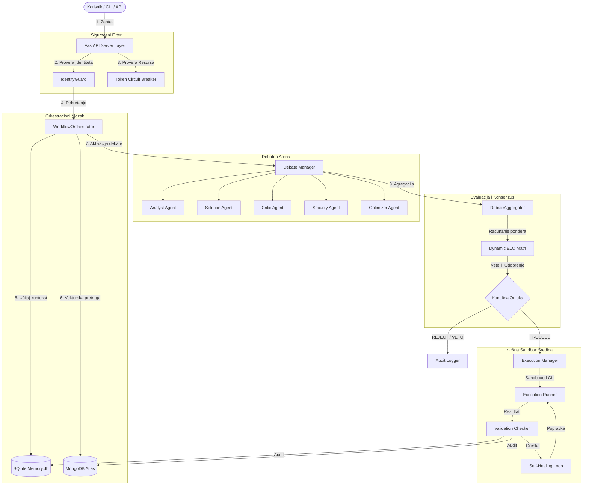

# 🏗️ Arhitektura Sistema & ADR

Ovaj dokument pruža formalnu arhitektonsku specifikaciju za **AI Workflow Orchestrator**. 

Sistem je zasnovan na principima visoke auditabilnosti, otpornosti i nultog-poverenja (Zero-Trust), integrišući modularne agente sa perzistentnom memorijom i adversarial ocenjivanjem.

---

## 🗺️ Arhitektonski Dijagram Komponenti

Sledeći Mermaid dijagram vizualizuje raspored slojeva i protok podataka kroz sistem:

---

## 📦 Tabela Komponenti Sistema

| Komponenta | Tehnologija | Ključne Datoteke | Opis |
|---|---|---|---|
| **FastAPI Sloj** | FastAPI, Uvicorn | `api/routes.py` | API endpoint-ovi za pretragu, podnošenje zahteva i real-time SSE strimovanje. |
| **Orchestration Core** | Python AsyncIO | `orchestrator/engine.py` | Upravlja 11-stepenim tokom i povezuje memorijski sloj sa debatnim arenom. |
| **Debate Engine** | Vertex AI (Gemini) | `debate/rounds.py` | Koordinira pet specijalizovanih agenata kroz debate i rafinacije. |
| **Reputation System** | Python ELO Math | `debate/aggregator.py` | Izračunava konsenzus, detektuje konflikte i ažurira agent ELO ocene. |
| **Forenzička Memorija** | SQLite, PyMongo | `memory/database.py` | Perzistentno čuva rezultate, trace-ove i istorijske ishode. |
| **Bezbedni Izvršilac** | Subprocess, RE | `execution/runner.py` | Sandboxed okruženje koje filtrira i pokreće CLI naredbe uz rollback podršku. |

---

## ⚖️ ELO Konsenzus i Pravila Debate

Konačna odluka se ne donosi prostom većinom glasova, već kroz **ponderisani konsenzus** zasnovan na ELO reputaciji agenata i specifičnosti uloge.

### 1. Ponderisanje Uloga (Role Weights)
Svaka uloga ima podrazumevanu težinu na osnovu njene važnosti za sigurnost i stabilnost sistema:
* **Security Agent:** `2.0` (Najveća težina — veto mogućnost)
* **Critic Agent:** `1.5` (Visoka težina za pronalaženje edge-case-ova)
* **Solution Agent:** `1.2` (Proponiranje rešenja)
* **Analyst Agent:** `1.0` (Decomposition i klasifikacija)
* **Optimizer Agent:** `0.8` (Preporuke i poboljšanja)

### 2. Multiplikator Reputacije (Elo Multiplier)
Svaki agent ima dinamički Elo rating koji se čuva u SQLite bazi (`agent_elo` tabela). Multiplikator reputacije se računa po formuli:

$$\text{Reputacioni Multiplikator} = \max\left(0.5, \min\left(1.5, \frac{\text{Agent Elo}}{1200.0}\right)\right)$$

### 3. Adversarial Duels (Konflikti i ELO ažuriranje)
* **Solution vs Critic:** Ako Critic agent detektuje propust sa konfidencijom $> 0.7$:
  - Critic dobija $+10$ Elo bodova.
  - Solution gubi $-10$ Elo bodova (zbog lošeg dizajna).
  - Inače, Solution dobija $+5$ Elo, a Critic gubi $-5$ Elo.
* **Security Veto:** Ako Security agent označi rizik sa konfidencijom $\ge 0.9$:
  - Security dobija $+25$ Elo za sprečavanje incidenta.
  - Solution gubi $-50$ Elo bodova (težak penal za bezbednosni propust).
  - Zahtev se odmah odbija sa statusom `REJECTED: Critical security risk detected`.

---

## 🛠️ ADR (Architecture Decision Records)

<b>ADR 001: Korišćenje SQLite baze za ELO Rating i Lokalni Kontekst</b>

* **Kontekst:** Potrebno je brzo, determinističko i lokalno skladište za sesije i ELO ratinge bez uvođenja mrežnog overhead-a tokom debata.
* **Odluka:** Izabrana je SQLite baza podataka (`memory.db`) sa omogućenom `Row` fabrikom. SQLite nam obezbeđuje ACID transakcije unutar istog OS okruženja.
* **Posledice:** Izuzetno niska latencija pri čitanju Elo rejtinga agenata ($< 1\text{ms}$), jednostavna migracija i nezavisnost od spoljnih servisa tokom testiranja.

<b>ADR 002: MongoDB Atlas kao Forensic Memory Layer i Vektorska Pretraga</b>

* **Kontekst:** Pored lokalnog SQLite skladišta, sistem zahteva globalni audit i semantičku pretragu istorijskih konflikata preko udaljenih instanci.
* **Odluka:** Integrisan je MongoDB Atlas sa podrškom za Atlas Vector Search za indeksiranje debatnih trace-ova i istorijskih rešenja.
* **Posledice:** Omogućeno je semantičko pretraživanje sličnih konflikata na osnovu embeddinga korisničkog zahteva. U slučaju nedostupnosti MongoDB mreže, sistem se bezbedno prebacuje na lokalnu SQLite bazu kao failover.

<b>ADR 003: Rule-of-3 Adversarial Refinement Loop</b>

* **Kontekst:** Jednokratne debate mogu ostaviti nerešene konflikte ukoliko agenti imaju nisku konfidenciju. Beskonačne petlje razgovora su skupe i spore.
* **Odluka:** Uvedeno je ograničenje od maksimalno 3 kruga rafinisanja. Ako je ukupna konfidencija konsenzusa $< 0.8$, Solution agent dobija kritike i dobija tačno 3 šanse da popravi plan.
* **Posledice:** Determinističko vreme izvršenja, optimalan balans troškova API tokena i kvaliteta rešenja.

---

## 🔒 Bezbednost i RBAC

Sistem primenjuje rigorozne bezbednosne provere:
1. **Zabranjene komande:** `ExecutionRunner` na nivou statičkog regex filtera blokira bilo koji pokušaj mount-ovanja `/var/run/docker.sock`, montiranje `hostPath` na Kubernetesu i SQL `OR 1=1` injekcije.
2. **Identity Lock:** Nulti-stepeni `IdentityGuard` verifikuje da se kod izvršava isključivo u odobrenom GCP projektu (`sixth-hawk-492717-m1`) i odobrenoj MongoDB bazi podataka.

---

## ⚡ Performanse i Ograničenja

* **Maksimalni sesijski tokeni:** `100,000` (FastAPI Token Budget Middleware).
* **Paralelizam debata:** Debate se izvršavaju sekvencijalno po rundama (Analyst -> Solution -> Critic -> Security -> Optimizer) kako bi se osigurao pun kontekst svakom sledećem agentu, dok se verifikacija planova odvija asinhrono.
* **Vreme odziva:** Prosečno trajanje debate iznosi $3-5$ sekundi, što predstavlja svesni inženjerski kompromis u korist apsolutne sigurnosti i tačnosti rešenja.
