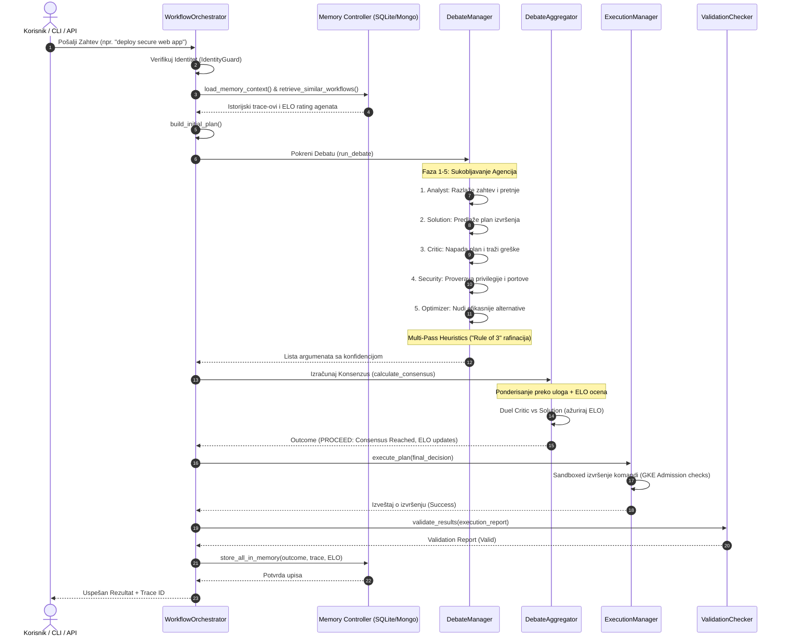
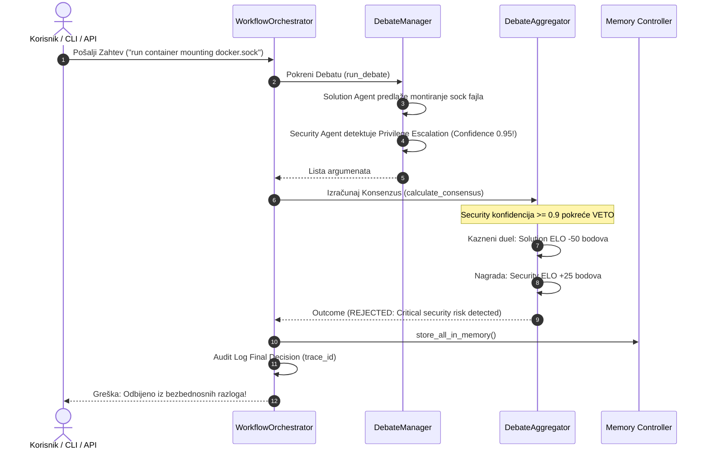
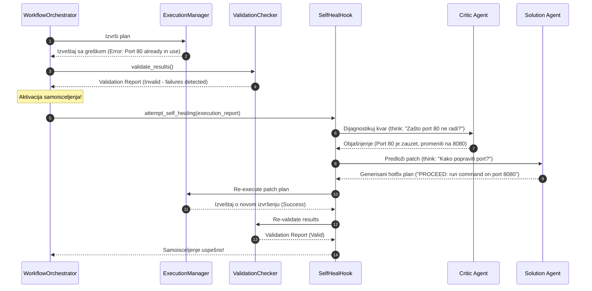

# 🔄 Tokovi Podataka & Sekvencijalni Dijagrami

Ovaj priručnik detaljno prikazuje kako podaci i kontrolni tokovi cirkulišu kroz **AI Workflow Orchestrator**. 

Kroz sekvencijalne dijagrame, dokument objašnjava tri ključna scenarija: standardno izvršenje sa debatom, sigurnosni veto i asinhrono samoisceljenje (Self-Healing) u slučaju kvara.

---

## 🟢 1. Standardni Orkestracioni Tok (Consensus Proceed)

Sledeći sekvencijalni dijagram prikazuje standardni krug rada kada agenti postignu visok stepen poverenja i konsenzus bez bezbednosnih alarma:

---

## 🔴 2. Sigurnosni Veto (Security Veto Triggered)

Ukoliko Security agent prepozna ozbiljan rizik (npr. montiranje `/var/run/docker.sock` ili privilegovani `hostPath` u Kubernetes pod-u) sa konfidencijom $\ge 0.9$, debata se odmah prekida, plan odbija i sprovode se kaznene mere:

---

## 🟡 3. Asinhrono Samoisceljenje (Self-Healing Loop)

Ukoliko validation check ne uspe nakon izvršenja komande (npr. greška u portu ili sintaksi), orkestrator aktivira **Self-Healing Loop** za automatsko rešavanje problema:

