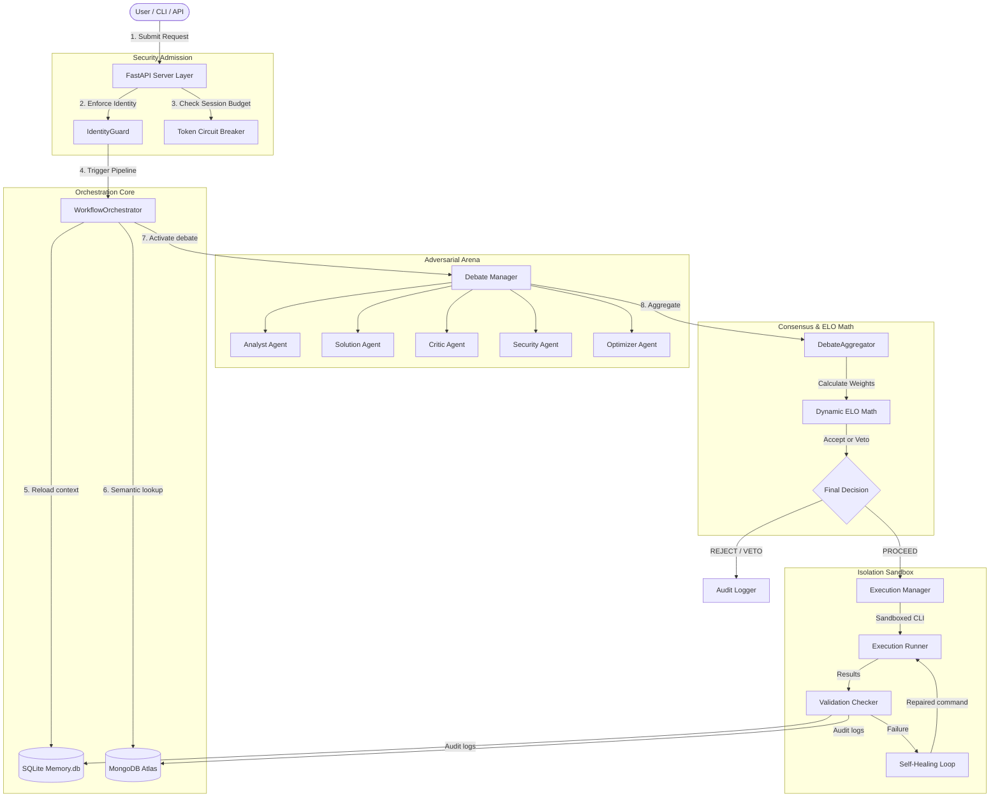

# 🏗️ System Architecture & ADR

This document provides a formal technical specification of the **AI Workflow Orchestrator** architecture.

The platform is designed around strict auditability, execution isolation, zero-trust configurations, and dynamic adversarial consensus.

---

## 🗺️ Component Architecture Diagram

The Mermaid diagram below visualizes the core execution layers and data flows:

---

## 📦 System Component Catalog

| Component | Technology | Key Files | Description |
|---|---|---|---|
| **FastAPI Layer** | FastAPI, Uvicorn | `api/routes.py` | Exposes REST endpoints for triggering workflows, retrieving memory traces, and Server-Sent Events (SSE) status streaming. |
| **Orchestration Core** | Python AsyncIO | `orchestrator/engine.py` | Manages the 11-step pipeline, reloading past decisions and coordinating executions. |
| **Debate Engine** | Vertex AI (Gemini Pro) | `debate/rounds.py` | Coordinates specialized agents across adversarial turns and refinement passes. |
| **Reputation System** | Python ELO Math | `debate/aggregator.py` | Evaluates consensus confidence, extracts conflict points, and calculates Elo reputation ratings. |
| **Forensic Memory** | SQLite, PyMongo | `memory/database.py` | Implements persistent local storage for trace replays, histories, and ratings. |
| **Sandboxed Executor** | Python Subprocess | `execution/runner.py` | Safely parses commands, executes approved steps, and initiates automatic reverse rollbacks on failures. |

---

## ⚖️ ELO Consensus & Debate Governance

Final decisions are never made by simple majority vote. The system implements a **weighted consensus engine** driven by agent specialties and their dynamic historical reputation.

### 1. Role Weights
Each specialized agent has an inherent architectural weighting reflecting their priority for safety and system stability:
* **Security Agent:** `2.0` (Highest priority - veto capabilities)
* **Critic Agent:** `1.5` (High priority for catching edge-case flaws)
* **Solution Agent:** `1.2` (Standard priority for plan proposals)
* **Analyst Agent:** `1.0` (Decomposition and classification)
* **Optimizer Agent:** `0.8` (Refinement and alternative proposals)

### 2. Reputation Multipliers
Every agent's historical rating is saved in the SQLite `agent_elo` table. The current debate weight is multiplied by a reputation factor calculated as:

$$\text{Reputation Multiplier} = \max\left(0.5, \min\left(1.5, \frac{\text{Agent Elo}}{1200.0}\right)\right)$$

### 3. Adversarial Duels
* **Solution vs Critic:** If the Critic agent challenges a proposal with a confidence score $> 0.7$:
  - Critic receives $+10$ Elo points.
  - Solution loses $-10$ Elo points (penalized for design weaknesses).
  - Otherwise, Solution receives $+5$ Elo points, and Critic loses $-5$ Elo points.
* **Security Veto:** If the Security agent detects a vulnerability with a confidence score $\ge 0.9$:
  - Security receives $+25$ Elo points for avoiding an incident.
  - Solution suffers a massive $-50$ Elo penalty (severe penalty for proposing unsafe plans).
  - The request is immediately blocked: `REJECTED: Critical security risk detected`.

---

## 🛠️ ADR (Architecture Decision Records)

<b>ADR 001: SQLite Database for Local Context and ELO Rankings</b>

* **Context:** The system requires a zero-latency, ACID-compliant local database to track ELO ratings and session states without network dependency during multi-agent turns.
* **Decision:** We chose SQLite (`memory.db`) with `Row` factory mapping for structured SQL queries within the monorepo context.
* **Consequences:** Extremely low latency ($< 1\text{ms}$ reads) for agent ratings and reliable transaction logging without external service dependencies during testing.

<b>ADR 002: MongoDB Atlas for Cloud Traces and Vector Retrieval</b>

* **Context:** Beside local SQLite caching, auditing teams need semantically searchable global logs of past debate outcomes and agent arguments.
* **Decision:** We integrated MongoDB Atlas using Atlas Vector Search to index and query past debate trace embeddings.
* **Consequences:** Semantically similar conflict patterns are reloaded from the cloud during pipeline Step 3. If MongoDB is unreachable, the system gracefully falls back to local SQLite tables without interrupting execution.

<b>ADR 003: Rule-of-3 Adversarial Refinement Loop</b>

* **Context:** Simple one-pass debates can fail to reach a stable consensus if confidence remains low, while unbounded loops risk infinite API charges.
* **Decision:** We established a strict maximum limit of 3 refinement passes. If aggregate consensus confidence falls below `0.8`, the Solution agent receives target points from the Critic and is granted 3 turns to repair the proposal.
* **Consequences:** Stable execution times, deterministic API token costs, and high-quality final plan formulations.

---

## 🔒 Admission and RBAC Security

The sandbox enforces strict execution validation gates:
1. **Admission Filters:** The `ExecutionRunner` uses pre-execution regex checks to block commands trying to mount `/var/run/docker.sock`, privileged GKE hostPaths, or insert database SQL injection strings like `OR 1=1`.
2. **Environment Identity Locking:** The `IdentityGuard` verifies environment parameters before main start, asserting that execution is bound exclusively to the locked GCP project `sixth-hawk-492717-m1` and MongoDB database `ai_workflow_orchestrator`.

---

## ⚡ Performance Boundaries

* **Session Token Ceiling:** `100,000` tokens managed by FastAPI Token Middleware.
* **Debate Turn sequence:** Sequential execution (Analyst -> Solution -> Critic -> Security -> Optimizer) ensures each agent acts on full context, while verification processes operate asynchronously.
* **Latency Profile:** The adversarial debate consumes $3-5$ seconds, which represents a deliberate engineering trade-off favoring stability, absolute security, and auditable alignment.
