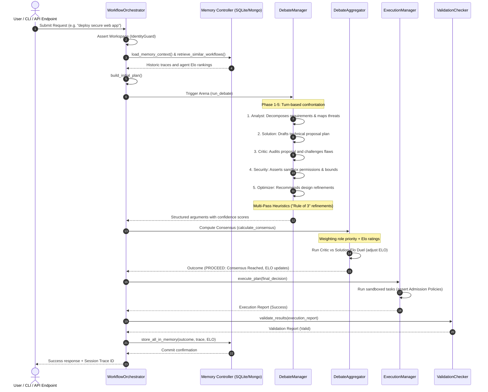
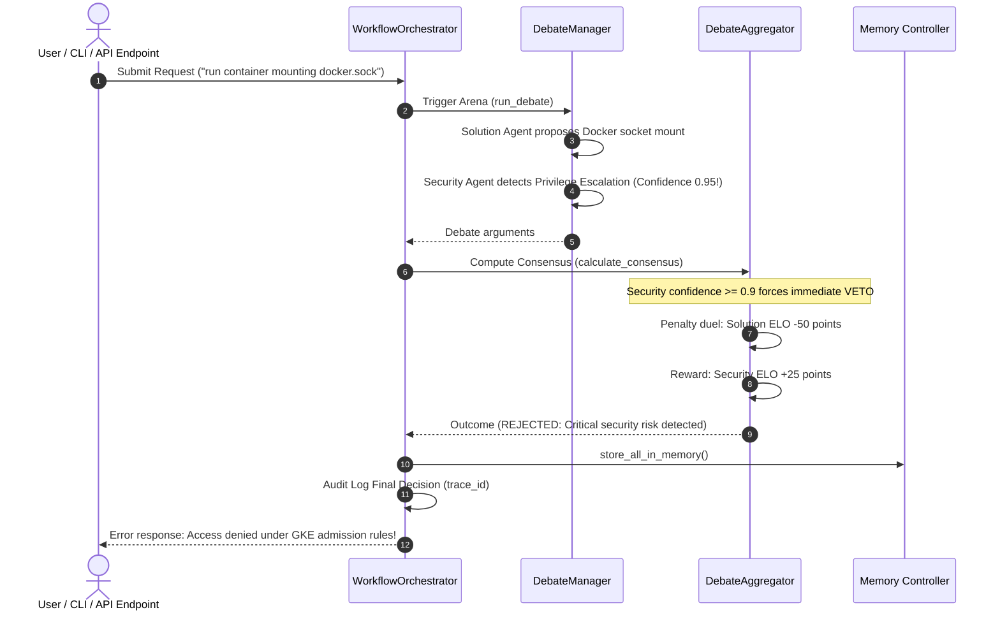
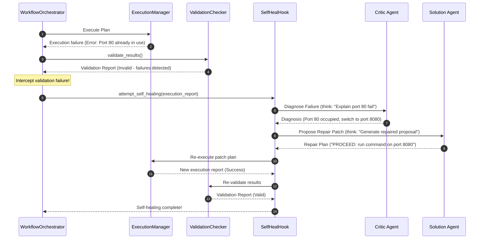

# 🔄 Data Flows & Sequence Diagrams

This document visualizes how request vectors, agent states, and evaluation variables flow across the **AI Workflow Orchestrator**.

Using formal Mermaid sequence flows, we break down three core operational patterns: Standard execution consensus, Security Veto intercepts, and Autonomous Self-Healing loops.

---

## 🟢 1. Standard Execution Flow (Consensus Proceed)

The sequence map below demonstrates a standard execution pipeline where the adversarial arena resolves with high consensus confidence and no security anomalies:

---

## 🔴 2. Security Veto Intercept (Security Veto Triggered)

If the Security agent identifies a critical runtime privilege violation (such as mounting `/var/run/docker.sock` or hostPath volumes) with a confidence score $\ge 0.9$, the debate is immediately halted, execution plans are discarded, and penalties are applied:

---

## 🟡 3. Autonomous Self-Healing Loop

If post-execution verification fails (e.g. system reports syntax issues or port blockages), the orchestrator intercepts the error and routes the state to the **Self-Healing Loop** to automatically patch the plan:

