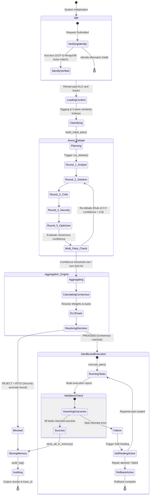

# 🔄 Orchestration & State Transitions

The runtime cycle of the orchestrator is formally modeled as a **Finite State Machine (FSM)** with strictly defined states and transition triggers. This document explains each state shift and evaluation gate inside the system.

---

## 🗺️ System State Machine Diagram

The diagram below maps the FSM states traversed from request submission to memory audit logging:

---

## 📊 State Transition Specifications

| Initial State | Event / Triggering Condition | Next State | Functional Description |
|---|---|---|---|
| **`Idle`** | Request submitted by Client | **`VerifyingIdentity`** | Initiates zero-trust checking inside `IdentityGuard`. |
| **`VerifyingIdentity`** | Workspace variables mismatch | **`Aborted`** | Halts execution immediately (`sys.exit(1)`). |
| **`Planning`** | Baseline plan drafted | **`Round_1_Analyst`** | Commences turn-based adversarial debate rounds. |
| **`Multi_Pass_Check`** | Consensus $< 0.8$ and turns $< 3$ | **`Round_2_Solution`** | Solution agent receives Critic reviews and refines plan. |
| **`ResolvingDecision`** | Security confidence $\ge 0.9$ | **`Blocked`** | **VETO!** Immediate rejection of unsafe operations. |
| **`ValidationCheck`** | Task returns exit code $\ne 0$ | **`SelfHealingActive`** | Activates the autonomous self-healing diagnostics. |
| **`SelfHealingActive`** | Critic fails to diagnose failure | **`RollbackActive`** | Runs reverse-rollback operations. |
| **`Success`** | All validations passed | **`StoringMemory`** | Commits outputs to local SQLite and cloud Atlas collections. |

---

## ⚖️ Decision Rules for Proceed and Veto Transitions

When transitioning from **`ResolvingDecision`** to execution runs, the consensus engine validates the following criteria:

1. **Transition to `Blocked` (REJECT):**
   * If the Security Agent flags the plan with a confidence score $\ge 0.9$ (e.g. static regex flags SQL Injection attempts).
   * If the aggregate weighted consensus confidence score remains $< 0.6$ after all refinement passes are exhausted.
2. **Transition to `SandboxedExecution` (PROCEED):**
   * If the aggregate consensus confidence is $\ge 0.6$ and no active security block is triggered.
