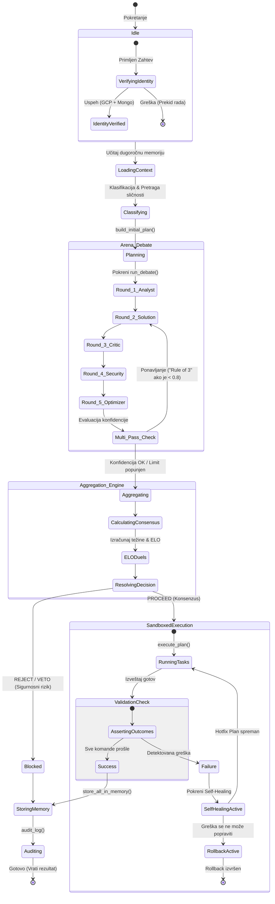

# 🔄 Procesi Orkestracije i Stanja

Rad orkestratora je modelovan kao **konačni automat (Finite State Machine - FSM)** sa precizno definisanim stanjima i prelazima. Ovaj dokument objašnjava svaku promenu stanja i logiku donošenja odluka u sistemu.

---

## 🗺️ Dijagram Stanja Sistema (System State Machine)

Sledeći dijagram prikazuje stanja kroz koja sistem prolazi od prihvatanja zahteva do čuvanja audita u memoriju:

---

## 📊 Tabela Tranzicija Stanja (State Transition Table)

| Početno Stanje | Događaj / Uslov | Sledeće Stanje | Opis |
|---|---|---|---|
| **`Idle`** | Korisnik šalje zahtev | **`VerifyingIdentity`** | Pokreće se nulta provera `IdentityGuard`-a. |
| **`VerifyingIdentity`** | Neuspeh u GCP projektu | **`Aborted`** | Sigurnosni prekid rada (sys.exit). |
| **`Planning`** | Plan spreman | **`Round_1_Analyst`** | Pokreće se prva runda adversarial debate. |
| **`Multi_Pass_Check`** | Konfidencija $< 0.8$ i krug $< 3$ | **`Round_2_Solution`** | Solution agent dobija primedbe i prepravlja plan. |
| **`ResolvingDecision`** | Security konfidencija $\ge 0.9$ | **`Blocked`** | **VETO!** Plan se odbija bez prava na izvršenje. |
| **`ValidationCheck`** | Bilo koja komanda vrati exit code $\ne 0$ | **`SelfHealingActive`** | Pokreće se asinhrono samoisceljenje. |
| **`SelfHealingActive`** | Critic ne može dijagnostikovati kvar | **`RollbackActive`** | Pokreće se obrnuta rollback sekvenca. |
| **`Success`** | Svi testovi prošli | **`StoringMemory`** | Ishod se trajno upisuje u SQLite i MongoDB Atlas. |

---

## ⚖️ Pravila Tranzicije za Konsenzus i Veto

Prilikom prelaska iz stanja **`ResolvingDecision`** u izvršenje, agregator primenjuje sledeće tranzicione formule:

1. **Tranzicija u `Blocked` (REJECT):**
   * Ako Security Agent ima konfidenciju $\ge 0.9$ (npr. detektovana SQL Injection string interpolacija).
   * Ako je ukupna težinski-prosečna konfidencija debata $< 0.6$ nakon svih rundi rafinisanja.
2. **Tranzicija u `SandboxedExecution` (PROCEED):**
   * Ako je ukupna konfidencija $\ge 0.6$ i nema aktivnih sigurnosnih pretnji.
